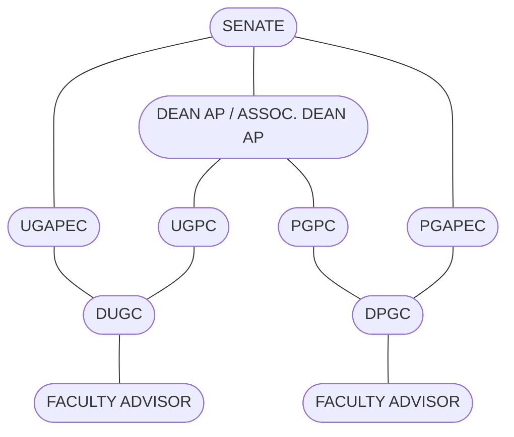

# Fee Circular for UG New Entrants 2025.pdf

**No. Acad./UG/Fees/Autumn Semester 2025-26** **Date: 19th June 2025**

## Schedule for Payment of Academic Fees by UG New Entrants for Autumn Semester 2025-26

All undergraduate students admitted through JEE (Advanced) 2025, UCEED 2025, INMO 2025 and Preparatory Course 2024 are required to pay their fees for Autumn Semester 2025-26 as per the following schedule. Detailed fee structure is enclosed for a quick reference. However, specimen copy of offer letters may be referred for details of fees payable after adjustment of seat acceptance fee/ processing charges, if any (https://acad.iitb.ac.in/landing-page-ug-new-entrants-2025-26).

<table>
    <tr>
        <th>Payment of fees for Autumn Semester 2025-26</th>
        <th>17/07/2025 (Thursday) - 29/07/2025 (Tuesday)</th>
    </tr>
</table>The following be noted for payment of fees:

1. All students (including students paying through a Bank Loan/ Sponsoring Agency) need to pay fees using “online portal” (https://portal.iitb.ac.in/asc) only.
2. Instructions for online fee payment are made available on ASC home page (https://portal.iitb.ac.in/asc). Students should use payment methods **other than UPI**, for payment greater than Rs. 1 lakh, due to daily UPI limits.
3. Students paying fees through an online portal must ensure that their transaction is completed in all respects.
4. Students under SC / ST / PwD category are exempted from the payment of Tuition Fees.
5. Students paying fees through Bank Loan/ Sponsorship/ NEFT are required to generate “official fee demand” using ASC portal only [“Bank Loan/ NEFT Fee payment” tab at https://portal.iitb.ac.in/asc ].
        (a) A demand will be valid for 10 days only, before which the money has to be transferred. In case of delays expected from the agency transferring the fees, a fresh demand has to be generated.
        (b) Once the money has been transferred, the concerned student must enter the UTR number and other details on ASC Portal.
        (c) Such student should initiate the payment process with the sponsoring agency at least 15 days prior to the fee deadline, as reconciliation with bank takes few days and semester registration is linked to the fee payment.
        (d) Such students should not pay fees directly to the “Registrar, IIT Bombay” account. They are required to generate “official fee demand” only on ASC portal. Only online fee demand and UTR entry will be entertained henceforth.
        (e) Please refer to the FAQs for UTR verification at the following link https://docs.google.com/document/d/17OpeF7ZjVVKSUIhcfLwZp4jzP3GicpD7aZ31ZDKqTic Please write to onlinepay@iitb.ac.in for queries, if any.
6. The fee receipts will be generated only after reconciliation. Student need to collect the fee receipt in person from the Cash Section, 1st Floor, Nandan Nilekani Main Building, IIT Bombay after 8-10 days of payment.
7. **Fee Refund Policy for UG:**
        (a) Deduction of Seat Acceptance Fees and Processing Charges: Whenever a student who secures admission to IIT Bombay chooses to withdraw before the last date of payment of Semester Fees, the student will receive a refund of the Semester Fee after deducting the Seat Acceptance Fees and Processing Charges of Rs. 5,000/-.
        (b) Refund of Caution Deposits: Whenever a student who secures admission in IIT Bombay chooses to withdraw after the last date of payment of Semester Fees, the student will receive only the refund of Caution Deposits (Institute, Library and Hostel) subject to 'No Dues'. Mess charges will be collected on a pro-rata basis.

> Digital Signature
> Sudam Damu Adlinge (10002113)
> 20-Jun-25 09:51:48 AM
> **Deputy Registrar (Academic-UG)**

**To:**
1. All Heads / Conveners of the Departments / Centres / Schools / Interdisciplinary Programmes
2. Students-notices
3. Dean (ACR) } With a request to send the list of students (Roll No., Name, programme, Department) in advance for fees against Loan
4. IITB AA

**Copy to:**
1. The Registrar / Dean (AP) / Associate Dean (AP) / The Dean (SA) / Associate Dean (SA)
2. The Head, Application Software Centre (ASC)
3. Deputy Registrar (F&A): - With a request to verify that all students have paid appropriate fees as applicable. Discrepancies (if any) may be brought to the notice of the Academic Office/HCU/ASC as applicable, for rectification
4. In-Charge, Cash Section
5. Assistant Registrar, Hostel Co-ordinating Unit
6. The Manager, Canara bank, IIT Powai Branch } With a request to transfer semester fees of students’ account holder to IITB Main Account and request to send Demand Draft list in advance
7. The Manager, SBI, IIT Powai Branch

---

# INDIAN INSTITUTE OF TECHNOLOGY BOMBAY
## <u>Fee Structure for UG New Entrants</u>

**(B.Tech., B.Tech. + M. Tech., B. Des. and B.S.)**

### Autumn Semester 2025-26

### I. Academic Fees

<table>
  <thead>
    <tr>
        <th rowspan="2">Sr. No.</th>
        <th rowspan="2">Particulars</th>
        <th colspan="2">Fee payable (Rs.)</th>
    </tr>
    <tr>
        <th>Indian Nationals {including PIO/ OCI Card holders (issued before 4th March 2021)}</th>
        <th>Foreign Nationals#</th>
    </tr>
  </thead>
  <tbody>
    <tr>
        <td colspan="4">I(A) At the time of Admission (one time)</td>
    </tr>
    <tr>
        <td>1.</td>
        <td>Admission Fee</td>
        <td>9200</td>
        <td>9200</td>
    </tr>
    <tr>
        <td>2.</td>
        <td>Student Welfare Fund</td>
        <td>1300</td>
        <td>1300</td>
    </tr>
    <tr>
        <td colspan="2">Total I (A)</td>
        <td>10500</td>
        <td>10500</td>
    </tr>
    <tr>
        <td colspan="4">I(B) Per Semester Fees</td>
    </tr>
    <tr>
        <td>1. Tuition Fee – Statutory Fees</td>
        <td>100000</td>
        <td>300000</td>
        <td></td>
    </tr>
    <tr>
        <td>2. Registration Fee &amp; Examination Fee</td>
        <td>2300</td>
        <td>2300</td>
        <td></td>
    </tr>
    <tr>
        <td>3. Gymkhana Fee</td>
        <td>2300</td>
        <td>2300</td>
        <td></td>
    </tr>
    <tr>
        <td>4. Student Benevolent Fund</td>
        <td>750</td>
        <td>750</td>
        <td></td>
    </tr>
    <tr>
        <td>5. Student Accident Insurance Fund</td>
        <td>350</td>
        <td>350</td>
        <td></td>
    </tr>
    <tr>
        <td>6. Medical Fee</td>
        <td>2050</td>
        <td>2050</td>
        <td></td>
    </tr>
    <tr>
        <td colspan="2">Total I (B)</td>
        <td>107750</td>
        <td>307750</td>
    </tr>
    <tr>
        <td colspan="4">I(C) Refundable Deposits (To be paid at the time of admission)</td>
    </tr>
    <tr>
        <td>1. Institute Security Deposits</td>
        <td>5000</td>
        <td>5000</td>
        <td></td>
    </tr>
    <tr>
        <td>2. Library Security Deposits</td>
        <td>5000</td>
        <td>5000</td>
        <td></td>
    </tr>
    <tr>
        <td colspan="2">Total I (C)</td>
        <td>10000</td>
        <td>10000</td>
    </tr>
    <tr>
        <td colspan="2">Grand Total of Academic Fees I(A)+I(B)+I (C)</td>
        <td>128250</td>
        <td>328250</td>
    </tr>
  </tbody>
</table>

a) All SC/ ST/ PwD category students are exempted from the payment of Tuition Fee I(B)-1.

b) IIT Bombay reserves the right to revise the fee structure in subsequent semesters.

c) B.Tech., B.S. and B.Des. are 4-year programmes (8 semesters), and Dual Degree (B.Tech. + M.Tech.) is a 5year programme (10 semesters).

d) #Foreign Nationals with valid PIO/ OCI cards (issued before 04/03/2021) allotted seats under the OPEN category will pay the fees same as Indian Nationals. Foreign Nationals without PIO/ OCI cards allotted through Foreign National supernumerary seats will pay Foreign National fees.

------------------xxx------------------

---

# Fee Circular_PG_PhD.pdf

# INDIAN INSTITUTE OF TECHNOLOGY BOMBAY
# ACADEMIC SECTION

No.Acd./PG/PhD/Fees-Autumn-2025-26
Date : 24 April 2025

**Schedule for Payment of Academic Fees by on-roll PG/Ph.D. Students for the Autumn Semester 2025-26 and Academic Fee structure for new entrants 2025-26.**

All PG/Ph.D. students are required to pay their fees for Autumn Semester 2025-26 as per the following schedule. Detailed fee structure is enclosed for a quick reference.

<table>
  <tbody>
    <tr>
        <td>Payment of fees for Autumn Semester 2025-26</td>
        <td>01/05/2025 (Thursday) to 15/07/2025 (Tuesday)</td>
    </tr>
    <tr>
        <td>Late Payment of Fees for Autumn Semester 2025-26 with fine of Rs.1000/-</td>
        <td>16/07/2025 (Wednesday) to 22/07/2025 (Tuesday)</td>
    </tr>
    <tr>
        <td>Late Payment of Fees with fine of Rs.1000/- per week (in addition to Rs.1000/- fine with a maximum cap of Rs.10,000/-)</td>
        <td>from 23/07/2025 (Wednesday) till the date of payment of fees</td>
    </tr>
  </tbody>
</table>

Autumn Semester 2025-26 registration is linked with fee payment. For registration, students must pay all fees that are pending till previous semesters AND semester fees for the current semester (Autumn Semester 2025-26).

Following be noted for payment of fees.

1. All students (including students paying through a Bank Loan/ Sponsoring Agency) need to pay fees using “online portal” (https://portal.iitb.ac.in/asc) only.

2. Instructions for online fee payment are made available on ASC home page (https://portal.iitb.ac.in/asc). Students should use payment methods other than UPI, for payment greater than 1 lakh, due to daily UPI limits.

3. Students paying fees through an online portal must ensure that their transaction is completed in all respects.

4. Students under SC / ST / PwD category are exempted from the payment of Tuition Fees.

5. Research Scholars who are submitting their Ph.D. thesis on or before the 1st day of Autumn Semester (2025-26) registration, need not to pay fees for Autumn Semester 2025-26.

6. **Students paying fees through Bank Loan/Sponsorship/NEFT are required to generate “Official fee demand” using ASC portal only [“Bank Loan/NEFT Fee payment” tab at https://portal.iitb.ac.in/asc ].**
    (a) A demand will be valid for 10 days only, before which the money has to be transferred. In case of delays expected from the agency transferring the fees, a fresh demand has to be generated.
    (b) Once the money has been transferred, the concerned student must enter the UTR number and other details on ASC Portal.
    (c) Such student should initiate the payment process with the sponsoring agency at least 15 days prior to the fee deadline, as reconciliation with bank takes few days and semester registration is linked to the fee payment.
    (d) Such students **should not pay fees directly to the “Registrar, IIT Bombay” account** as done in the past. They are required to generate “Official fee demand” only on ASC portal. Only online fee demand and UTR entry will be entertained henceforth.
    (e) Please refer to the FAQs for UTR verification at the following link
    https://docs.google.com/document/d/17OpeF7ZjVVKSUIhcfLwZp4jzP3GicpD7aZ31ZDKqTic
    Please write to onlinepay@iitb.ac.in for any queries related to online payment only.

7. The fee receipts will be generated only after reconciliation. Student need to collect the fee receipt in person from the Cash Section, 1st Floor, NN Main Building, IIT Bombay after 8-10 days of payment.

**Dy. Registrar (Academic)**

**To:**
1. All Heads / Conveners of the Departments / Centres / Schools / Interdisciplinary Programmes
2. Students-notices
3. Dean (ACR) <u>*With a request to send the list of students(Roll No., Name, programme, Department) in advance*</u>
4. IITB AA <u>*for fees against Loan*</u>

**Copy to:**
1. The Registrar / Dean (AP) / Associate Dean (AP) / The Dean (SA) / Associate Dean (SA)
2. The Head, Application Software Centre (ASC)
3. Deputy Registrar (F&A): - <u>*With a request to verify that all students have paid appropriate fees as applicable. Discrepancies (if any) may be brought to the notice of the Academic Office/HCU/ASC, as applicable, for rectification*</u>
4. In-Charge, Cash Section
5. Assistant Registrar, Hostel Co-ordinating Unit
6. The Manager, Canara bank, IIT Powai Branch
7. The Manager, SBI, IIT Powai Branch

---

# Important Notes for PG and Ph.D. students wrt Academic Fees

The Academic Fee structure and total payable academic fees for Indian national students are given at Flag-1 (for new entrants) and Flag-2 (for onroll students). For International students the Academic fee structure and total payable is given in Flag-3 (for new entrants) and Flag-4 (For onroll students). Indian national students should also refer the Table-1 (below) which describes the distribution of Groups (I & II)– for students under admission category whom the “Concessional Tuition Fee” and “Non-concessional Tuition Fee” are applicable.

* In general, at the time of admission, NEW ENTRANTS students have to pay the **“Academic fees”** calculated as Admission fees (Non-refundable – to be paid one time) + Refundable Deposits (to be paid one time) + Semester fees (to be paid every semester). [REFER FLAG-1 for Indian National.]

* The ONROLL Students (Indian National students) have to pay the semester fees (to be paid every semester), depending upon their admission category (as per below table), to the programme they are registered in a particular semester and as applicable to their batch. Students admitted to the Dual Degrees programmes (Masters+Ph.D.)$ have to pay fees as per Masters’ programme till successful completion of Research Proposal/Conversion to the Ph.D. programme and thereafter, have to pay fees as applicable to the Ph.D. programme. [REFER FLAG-2 For Indian National students.]

* Pls. Refer to the applicable batch for “Tuition Fee”.

* “Tuition Fee” component is charged as per MoU for "Steel Technology Centre" & “INS Shivaji” Students.

* Students permitted to take ‘Temporary withdrawal’ from the programme for one or more semesters, are required to pay Rs. 3000/- as a continuation fee per semester.

* **International Students** at the time of admission, should pay **“Academic fees”** as mentioned in **FLAG-3** (for NEW ENTRANTS), as applicable to their programme and ONROLL International students should pay Semester **“Academic fees”** as mentioned in **FLAG-4**, as applicable to their programme and batch.

* International Students from **SAARC countries**, includes students from Afghanistan, Pakistan, Bangladesh, Nepal, Sri Lanka, Bhutan, Maldives). International students from countries other than the above mentioned are considered as Non-SAARC.

* Fee component (**“Other Specified Fees” (Only for MBA)**) includes library, teaching aid, computational facilities, etc.

* For any query related to hostel fees / hostel room allotment / payment/refund of hostel fees etc., students are required to write to Assistant Registrar- HCU (arhcu@iitb.ac.in), HCU office (hcu.office@iitb.ac.in).

* $ - *[The Students of Masters+Ph.D. have to pay fees: Masters fees as applicable up to conversion from Masters to Dual Degree (Masters+Ph.D.) and Ph.D. fees as applicable after conversion.]*

**Table-1 : Group-I and Group-II Categories for PG & PhD students (for Indian Nationals):**

<table>
  <thead>
    <tr>
        <th>Group-I (Concessional Tuition Fee Group)</th>
        <th>Group-II (Non-concessional Tuition fees Group)</th>
    </tr>
  </thead>
  <tbody>
    <tr>
        <td>* Teaching Assistantship (TA) * Research Assistantship (RA) * Govt./ Semi Govt. Fellowship Awardees (AERB / AICTE / ARCI / CPHEEO / CSIR / DAE / DST / DBT / HBNI / ICAR / ICMR / ICPR / ICSSR / MERC / MNES / NBHM / PMRF / QIP / UGC / ENDOWMENT), IITB-Monash-CSIR/UGC/DST-Inspire * Teaching Assistantship through Project (TAP)\ * Research Assistantship through Project (RAP) * Foreign students under TA/TAP and FA.</td>
        <td>* Sponsored (SW) category (including IITB-Monash Indian &amp; International Students) * Project Staff (PS) category * DRDO Sponsored * Sponsored Fellowship Awardees (SFA)- (e.g. CG, Infosys, TCS, Forbes Marshall, etc.) * Self-Finance (SF) Category (including College Teacher (CT) and SF with Study Leave, External (EX) category.</td>
    </tr>
  </tbody>
</table>

**IIT Bombay reserves the right to revise the fee structure in subsequent semesters.**

---

<table>
  <thead>
    <tr>
        <th colspan="5">PG (Masters’ and Ph.D. programmes)</th>
        <th rowspan="2">Flag-1</th>
    </tr>
    <tr>
        <th colspan="5">Color Code for specific components :- Ph.D. - Orange, Masters’ - Green</th>
    </tr>
    <tr>
        <th>Fee Components / Applicable programmes</th>
        <th>For Group-I Admission Category</th>
        <th>For Group-II Admission Category</th>
        <th>For SC/ST/PWD Category</th>
        <th>For Institute Staff category</th>
        <th>Non Specified Group</th>
    </tr>
  </thead>
  <tbody>
    <tr>
        <td colspan="6">**A. Admission Fees (to be paid one time at the time of admission) – Non Refundable**</td>
    </tr>
    <tr>
        <td>1 Admission Fees</td>
        <td>9200</td>
        <td>9200</td>
        <td>9200</td>
        <td>9200</td>
        <td>9200</td>
    </tr>
    <tr>
        <td>2 Student Welfare Fund</td>
        <td>1300</td>
        <td>1300</td>
        <td>1300</td>
        <td>1300</td>
        <td>1300</td>
    </tr>
    <tr>
        <td>3 Thesis Fees (only for Ph.D.)</td>
        <td>3200</td>
        <td>3200</td>
        <td>3200</td>
        <td>3200</td>
        <td>3200</td>
    </tr>
    <tr>
        <td>Total one time Non-refundable admission fees payable at the time of Admission for **Masters’** (M.Tech./M.P.P./M.Des./MBA/MS by Research/ MA by Research &amp; M.Des. by Research) M.Sc., M.Sc./M.A.+Ph.D. and M.Tech.+Ph.D. direct admission</td>
        <td>10500</td>
        <td>10500</td>
        <td>10500</td>
        <td>10500</td>
        <td>10500</td>
    </tr>
    <tr>
        <td>Total one time Non-refundable admission fees payable at the time of Admission for **Ph.D.**</td>
        <td>13700</td>
        <td>13700</td>
        <td>13700</td>
        <td>13700</td>
        <td>13700</td>
    </tr>
    <tr>
        <td>HBNI officials (for Ph.D.)</td>
        <td> </td>
        <td> </td>
        <td> </td>
        <td> </td>
        <td>0</td>
    </tr>
  </tbody>
</table>

**B. Deposits (to be paid one time at the time of admission) – Refundable \***

\* - Deposits will be refunded to the students after he/she has left (leaves of his/her own/asked to leave/graduates) from the Institute, subject to clearing all the dues.

If any dues are pending, they can be deducted from the deposits and the remaining amount will be refunded. For the graduated students, the charges of Lifetime membership of IITBAA will be deducted from the Deposits.

<table>
  <tbody>
    <tr>
        <td>1 Institute Security Deposits</td>
        <td>5000</td>
        <td>5000</td>
        <td>5000</td>
        <td>0</td>
        <td>5000</td>
    </tr>
    <tr>
        <td>2 Library Security Deposits</td>
        <td>5000</td>
        <td>5000</td>
        <td>5000</td>
        <td>0</td>
        <td>5000</td>
    </tr>
    <tr>
        <td>**One time Deposits payable at the time of admission**</td>
        <td>**10000**</td>
        <td>**10000**</td>
        <td>**10000**</td>
        <td>**0**</td>
        <td>**10000**</td>
    </tr>
  </tbody>
</table>

**C. Total Per Semester Fees payable (For detailed Semester fee structure, refer Flag-2)**

**FOR BATCH 2025 (New entrants)**

<table>
  <tbody>
    <tr>
        <td>For Masters’ (M.Tech./M.P.P./M.Des./MS by Research/MA by Research &amp; M.Des. by Research), M.Sc.+Ph.D. and M.Tech.+Ph.D. direct admission (Tuition Fee concession of Rs.42000/- is included for Group-I category)</td>
        <td>25750</td>
        <td>67750</td>
        <td>7750</td>
        <td>5350</td>
        <td> </td>
    </tr>
    <tr>
        <td>Masters in Develpoment Practice (MDP)</td>
        <td> </td>
        <td> </td>
        <td> </td>
        <td> </td>
        <td>150000</td>
    </tr>
    <tr>
        <td>Master of Business Administration (MBA)</td>
        <td> </td>
        <td> </td>
        <td>173750</td>
        <td> </td>
        <td>373750</td>
    </tr>
    <tr>
        <td>2 yrs. M.Sc. &amp; M.Sc./MA+Ph.D.</td>
        <td> </td>
        <td> </td>
        <td>7750</td>
        <td> </td>
        <td>16000</td>
    </tr>
    <tr>
        <td>**INDUSTRY/ORGANIZATION SPONSORED (M.Tech.)**</td>
        <td> </td>
        <td> </td>
        <td> </td>
        <td> </td>
        <td> </td>
    </tr>
    <tr>
        <td>INS Shivaji Sponsored (M.Tech.)</td>
        <td> </td>
        <td> </td>
        <td> </td>
        <td> </td>
        <td>135300</td>
    </tr>
    <tr>
        <td>Steel Technology Sponsored (M.Tech.)</td>
        <td> </td>
        <td> </td>
        <td> </td>
        <td> </td>
        <td>157750</td>
    </tr>
    <tr>
        <td>For Ph.D. (Tuition Fee concession of Rs. 21250/- is included for Group-I category)</td>
        <td>11500</td>
        <td>32750</td>
        <td>7750</td>
        <td>5350</td>
        <td> </td>
    </tr>
    <tr>
        <td>Ph.D. External Category – Those who joins parent organization after completion of course work. (Tuition fees + SAIF)</td>
        <td> </td>
        <td>10350</td>
        <td>350</td>
        <td> </td>
        <td> </td>
    </tr>
    <tr>
        <td>HBNI officials (for Ph.D.)</td>
        <td> </td>
        <td> </td>
        <td> </td>
        <td> </td>
        <td>11500</td>
    </tr>
  </tbody>
</table>

---

<table>
  <thead>
    <tr>
        <th colspan="6">**TOTAL ACADEMIC FEES PAYABLE AT THE TIME OF ADMISSION (Autumn-2025-26)**</th>
    </tr>
    <tr>
        <th colspan="6">**(Non-Refundable fees (A) + Refundable Deposits (B) + Semester fees (C))**</th>
    </tr>
    <tr>
        <th colspan="6">**FOR BATCH 2025 (New entrants)**</th>
    </tr>
    <tr>
        <th>Fees payable for applicable programmes and batch</th>
        <th>For Group-I Admission Category</th>
        <th>For Group-II Admission Category</th>
        <th>For SC/ST/PWD Category</th>
        <th>For Institute Staff category</th>
        <th>Non Specified Group</th>
    </tr>
  </thead>
  <tbody>
    <tr>
        <td>For Masters’ (M.Tech./M.P.P./M.Des./MS by Research/MA by Research &amp; M.Des. by Research) and M.Tech.+Ph.D. direct admission (Tuition Fee concession of Rs.42000/- is included for Group-I category)</td>
        <td>46250</td>
        <td>88250</td>
        <td>28250</td>
        <td>15850</td>
        <td> </td>
    </tr>
    <tr>
        <td>Masters in Development Practice (MDP) Only Tuition Fees per semester is applicable</td>
        <td> </td>
        <td> </td>
        <td> </td>
        <td> </td>
        <td>150000</td>
    </tr>
    <tr>
        <td>Master of Business Administration (MBA)</td>
        <td> </td>
        <td> </td>
        <td>194250</td>
        <td> </td>
        <td>394250</td>
    </tr>
    <tr>
        <td>2 yrs. M.Sc. &amp; M.Sc./MA+Ph.D.</td>
        <td> </td>
        <td> </td>
        <td>28250</td>
        <td> </td>
        <td>36500</td>
    </tr>
    <tr>
        <td colspan="6">**INDUSTRY/ORGANIZATION SPONSORED (M.Tech.)**</td>
    </tr>
    <tr>
        <td>INS Shivaji Sponsored (M.Tech.)</td>
        <td> </td>
        <td> </td>
        <td> </td>
        <td> </td>
        <td>155800</td>
    </tr>
    <tr>
        <td>Steel Technology Sponsored (M.Tech.)</td>
        <td> </td>
        <td> </td>
        <td> </td>
        <td> </td>
        <td>178250</td>
    </tr>
    <tr>
        <td colspan="6">**PH.D. PROGRAMME**</td>
    </tr>
    <tr>
        <td>For Ph.D. (Tuition Fee concession of Rs. 21250/- is included for Group-I category)</td>
        <td>35200</td>
        <td>56450</td>
        <td>31450</td>
        <td>19050</td>
        <td> </td>
    </tr>
    <tr>
        <td>HBNI officials (for Ph.D.) [Tuition Fee (Group I) + Semester fee]</td>
        <td> </td>
        <td> </td>
        <td> </td>
        <td> </td>
        <td>11500</td>
    </tr>
  </tbody>
</table>

---

<table>
  <thead>
    <tr>
        <th>Fees payable for applicable programmes and batch</th>
        <th>For Group-I Admission Category</th>
        <th>For Group-II Admission Category</th>
        <th>For SC/ST/ PWD Category</th>
        <th>For Institute Staff category</th>
        <th>Non Specified Group</th>
    </tr>
  </thead>
  <tbody>
    <tr>
        <td colspan="6">FOR BATCH 2024</td>
    </tr>
    <tr>
        <td>For Masters’ (M.Tech./M.P.P./M.Des./MS by Research/MA by Research &amp; M.Des. by Research), M.Sc.+Ph.D. and M.Tech.+Ph.D. direct admission (Tuition Fee concession of Rs.42000/- is included for Group-I category)</td>
        <td>25350</td>
        <td>67350</td>
        <td>7350</td>
        <td>5100</td>
        <td> </td>
    </tr>
    <tr>
        <td>Masters in Development Practice (MDP) * Note: If the programme is extended beyond 1 year, for a student, continuation fee of Rs. 3000/- per semester is applicable.</td>
        <td>NA</td>
        <td>NA</td>
        <td>NA</td>
        <td>NA</td>
        <td>NA</td>
    </tr>
    <tr>
        <td>Master of Business Administration (MBA)</td>
        <td> </td>
        <td> </td>
        <td>165400</td>
        <td> </td>
        <td>365400</td>
    </tr>
    <tr>
        <td>2 yrs. M.Sc. &amp; M.Sc./MA+Ph.D.</td>
        <td> </td>
        <td> </td>
        <td>7350</td>
        <td> </td>
        <td>15600</td>
    </tr>
    <tr>
        <td colspan="6">INDUSTRY/ORGANIZATION SPONSORED (M.Tech.)</td>
    </tr>
    <tr>
        <td>INS Shivaji Sponsored (M.Tech.)</td>
        <td> </td>
        <td> </td>
        <td> </td>
        <td> </td>
        <td>134900</td>
    </tr>
    <tr>
        <td>Steel Technology Sponsored (M.Tech.)</td>
        <td> </td>
        <td> </td>
        <td> </td>
        <td> </td>
        <td>157350</td>
    </tr>
    <tr>
        <td>For Ph.D. (Tuition Fee concession of Rs. 21250/- is included for Group-I category)</td>
        <td>11100</td>
        <td>32350</td>
        <td>7350</td>
        <td>5100</td>
        <td> </td>
    </tr>
    <tr>
        <td>Ph.D. External Category – Those who joins parent organization after completion of course work. (Tuition fees + SAIF)</td>
        <td> </td>
        <td>10300</td>
        <td>300</td>
        <td> </td>
        <td> </td>
    </tr>
    <tr>
        <td>HBNI officials (for Ph.D.)</td>
        <td> </td>
        <td> </td>
        <td> </td>
        <td> </td>
        <td>11500</td>
    </tr>
    <tr>
        <td colspan="6">FOR BATCH 2023</td>
    </tr>
    <tr>
        <td>For Masters’ (M.Tech./M.P.P./M.Des./MS by Research &amp; MA by Research) and M.Tech.+Ph.D. direct admission (Tuition Fee concession of Rs.35000/- is included for Group-I category)</td>
        <td>21950</td>
        <td>56950</td>
        <td>6950</td>
        <td>2750</td>
        <td> </td>
    </tr>
    <tr>
        <td>Masters in Development Practice (MDP) * Note: If the programme is extended beyond 1 year, for a student, continuation fee of Rs. 3000/- per semester is applicable.</td>
        <td>NA</td>
        <td>NA</td>
        <td>NA</td>
        <td>NA</td>
        <td>NA</td>
    </tr>
    <tr>
        <td>Master of Business Administration (MBA)</td>
        <td> </td>
        <td> </td>
        <td>157450</td>
        <td> </td>
        <td>357450</td>
    </tr>
    <tr>
        <td>2 yrs. M.Sc. &amp; M.Sc./MA+Ph.D.</td>
        <td> </td>
        <td> </td>
        <td>6950</td>
        <td> </td>
        <td>14450</td>
    </tr>
    <tr>
        <td colspan="6">INDUSTRY/ORGANIZATION SPONSORED (M.Tech.)</td>
    </tr>
    <tr>
        <td>INS Shivaji Sponsored (M.Tech.)</td>
        <td> </td>
        <td> </td>
        <td> </td>
        <td> </td>
        <td>131950</td>
    </tr>
    <tr>
        <td>Steel Technology Sponsored (M.Tech.)</td>
        <td> </td>
        <td> </td>
        <td> </td>
        <td> </td>
        <td>156950</td>
    </tr>
    <tr>
        <td>For Ph.D. and Dual Degrees (Masters’+Ph.D.)(M.Tech./M.Sc./MPP/M.Phil./MA+Ph.D.), those who have Converted/presented successful Research Proposal and confirmed to Ph.D. programme (Tuition Fee concession of Rs. 21250/- is included for Group-I category)</td>
        <td>10700</td>
        <td>31950</td>
        <td>6950</td>
        <td>2750</td>
        <td> </td>
    </tr>
    <tr>
        <td>Ph.D. External Category – Those who joins parent organization after completion of course work. (Tuition fees + SAIF)</td>
        <td> </td>
        <td>10250</td>
        <td>250</td>
        <td> </td>
        <td> </td>
    </tr>
  </tbody>
</table>

---

<table>
  <thead>
    <tr>
        <th>Fees payable for applicable programmes and batch</th>
        <th>For Group-I Admission Category</th>
        <th>For Group-II Admission Category</th>
        <th>For SC/ST/ PWD Category</th>
        <th>For Institute Staff category</th>
        <th>Non Specified Group</th>
    </tr>
  </thead>
  <tbody>
    <tr>
        <td colspan="6">For BATCH 2022</td>
    </tr>
    <tr>
        <td>For Masters’ (M.Tech./M.P.P./M.Des./MS by Research &amp; MA by Research) and M.Tech.+Ph.D. direct admission (Tuition Fee concession of Rs.35000/- is included for Group-I category)</td>
        <td>21600</td>
        <td>56600</td>
        <td>6600</td>
        <td>2600</td>
        <td> </td>
    </tr>
    <tr>
        <td>Master of Business Administration (MBA)</td>
        <td> </td>
        <td> </td>
        <td>149950</td>
        <td> </td>
        <td>349950</td>
    </tr>
    <tr>
        <td>2 yrs. M.Sc. &amp; M.Sc./MA+Ph.D.</td>
        <td> </td>
        <td> </td>
        <td>6600</td>
        <td> </td>
        <td>14100</td>
    </tr>
    <tr>
        <td colspan="6">INDUSTRY/ORGANIZATION SPONSORED (M.Tech.)</td>
    </tr>
    <tr>
        <td>INS Shivaji Sponsored (M.Tech.)</td>
        <td> </td>
        <td> </td>
        <td> </td>
        <td> </td>
        <td>131600</td>
    </tr>
    <tr>
        <td>Steel Technology Sponsored (M.Tech.)</td>
        <td> </td>
        <td> </td>
        <td> </td>
        <td> </td>
        <td>156600</td>
    </tr>
    <tr>
        <td>For Ph.D. and Dual Degrees (Masters’+Ph.D.)(M.Tech./M.Sc./MPP/M.Phil./MA+Ph.D.), those who have Converted/presented successful Research Proposal and confirmed to Ph.D. programme (Tuition Fee concession of Rs. 21250/- is included for Group-I category)</td>
        <td>10350</td>
        <td>31600</td>
        <td>6600</td>
        <td>2600</td>
        <td> </td>
    </tr>
    <tr>
        <td>Ph.D. External Category – Those who joins parent organization after completion of course work. (Tuition fees + SAIF)</td>
        <td> </td>
        <td>10250</td>
        <td>250</td>
        <td> </td>
        <td> </td>
    </tr>
    <tr>
        <td colspan="6">Upto BATCH 2021</td>
    </tr>
    <tr>
        <td>For Ph.D. and Dual Degrees (Masters’+Ph.D.)(M.Tech./M.Sc./MPP/M.Phil./MA+Ph.D.), those who have Converted/presented successful Research Proposal and confirmed to Ph.D. programme (Tuition Fee concession of Rs. 22500/- is included for Group-I category)</td>
        <td>9100</td>
        <td>31600</td>
        <td>6600</td>
        <td>2600</td>
        <td> </td>
    </tr>
    <tr>
        <td>Ph.D. External Category – Those who joins parent organization after completion of course work. (The fees are “Continuation fees”, however mentioned under Tution fee column) (Continuation fees + SAIF)</td>
        <td> </td>
        <td>5250</td>
        <td>2300</td>
        <td> </td>
        <td> </td>
    </tr>
  </tbody>
</table>

---

<table>
  <thead>
    <tr>
        <th>Fee Components</th>
        <th>For Group-I Admission Category</th>
        <th>For Group-II Admission Category</th>
        <th>For SC/ST/PWD Category</th>
        <th>For Institute Staff category</th>
        <th colspan="2">Non Specified Group</th>
    </tr>
  </thead>
  <tbody>
    <tr>
        <td colspan="6">25-04-2025</td>
        <td></td>
    </tr>
    <tr>
        <td>A</td>
        <td colspan="5">TUITION FEES (STATUTORY FEES)</td>
        <td></td>
    </tr>
    <tr>
        <td colspan="6">MASTERS’ PROGRAMME (including Dual Degrees (Masters’+Ph.D.)</td>
        <td></td>
    </tr>
    <tr>
        <td colspan="6">FOR BATCH 2022 &amp; 2023</td>
        <td></td>
    </tr>
    <tr>
        <td>A1</td>
        <td>M.Tech./M.Des./MPP/M.Phil./MA by Research/MS by Research. &amp; M.Tech./MPP/M.Phil.+Ph.D., those who are in Masters’ programme of the Dual Degree) (Tuition Fee concession of Rs. 35000/- is included for Group-I category)</td>
        <td>15000</td>
        <td>50000</td>
        <td>0</td>
        <td>0</td>
        <td> </td>
    </tr>
    <tr>
        <td>A2</td>
        <td>Master in Develpoment Practice (MDP)</td>
        <td>NA</td>
        <td>NA</td>
        <td>NA</td>
        <td>NA</td>
        <td>NA</td>
    </tr>
    <tr>
        <td>A3</td>
        <td>Master of Business Administration (MBA)</td>
        <td> </td>
        <td> </td>
        <td>0</td>
        <td>0</td>
        <td>200000</td>
    </tr>
    <tr>
        <td>A4</td>
        <td>2 yrs. M.Sc. &amp; M.Sc./MA+Ph.D., those who are in Masters’ programme of the Dual Degree)</td>
        <td> </td>
        <td> </td>
        <td>0</td>
        <td>0</td>
        <td>7500</td>
    </tr>
    <tr>
        <td colspan="6">INDUSTRY/ORGANIZATION SPONSORED (M.Tech.) From Batch 2021 till 2023</td>
        <td></td>
    </tr>
    <tr>
        <td>A5</td>
        <td>INS Shivaji Sponsored</td>
        <td> </td>
        <td> </td>
        <td>0</td>
        <td>0</td>
        <td>125000</td>
    </tr>
    <tr>
        <td>A6</td>
        <td>Steel Technology Sponsored</td>
        <td> </td>
        <td> </td>
        <td>0</td>
        <td>0</td>
        <td>150000</td>
    </tr>
    <tr>
        <td colspan="6">FOR BATCH 2024 and 2025</td>
        <td></td>
    </tr>
    <tr>
        <td>A1</td>
        <td>M.Tech./M.Des./MPP/M.Phil./MA by Research/MS by Research/M.Des. by Research &amp; M.Tech./MPP/M.Phil.+Ph.D., those who are in Masters’ programme of the Dual Degree) (Tuition Fee concession of Rs.42000/- is included for Group-I category)</td>
        <td>18000</td>
        <td>60000</td>
        <td>0</td>
        <td>0</td>
        <td> </td>
    </tr>
    <tr>
        <td>A2</td>
        <td>Msters in Develpoment Practice (MDP) :Not for 2024 batch</td>
        <td> </td>
        <td> </td>
        <td>0</td>
        <td> </td>
        <td>150000</td>
    </tr>
    <tr>
        <td>A3</td>
        <td>Master of Business Administration (MBA)</td>
        <td> </td>
        <td> </td>
        <td>0</td>
        <td>0</td>
        <td>200000</td>
    </tr>
    <tr>
        <td>A4</td>
        <td>2 yrs. M.Sc. &amp; M.Sc./MA+Ph.D., those who are in Masters’ programme of the Dual Degree)</td>
        <td> </td>
        <td> </td>
        <td>0</td>
        <td>0</td>
        <td>8250</td>
    </tr>
    <tr>
        <td colspan="6">INDUSTRY/ORGANIZATION SPONSORED (M.Tech.) For Batch 2024</td>
        <td></td>
    </tr>
    <tr>
        <td>A5</td>
        <td>INS Shivaji Sponsored</td>
        <td> </td>
        <td> </td>
        <td>0</td>
        <td>0</td>
        <td>127550</td>
    </tr>
    <tr>
        <td>A6</td>
        <td>Steel Technology Sponsored</td>
        <td> </td>
        <td> </td>
        <td>0</td>
        <td>0</td>
        <td>150000</td>
    </tr>
    <tr>
        <td colspan="6">Ph.D. PROGRAMME (Including Dual Degrees (Masters’+Ph.D.)</td>
        <td></td>
    </tr>
    <tr>
        <td colspan="6">UPTO BATCH 2021</td>
        <td></td>
    </tr>
    <tr>
        <td>A7</td>
        <td>Ph.D. and Dual Degrees (Masters’+Ph.D.)(M.Tech./M.Sc./MPP/M.Phil./MA+Ph.D.) , those who have Converted/presented successful Research Proposal and confirmed to Ph.D. programme (Tuition Fee concession of Rs. 22500/- is included for Group-I category)</td>
        <td>2500</td>
        <td>25000</td>
        <td>0</td>
        <td>0</td>
        <td> </td>
    </tr>
    <tr>
        <td>A8</td>
        <td>Ph.D. External Category – Those who joins parent organization after completion of course work. (The fees are “Continuation fees”, however mentioned under Tution fee column)</td>
        <td> </td>
        <td>5000</td>
        <td>2050</td>
        <td>0</td>
        <td> </td>
    </tr>
    <tr>
        <td colspan="6">FROM BATCH 2022 ONWARDS</td>
        <td></td>
    </tr>
    <tr>
        <td>A7</td>
        <td>Ph.D. and Dual Degrees (Masters’+Ph.D.)(M.Tech./M.Sc./MPP/M.Phil./MA+Ph.D.) , those who have Converted/presented successful Research Proposal and confirmed to Ph.D. programme (Tuition Fee concession of Rs. 21250/- is included for Group-I category)</td>
        <td>3750</td>
        <td>25000</td>
        <td>0</td>
        <td>0</td>
        <td> </td>
    </tr>
    <tr>
        <td>A8</td>
        <td>Ph.D. External Category – Those who joins parent organization after completion of course work. (from 2022 onwards, the ‘continuation fees’ term used is “Tuition fees”)</td>
        <td> </td>
        <td>10000</td>
        <td>0</td>
        <td>0</td>
        <td> </td>
    </tr>
  </tbody>
</table>

---

<table>
    <thead>
    <tr>
        <th></th>
        <th>Fee Components</th>
        <th>For Group-I
Admission
Category</th>
        <th>For Group-II
Admission
Category</th>
        <th>For
SC/ST/
PWD
Category</th>
        <th>For
Institute
Staff
category</th>
        <th>Non
Specified
Group</th>
    </tr>
    </thead>
    <tr>
        <td>B</td>
        <td colspan="6">OTHER FEES (NON STATUTORY FEES) FOR ALL</td>
    </tr>
    <tr>
        <td></td>
        <td>Fee Components</td>
        <td>For Group-I
Admission
Category</td>
        <td>For Group-II
Admission
Category</td>
        <td>For
SC/ST/
PWD
Category</td>
        <td>For
Institute
Staff
category</td>
        <td>Non
Specified
Group</td>
    </tr>
    <tr>
        <td colspan="7">For Batch 2025</td>
    </tr>
    <tr>
        <td>B1</td>
        <td>Registration and Examination Fee</td>
        <td>2300</td>
        <td>2300</td>
        <td>2300</td>
        <td>2300</td>
        <td>2300</td>
    </tr>
    <tr>
        <td>B2</td>
        <td>Gymkhana Fee</td>
        <td>2300</td>
        <td>2300</td>
        <td>2300</td>
        <td>2300</td>
        <td>2300</td>
    </tr>
    <tr>
        <td>B3</td>
        <td>Student Benevolent Fund</td>
        <td>750</td>
        <td>750</td>
        <td>750</td>
        <td>750</td>
        <td>750</td>
    </tr>
    <tr>
        <td>B4</td>
        <td>Student Accident Insurance Fund (SAIF)</td>
        <td>350</td>
        <td>350</td>
        <td>350</td>
        <td>0</td>
        <td>350</td>
    </tr>
    <tr>
        <td>B5</td>
        <td>Medical Fee</td>
        <td>2050</td>
        <td>2050</td>
        <td>2050</td>
        <td>0</td>
        <td>2050</td>
    </tr>
    <tr>
        <td colspan="2">Total Other Fees (Non Statutory) (B1+B2+B3+B4+B5):</td>
        <td>7750</td>
        <td>7750</td>
        <td>7750</td>
        <td>5350</td>
        <td>7750</td>
    </tr>
    <tr>
        <td>C</td>
        <td>Other Specified Fees (Only for MBA students)</td>
        <td></td>
        <td></td>
        <td>166000</td>
        <td></td>
        <td>166000</td>
    </tr>
    <tr>
        <td colspan="7">For Batch 2024</td>
    </tr>
    <tr>
        <td>B1</td>
        <td>Registration and Examination Fee</td>
        <td>2200</td>
        <td>2200</td>
        <td>2200</td>
        <td>2200</td>
        <td>2200</td>
    </tr>
    <tr>
        <td>B2</td>
        <td>Gymkhana Fee</td>
        <td>2200</td>
        <td>2200</td>
        <td>2200</td>
        <td>2200</td>
        <td>2200</td>
    </tr>
    <tr>
        <td>B3</td>
        <td>Student Benevolent Fund</td>
        <td>700</td>
        <td>700</td>
        <td>700</td>
        <td>700</td>
        <td>700</td>
    </tr>
    <tr>
        <td>B4</td>
        <td>Student Accident Insurance Fund (SAIF)</td>
        <td>300</td>
        <td>300</td>
        <td>300</td>
        <td>0</td>
        <td>300</td>
    </tr>
    <tr>
        <td>B5</td>
        <td>Medical Fee</td>
        <td>1950</td>
        <td>1950</td>
        <td>1950</td>
        <td>0</td>
        <td>1950</td>
    </tr>
    <tr>
        <td colspan="2">Total Other Fees (Non Statutory) (B1+B2+B3+B4+B5):</td>
        <td>7350</td>
        <td>7350</td>
        <td>7350</td>
        <td>5100</td>
        <td>7350</td>
    </tr>
    <tr>
        <td>C</td>
        <td>Other Specified Fees (Only for MBA students)</td>
        <td></td>
        <td></td>
        <td>158050</td>
        <td></td>
        <td>158050</td>
    </tr>
    <tr>
        <td colspan="7">For Batch 2023</td>
    </tr>
    <tr>
        <td>B1</td>
        <td>Medical Fee</td>
        <td>1850</td>
        <td>1850</td>
        <td>1850</td>
        <td>0</td>
        <td>1850</td>
    </tr>
    <tr>
        <td>B2</td>
        <td>Examination Fee</td>
        <td>1200</td>
        <td>1200</td>
        <td>1200</td>
        <td>1200</td>
        <td>1200</td>
    </tr>
    <tr>
        <td>B3</td>
        <td>Registration Fee</td>
        <td>900</td>
        <td>900</td>
        <td>900</td>
        <td>900</td>
        <td>900</td>
    </tr>
    <tr>
        <td>B4</td>
        <td>Gymkhana Fee</td>
        <td>2100</td>
        <td>2100</td>
        <td>2100</td>
        <td>0</td>
        <td>2100</td>
    </tr>
    <tr>
        <td>B5</td>
        <td>Student Benevolent Fund</td>
        <td>650</td>
        <td>650</td>
        <td>650</td>
        <td>650</td>
        <td>650</td>
    </tr>
    <tr>
        <td>B6</td>
        <td>Student Accident Insurance Fund (SAIF)</td>
        <td>250</td>
        <td>250</td>
        <td>250</td>
        <td>0</td>
        <td>250</td>
    </tr>
    <tr>
        <td colspan="2">Total Other Fees (Non Statutory) (B1+B2+B3+B4+B5+B6):</td>
        <td>6950</td>
        <td>6950</td>
        <td>6950</td>
        <td>2750</td>
        <td>6950</td>
    </tr>
    <tr>
        <td>C</td>
        <td>Other Specified Fees (Only for MBA students)</td>
        <td></td>
        <td></td>
        <td>150500</td>
        <td></td>
        <td>150500</td>
    </tr>
    <tr>
        <td colspan="7">Till Batch 2022</td>
    </tr>
    <tr>
        <td>B1</td>
        <td>Medical Fee</td>
        <td>1750</td>
        <td>1750</td>
        <td>1750</td>
        <td>0</td>
        <td>1750</td>
    </tr>
    <tr>
        <td>B2</td>
        <td>Examination Fee</td>
        <td>1150</td>
        <td>1150</td>
        <td>1150</td>
        <td>1150</td>
        <td>1150</td>
    </tr>
    <tr>
        <td>B3</td>
        <td>Registration Fee</td>
        <td>850</td>
        <td>850</td>
        <td>850</td>
        <td>850</td>
        <td>850</td>
    </tr>
    <tr>
        <td>B4</td>
        <td>Gymkhana Fee</td>
        <td>2000</td>
        <td>2000</td>
        <td>2000</td>
        <td>0</td>
        <td>2000</td>
    </tr>
    <tr>
        <td>B5</td>
        <td>Student Benevolent Fund</td>
        <td>600</td>
        <td>600</td>
        <td>600</td>
        <td>600</td>
        <td>600</td>
    </tr>
    <tr>
        <td>B6</td>
        <td>Student Accident Insurance Fund (SAIF)</td>
        <td>250</td>
        <td>250</td>
        <td>250</td>
        <td>0</td>
        <td>250</td>
    </tr>
    <tr>
        <td colspan="2">Total Other Fees (Non Statutory) (B1+B2+B3+B4+B5+B6):</td>
        <td>6600</td>
        <td>6600</td>
        <td>6600</td>
        <td>2600</td>
        <td>6600</td>
    </tr>
    <tr>
        <td>C</td>
        <td>Other Specified Fees (Only for MBA students)</td>
        <td></td>
        <td></td>
        <td>143350</td>
        <td></td>
        <td>143350</td>
    </tr>
</table>

---

25-04-2025

### NEW ENTRANTS (2025 Admission Batch)
#### PG (Masters’ and Ph.D. programmes)

<table>
  <thead>
    <tr>
        <th colspan="3"> </th>
        <th colspan="2">Flag-3</th>
    </tr>
    <tr>
        <th colspan="5">PG (Masters’ and Ph.D. programmes)</th>
    </tr>
    <tr>
        <th>Fee Components / Applicable programmes</th>
        <th>Ph.D.</th>
        <th>Masters’</th>
        <th colspan="2">Master of Business Administration (MBA)</th>
    </tr>
    <tr>
        <th colspan="5">A. Admission Fees (to be paid one time at the time of admission) – Non Refundable</th>
    </tr>
  </thead>
  <tbody>
    <tr>
        <td>1</td>
        <td>Admission Fees</td>
        <td>23150</td>
        <td>23150</td>
        <td>30650</td>
    </tr>
    <tr>
        <td>2</td>
        <td>International Students’ Association (ISA) Fees</td>
        <td>5100</td>
        <td>5100</td>
        <td>5100</td>
    </tr>
    <tr>
        <td>Total Admission Fees (to be paid one time at the time of admission) – Non Refundable</td>
        <td>28250</td>
        <td>28250</td>
        <td>35750</td>
        <td></td>
    </tr>
    <tr>
        <td colspan="4">B. Deposits (to be paid one time at the time of admission) – Refundable *</td>
        <td></td>
    </tr>
    <tr>
        <td colspan="4">* - Deposits will be refunded to the students after he/she has left (leaves of his/her own/asked to leave/graduates) the Institute, subject to clearing all the dues.</td>
        <td></td>
    </tr>
    <tr>
        <td colspan="4">If any dues are pending, it can be deducted from the deposits and the renaming amount will be refunded. For the graduated students, the charges of Annual membership of IITBAA will be deducted from the Deposits.</td>
        <td></td>
    </tr>
    <tr>
        <td>1</td>
        <td>Institute Security Deposits</td>
        <td>12000</td>
        <td>12000</td>
        <td>12000</td>
    </tr>
    <tr>
        <td colspan="4">C. Per Semester Fees payable - (For detailed Semester fee structure, refer Flag-4)</td>
        <td></td>
    </tr>
    <tr>
        <td>Students from Non SAARC countries (ICCR / SF / Study in India (SII))</td>
        <td>157750</td>
        <td>177750</td>
        <td> </td>
        <td></td>
    </tr>
    <tr>
        <td>Students from SAARC countries (ICCR / SF / Study in India (SII))</td>
        <td>82750</td>
        <td>92750</td>
        <td> </td>
        <td></td>
    </tr>
    <tr>
        <td>Students with concession of “Tuition Fees” (under TA/FA category, DAAD, ASEAN) (Fees same as applicable for Indian Nationals, Group-I)</td>
        <td>11500</td>
        <td>25750</td>
        <td> </td>
        <td></td>
    </tr>
    <tr>
        <td>Master of Science (M.Sc.) [ICCR/Self Finance]</td>
        <td> </td>
        <td>32750</td>
        <td> </td>
        <td></td>
    </tr>
    <tr>
        <td>For Master of Business Administration (MBA)</td>
        <td> </td>
        <td> </td>
        <td>673750</td>
        <td></td>
    </tr>
    <tr>
        <td colspan="4">TOTAL PAYABLE ACADEMIC FEES For NEW ENTRANTS PG STUDENTS</td>
        <td></td>
    </tr>
    <tr>
        <td colspan="4">Payable fees is calculated as : [respective A + B + C ]</td>
        <td></td>
    </tr>
    <tr>
        <td>Students from Non SAARC countries (ICCR / SF / Study in India (SII))</td>
        <td>198000</td>
        <td>218000</td>
        <td> </td>
        <td></td>
    </tr>
    <tr>
        <td>Students from SAARC countries (ICCR / SF / Study in India (SII))</td>
        <td>123000</td>
        <td>133000</td>
        <td> </td>
        <td></td>
    </tr>
    <tr>
        <td>Students with concession of “Tuition Fees” (under TA/FA category, DAAD, ASEAN) (Fees same as applicable for Indian Nationals, Group-I)</td>
        <td>51750</td>
        <td>66000</td>
        <td> </td>
        <td></td>
    </tr>
    <tr>
        <td>Master of Science (M.Sc.) [ICCR/Self Finance]</td>
        <td> </td>
        <td>73000</td>
        <td> </td>
        <td></td>
    </tr>
    <tr>
        <td>For Master of Business Administration (MBA)</td>
        <td> </td>
        <td> </td>
        <td>721500</td>
        <td></td>
    </tr>
  </tbody>
</table>

---

<table>
    <thead>
    <tr>
        <th colspan="9">PER SEMESTER ACADEMIC FEE STRUCTURE</th>
        <th></th>
    </tr>
    </thead>
    <tr>
        <td colspan="9">Autumn Semester 2025-26
(Masters’ and Ph.D. programmes)
For International Students
25-04-2025</td>
        <td>Flag-4</td>
    </tr>
    <tr>
        <td>Fee Components & Fees applicable for various
category and programme</td>
        <td>Tuition
Fees</td>
        <td>Medical
Fee</td>
        <td>Examination
Fees</td>
        <td>Registration
Fees</td>
        <td>Gymkhana
Fees</td>
        <td>Student
Benevolent
Fees</td>
        <td>Student
Accident
Insurance
Fund (SAIF)</td>
        <td>Other
Specified
Fees (only
for MBA</td>
        <td>Total Fees
Payable</td>
    </tr>
    <tr>
        <td colspan="10">MASTERS’ For the Batch 2022</td>
    </tr>
    <tr>
        <td>Students from Non SAARC countries (ICCR / SF /
Study in India (SII))</td>
        <td>170000</td>
        <td>1750</td>
        <td>1150</td>
        <td>850</td>
        <td>2000</td>
        <td>600</td>
        <td>250</td>
        <td></td>
        <td>176600</td>
    </tr>
    <tr>
        <td>Students from SAARC countries (ICCR / / Study
in India (SII))</td>
        <td>85000</td>
        <td>1750</td>
        <td>1150</td>
        <td>850</td>
        <td>2000</td>
        <td>600</td>
        <td>250</td>
        <td></td>
        <td>91600</td>
    </tr>
    <tr>
        <td>Students with concession of “Tuition Fees” (under
TA/FA category, DAAD)
(Fees same as applicable for Indian Nationals,
Group-I)</td>
        <td>15000</td>
        <td>1750</td>
        <td>1150</td>
        <td>850</td>
        <td>2000</td>
        <td>600</td>
        <td>250</td>
        <td></td>
        <td>21600</td>
    </tr>
    <tr>
        <td>Master of Business Administration (MBA)</td>
        <td>500000</td>
        <td>1750</td>
        <td>1150</td>
        <td>850</td>
        <td>2000</td>
        <td>600</td>
        <td>250</td>
        <td>143350</td>
        <td>649950</td>
    </tr>
    <tr>
        <td colspan="10">MASTERS’ For the Batch 2023</td>
    </tr>
    <tr>
        <td>Students from Non SAARC countries (ICCR / SF /
Study in India (SII))</td>
        <td>170000</td>
        <td>1850</td>
        <td>1200</td>
        <td>900</td>
        <td>2100</td>
        <td>650</td>
        <td>250</td>
        <td></td>
        <td>176950</td>
    </tr>
    <tr>
        <td>Students from SAARC countries (ICCR / Study in
India (SII))</td>
        <td>85000</td>
        <td>1850</td>
        <td>1200</td>
        <td>900</td>
        <td>2100</td>
        <td>650</td>
        <td>250</td>
        <td></td>
        <td>91950</td>
    </tr>
    <tr>
        <td>Students with concession of “Tuition Fees” (under
TA/FA category, DAAD)
(Fees same as applicable for Indian Nationals,
Group-I)</td>
        <td>15000</td>
        <td>1850</td>
        <td>1200</td>
        <td>900</td>
        <td>2100</td>
        <td>650</td>
        <td>250</td>
        <td></td>
        <td>21950</td>
    </tr>
    <tr>
        <td>Master of Business Administration (MBA)</td>
        <td>500000</td>
        <td>1850</td>
        <td>1200</td>
        <td>900</td>
        <td>2100</td>
        <td>650</td>
        <td>250</td>
        <td>150500</td>
        <td>657450</td>
    </tr>
    <tr>
        <td colspan="10">MASTERS’ For the Batch 2024</td>
    </tr>
    <tr>
        <td>Students from Non SAARC countries (ICCR / SF /
Study in India (SII))</td>
        <td>170000</td>
        <td>1950</td>
        <td colspan="2">2200</td>
        <td>2200</td>
        <td>700</td>
        <td>300</td>
        <td></td>
        <td>177350</td>
    </tr>
    <tr>
        <td>Students from SAARC countries (ICCR / Study in
India (SII))</td>
        <td>85000</td>
        <td>1950</td>
        <td colspan="2">2200</td>
        <td>2200</td>
        <td>700</td>
        <td>300</td>
        <td></td>
        <td>92350</td>
    </tr>
    <tr>
        <td>Students with concession of “Tuition Fees” (under
TA/TAP/FA category, DAAD)
(Fees same as applicable for Indian Nationals,
Group-I)</td>
        <td>18000</td>
        <td>1950</td>
        <td colspan="2">2200</td>
        <td>2200</td>
        <td>700</td>
        <td>300</td>
        <td></td>
        <td>25350</td>
    </tr>
    <tr>
        <td>Master of Science (M.Sc.) [ICCR/Self Finance]</td>
        <td>25000</td>
        <td>1950</td>
        <td colspan="2">2200</td>
        <td>2200</td>
        <td>700</td>
        <td>300</td>
        <td></td>
        <td>32350</td>
    </tr>
    <tr>
        <td>Master of Business Administration (MBA)</td>
        <td>500000</td>
        <td>1950</td>
        <td colspan="2">2200</td>
        <td>2200</td>
        <td>700</td>
        <td>300</td>
        <td>158050</td>
        <td>665400</td>
    </tr>
    <tr>
        <td colspan="10">Ph.D. Upto the Batch of 2021</td>
    </tr>
    <tr>
        <td>Students from Non SAARC countries (ICCR / SF /
Study in India (SII))</td>
        <td>150000</td>
        <td>1750</td>
        <td>1150</td>
        <td>850</td>
        <td>2000</td>
        <td>600</td>
        <td>250</td>
        <td></td>
        <td>156600</td>
    </tr>
    <tr>
        <td>Students from SAARC countries (ICCR / SF /
Study in India (SII))</td>
        <td>75000</td>
        <td>1750</td>
        <td>1150</td>
        <td>850</td>
        <td>2000</td>
        <td>600</td>
        <td>250</td>
        <td></td>
        <td>81600</td>
    </tr>
    <tr>
        <td>Students with concession of “Tuition Fees” (under
TA/FA category, DAAD, ASEAN)
(Fees same as applicable for Indian Nationals,
Group-I)</td>
        <td>2500</td>
        <td>1750</td>
        <td>1150</td>
        <td>850</td>
        <td>2000</td>
        <td>600</td>
        <td>250</td>
        <td></td>
        <td>9100</td>
    </tr>
    <tr>
        <td colspan="10">Ph.D. For the Batch 2022</td>
    </tr>
    <tr>
        <td>Students from Non SAARC countries (ICCR / SF /
Study in India (SII))</td>
        <td>150000</td>
        <td>1750</td>
        <td>1150</td>
        <td>850</td>
        <td>2000</td>
        <td>600</td>
        <td>250</td>
        <td></td>
        <td>156600</td>
    </tr>
    <tr>
        <td>Students from SAARC countries (ICCR / SF /
Study in India (SII))</td>
        <td>75000</td>
        <td>1750</td>
        <td>1150</td>
        <td>850</td>
        <td>2000</td>
        <td>600</td>
        <td>250</td>
        <td></td>
        <td>81600</td>
    </tr>
    <tr>
        <td>Students with concession of “Tuition Fees” (under
TA/FA category, DAAD, ASEAN)
(Fees same as applicable for Indian Nationals,
Group-I)</td>
        <td>3750</td>
        <td>1750</td>
        <td>1150</td>
        <td>850</td>
        <td>2000</td>
        <td>600</td>
        <td>250</td>
        <td></td>
        <td>10350</td>
    </tr>
    <tr>
        <td colspan="10">Ph.D. For the Batch 2023</td>
    </tr>
    <tr>
        <td>Students from Non SAARC countries (ICCR / SF /
Study in India (SII))</td>
        <td>150000</td>
        <td>1850</td>
        <td>1200</td>
        <td>900</td>
        <td>2100</td>
        <td>650</td>
        <td>250</td>
        <td></td>
        <td>156950</td>
    </tr>
    <tr>
        <td>Students from SAARC countries (ICCR / SF /
Study in India (SII))</td>
        <td>75000</td>
        <td>1850</td>
        <td>1200</td>
        <td>900</td>
        <td>2100</td>
        <td>650</td>
        <td>250</td>
        <td></td>
        <td>81950</td>
    </tr>
    <tr>
        <td>Students with concession of “Tuition Fees” (under
TA/FA category, DAAD, ASEAN)
(Fees same as applicable for Indian Nationals,
Group-I)</td>
        <td>3750</td>
        <td>1850</td>
        <td>1200</td>
        <td>900</td>
        <td>2100</td>
        <td>650</td>
        <td>250</td>
        <td></td>
        <td>10700</td>
    </tr>
    <tr>
        <td colspan="10">Ph.D. For the Batch 2024</td>
    </tr>
    <tr>
        <td>Students from Non SAARC countries (ICCR / SF /
Study in India (SII))</td>
        <td>150000</td>
        <td>1950</td>
        <td colspan="2">2200</td>
        <td>2200</td>
        <td>700</td>
        <td>300</td>
        <td></td>
        <td>157350</td>
    </tr>
    <tr>
        <td>Students from SAARC countries (ICCR / SF /
Study in India (SII))</td>
        <td>75000</td>
        <td>1950</td>
        <td colspan="2">2200</td>
        <td>2200</td>
        <td>700</td>
        <td>300</td>
        <td></td>
        <td>82350</td>
    </tr>
    <tr>
        <td>Students with concession of “Tuition Fees” (under
TA/FA category, DAAD, ASEAN)
(Fees same as applicable for Indian Nationals,
Group-I)</td>
        <td>3750</td>
        <td>1950</td>
        <td colspan="2">2200</td>
        <td>2200</td>
        <td>700</td>
        <td>300</td>
        <td></td>
        <td>11100</td>
    </tr>
</table>

---

<table>
  <thead>
    <tr>
        <th colspan="8">NEW ENTRANTS and ONROLL (2025 Batch) PG STUDENTS</th>
        <th>Flag-4</th>
    </tr>
    <tr>
        <th colspan="9">PER SEMESTER ACADEMIC FEE STRUCTURE AND TOTAL PAYABLE FEES</th>
    </tr>
    <tr>
        <th>Fee Components &amp; Fees applicable for various category and programme</th>
        <th>Tuition Fees</th>
        <th>Medical Fee</th>
        <th>Registration and Examination Fee</th>
        <th>Gymkhana Fees</th>
        <th>Student Benevolent Fees</th>
        <th>Student Accident Insurance Fund (SAIF)</th>
        <th>Other Specified Fees (only for MBA)</th>
        <th>Total Fees Payable</th>
    </tr>
    <tr>
        <th colspan="9">MASTERS’ For the Batch 2025 (New Entrants)</th>
    </tr>
  </thead>
  <tbody>
    <tr>
        <td>Students from Non SAARC countries (ICCR / SF / Study in India (SII))</td>
        <td>170000</td>
        <td>2050</td>
        <td>2300</td>
        <td>2300</td>
        <td>750</td>
        <td>350</td>
        <td> </td>
        <td>177750</td>
    </tr>
    <tr>
        <td>Students from SAARC countries (ICCR / Study in India (SII))/SF</td>
        <td>85000</td>
        <td>2050</td>
        <td>2300</td>
        <td>2300</td>
        <td>750</td>
        <td>350</td>
        <td> </td>
        <td>92750</td>
    </tr>
    <tr>
        <td>Students with concession of “Tuition Fees” (under TA/TAP/FA category, DAAD) (Fees same as applicable for Indian Nationals, Group-I)</td>
        <td>18000</td>
        <td>2050</td>
        <td>2300</td>
        <td>2300</td>
        <td>750</td>
        <td>350</td>
        <td> </td>
        <td>25750</td>
    </tr>
    <tr>
        <td>Master of Science (M.Sc.) [ICCR/Self Finance]</td>
        <td>25000</td>
        <td>2050</td>
        <td>2300</td>
        <td>2300</td>
        <td>750</td>
        <td>350</td>
        <td> </td>
        <td>32750</td>
    </tr>
    <tr>
        <td>Master of Business Administration (MBA)</td>
        <td>500000</td>
        <td>2050</td>
        <td>2300</td>
        <td>2300</td>
        <td>750</td>
        <td>350</td>
        <td>166000</td>
        <td>673750</td>
    </tr>
    <tr>
        <th colspan="9">Ph.D. for the Batch of 2025 (New Entrants)</th>
    </tr>
    <tr>
        <td>Students from Non SAARC countries (ICCR / SF / Study in India (SII))</td>
        <td>150000</td>
        <td>2050</td>
        <td>2300</td>
        <td>2300</td>
        <td>750</td>
        <td>350</td>
        <td> </td>
        <td>157750</td>
    </tr>
    <tr>
        <td>Students from SAARC countries (ICCR / SF / Study in India (SII))</td>
        <td>75000</td>
        <td>2050</td>
        <td>2300</td>
        <td>2300</td>
        <td>750</td>
        <td>350</td>
        <td> </td>
        <td>82750</td>
    </tr>
    <tr>
        <td>Students with concession of “Tuition Fees” (under TA/FA category, DAAD, ASEAN) (Fees same as applicable for Indian Nationals, Group-I)</td>
        <td>3750</td>
        <td>2050</td>
        <td>2300</td>
        <td>2300</td>
        <td>750</td>
        <td>350</td>
        <td> </td>
        <td>11500</td>
    </tr>
  </tbody>
</table>

---

# Handbook_CSE.pdf

A beginner’s guide to the Ins and Outs of CSE@IIT Bombay

# THE HANDBOOK

Prepared by:

<!-- layout: ciec page_1_image_1_v2.jpg -->

ISCP CSE Team 2022

IIT BOMBAY

---

# DISCLAIMER

Though the ISCP (Institute Student Companion Programme) has taken care while compiling the handbook, neither the council nor the Institute can be held responsible for errors/inadequacies that may inadvertently creep in. This handbook cannot be used as a basis for making a claim on facilities/concessions/interpretation of rules/statues or the like. If there is some critical information to which the reader of this handbook refers, it is with his or her own responsibility that it is put to use, with cross verification if need be.

---

# TABLE OF CONTENTS

**Chapter 1: The introduction** 4
About the Institute 4
About the Department 4
About ISCP 4
About You 5

**Chapter 2: Introductory Messages** 6
Message from the Head of the Department (HOD) 6
Message from the FacAds: **Error! Bookmark not defined.**
Message from ISCP: 8
Message from the Post Graduate Academic Council (PGAC) 10
Message from CSEA Council: 10

**Chapter 3: CSE Department** 11
People 11
Buildings 11
Labs 11
Department facilities and policies 14

**Chapter 4: Achievements 2021-22** 16
Faculty Achievements 16
Academic Achievements 16

**Chapter 5: Placements** 18
Statistics 18

**Chapter 6: Life at iitb** 19
Hostel Life 19
Sports 20
Clubs 21
Restaurants and Canteens 22
Visiting Facilities 24

---

Library and Reading Halls 24
Banks and ATM’s 25

**Chapter 7: Help at iitb** **26**
Gender Cell 26
SC/ST Cell 26
Student Wellness Center 26
Facads - Faculty Advisor 27
Quick Response Teams 27
IITB Hospital 27

**Chapter 8: Survival weapons** **28**
Apps 28
Stuff 28

**Chapter 9: Important Links** **29**
Institute wise 29
Department wise 30

**Chapter 10: Department Events** **31**

**Chapter 11: Department Representatives** **32**

**Chapter 12: Glimpse** **36**

---

# CHAPTER 1: THE INTRODUCTION

## About the Institute

Established in 1958, the second of its kind, IIT Bombay was the first to be set up with foreign assistance. The institute is recognised worldwide as a leader in the field of engineering education and research. Reputed for the outstanding calibre of students graduating from its undergraduate and postgraduate programmes, the institute attracts the best students from the country for its bachelor's, master's and doctoral programmes. Research and academic programmes at IIT Bombay are driven by an outstanding faculty, many of whom are reputed for their research contributions internationally. Over the years, the institute has created a niche for its innovative short-term courses through continuing education and distance education programmes. Members of the faculty of the institute have won many prestigious awards and recognitions, including the Shanti Swaroop Bhatnagar and Padma awards.

## About the Department

The Department of Computer Science and Engineering at Indian Institute of Technology Bombay, Mumbai is the largest and one of the most renowned Computer Science departments of the country. The department has internationally recognized research groups in most of the areas in Computer Science. The faculty here regularly publish papers in leading international conferences and journals and serve on the editorial boards and program committees of leading international journals and conferences. The department's teaching and research activities are handled by over forty faculty members.

## About ISCP

ISCP is a program within IIT Bombay Post Graduate (PG) student community. Its primary objective is to develop an atmosphere of cordial interaction amongst the PG entrants and the PG seniors. It will encourage the flow of information, knowledge, and sharing of experiences among the students.

Every entrant will be assigned a Student Companion (SC), who will be responsible for the orientation and wellbeing of the entrant. The Student Companion will be your first point of contact and will answer educational, administrative and personal queries.

---

# About You

You are going to be a Post Graduate student in the Department of Computer Science at IIT Bombay. You will be taking courses every semester which will give you credits. You will have to complete some minimum number of credits for your degree to be complete. Also, you will be given TA / RA responsibilities based on your admission type which you have to fulfil in lieu of a monthly stipend.

---

# CHAPTER 2: INTRODUCTORY MESSAGES

## Message from the Head of the Department (HOD)

Dear Students

A hearty welcome to all of you, to the Department of Computer Science and Engineering, IIT Bombay (CSE-IITB). You have all made it here through fierce competition and thus along with the welcome, I congratulate all of you for your achievement. It should be proud moment for you and your families.

Now that you are here, you must think about how to 'extract' the maximum value out of your time here. Being a part of the post-graduate programme at CSE-IITB gives you several unique opportunities that you will probably never get after these 2-3 years. The campus and the facilities themselves are rarely found elsewhere - do go ahead and fully utilize those, while you are here. The demanding academics here will require you to have hobbies of sports and arts to keep your balance.

In terms of academics, not only will you get to hone your existing skills and learn advanced topics in Computer Science from some of the most accomplished teachers and researchers in the world, you get a unique opportunity to *contribute* to the knowledge space in your chosen area of interest through your Master's Thesis. Whether your interest lies in AI, Systems, or Theory, when you leave IIT Bombay, if you commit to the vision of the post-graduate program, the world will know a little bit more about some problem, because of some explorations you did; or the world will have a new product which you built here, or it will gain from some improvement on some technology that you did while here. I invite you to commit today to making such a contribution while here.

You also get to make a genuine and direct difference in students' learning, through your Teaching Assistantship. In these two years, while you are also a student, I hope you will find immense satisfaction in contributing to the learning of other students, who are junior to you and can benefit from your knowledge and experience. Similarly, through your Research Assistantships, I hope you find satisfaction in various practical technical contributions.

Last but not the least, I hope you view being a part of any new organization as an opportunity to build new human relationships of all ages and levels - friends, staff, faculty; to learn from these, to broaden your views by engaging with people with diverse backgrounds, who you may thus far have never run into. I encourage you to take the opportunity to learn to communicate, to truly *listen* with an open mind, engage in civil discourses about difficult topics, and to look forward to changing at least one belief that you may currently have!

You are sure to get a lucrative job by the time you leave CSE IITB, but my wish is that when you leave with your post-graduate degree, you will look back to your time at CSE IITB and mark that as the

---

time you grew the most as a person, in all dimensions, and *that* will be your biggest gain from your time here.

That time begins now. My very best wishes, and welcome again.

*Dr. Varsha Apte*
Department Head
varsha@cse.iitb.ac.in

---

# Message from ISCP:

Dear new entrants,

Heartfelt congratulations for embarking on one of life’s most memorable journeys - the journey of learning at IIT. On the behalf of our prestigious institute of IIT Bombay, team ISCP welcomes you aboard.

Give a pat on your shoulder for having achieved this feat. Your dedication, hard work and perseverance brought you here, and we know that your experience will lead you towards great opportunities. We can guarantee that your time here on this colossal campus will be exciting and

knowledgeable. A degree will just be a small portion of what you will be leaving this institute with. You will also leave with beautiful memories of late-night conversations, interesting wing cultures, and crazy birthday parties (oh you are going to miss those!!). You will have the opportunity to mingle in various clubs and societies where individuals strive to become experts in their fields and devote endless hours. As a result, there will be many chances to learn inside and outside the classroom. So, entering this new universe presents both exhilaration and potential

Ananda Chanran
Cabinet Member
6370574104

Dipankar Kuli
Overall Coordinator
8638272899

difficulties. This is where we will help you by providing the tips you need to handle these difficulties and enjoy your time at IIT Bombay.

Now, you should be thinking what on earth is this ISCP? Institute Student Companion Programme (ISCP) is a student body with the primary objective of building a relationship of trust and comfort between the on-roll students and the incoming students of the PG programs. We are here to help you get familiar with the ways of IITB, guide you through your ups and downs and make sure that each voice is heard. You will become part of a culture where people want to perfect their craft and thus workday in and day out. Various events are organized by the cultural, technical, and sports clubs in the institute throughout the year. Managing these along with lectures might seem daunting at first, and hence, to help you with a world of problems, including these, we assign you a student companion.

<!-- layout: page_9_image_1_v2.jpg -->

Ashish Kumar Gautam
Cabinet Member
7607369675

<!-- layout: page_9_image_4_v2.jpg -->

Abhishek Raman
Overall Coordinator
8789676472

---

Prabhat
Overall Coordinator
9899946039

The student companions are self-motivated volunteers who will genuinely want to help you in low and high tides as an act of giving back what they received from the program. You can rely on the team for any advice or information on anything you are venturing out into, whether it be academics or extracurriculars, any issues that you are facing, any support or requirements that you want to raise as a part of the student community. And at last, but undoubtedly not least just for regular interaction because that is all the programme holds at its core. The knowledge and the experience that our student companions have gained with their stay on the campus will help your transition become smooth.

From campus tours to classroom lectures, from the grading system to completing the syllabus, from the profile to placements, from *Schezwan Frankie* to *curry-pakora*, they will be there for you.

We are sure that the last couple of years have been rough for many of you. But as we know that life moves on. So, make sure that you make the best out of your journey at IIT Bombay. Come and contribute to this vast store of knowledge and help it become more vibrant and colorful.

The campus of IIT Bombay awaits your presence; see you there.

<u>**Department Coordinators:**</u>

Hello freshers,

We your department coordinators welcome you on this beautiful journey, journey to learn and become a better version of you. "No pain no gain" so during this whole phase of learning you may face some difficulties. We with our team of student companions are always here to help you with any kind of academic or nonacademic issues you are facing during this journey. Having gone through this phase of transition we can completely understand the apprehensions you are possibly facing. We are very excited to guide you in the journey.

Regards,

Your Department Coordinators

*Aishwarya Mishra*
9644297534

*Vasudhan Varma Kandula*
6381851146

---

# Message from the Post Graduate Academic Council (PGAC)

Welcome-Freshers!

We all have gone through a lot in these past couple of years, so firstly congratulations to all of you for securing admission in one of the prestigious institutes in the country. IIT Bombay provides best exposure to its students in all the aspects, both academically as well as non-academically. The skills you develop here, the interactions you have with people here will stay with you throughout your life. The post-graduation demands something additional compared to the under graduation, more time, more effort, more determination and a ton of dedication. For meeting these primary requirements, often we find ourselves in a daunting situation.

> Mohit Meena
> Institute Secretary, Academic Affairs
> 8006080474

In order to make your stay at IIT Bombay convenient, the institute has established the PGAC (Post Graduate Academic Council). Any technical necessity, any placement related assistance, any research queries or any academic grievances, you can always reach out to us. Each department has their own AURAA (Academic Unit Representative of Academic Affairs), whom you can approach directly in case you find any difficulties. Wishing you all a really convenient and productive IIT journey!

**Email**: imr@iitb.ac.in

## Message from CSEA Council:

Hello facchas!,

Heartiest welcome to each and every one of you to one of the most prestigious and the best PG CSE program all over the country. Hold on tight to this rollercoaster ride, the next two years are gonna change you inside out. Hope you get to make the most of it. you are gonna find new friends, opportunities, and maybe the love of your life. This place is gonna be tough because it is difficult to choose between "badlu ki chai" and "cafe ka free diluted coffee". Make sure you keep looking, there are hobbies you can follow or make new ones.

> Manoj Kumar Maurya
> PG Representative
> 8417911821

CSEA is the council that handles all the events of the department. Academic or non-academic, I along with a team will be here to help you out with everything.

P.S. Don't forget to bring your brains, we need ranchos not chaturs.

**Email**: pgrep@cse.iitb.ac.in

---

# CHAPTER 3: CSE DEPARTMENT

## People

The faculties in the department are excellent in their domain and are degree-holders from prestigious institutes in the world. The department has students from BTech, Dual Degree, MTech, M.S and PhD programs, who are very deterministic and hard working. Both students and faculties are very enthusiastic about the academic activities and do participate proactively, thus each year we have many publications at top conferences and participations in hackathons. Students are also involved in many co-curricular activities apart from academics. To get more details, visit the department website.

## Buildings

CSE Department has 2 buildings

*Kanwal Rekhi Building (KReSIT, Old CSE)* &emsp;&emsp;&emsp;&emsp;&emsp;&emsp;&emsp;&emsp;&emsp;&emsp;&emsp;&emsp;&emsp;&emsp;&emsp;&emsp; *New CSE Building*

Kanwal Rekhi Building houses several facilities including ten well equipped research laboratories, six classrooms with data projectors and public address systems, a lecture hall, a multipurpose circular hall for up to 150 persons, a seminar hall, a 220-seater auditorium, a 30-seater conference room, and a growing library. In November 2006, the CSE department and the Kanwal Rekhi School of Information Technology merged to form a single Department of Computer Science and Engineering.

## Labs

<u>**Software Labs:**</u>

There are 4 labs: Software Labs SL1, SL2 and SL3, CS101 Lab (Basement). Registered CSE users can enter these labs, but non CSE students are only allowed to these labs with permission. All the students of the Computer Science and Engineering department are provided biometric access to the Software Lab 3 (Room 203, II floor, New CSE building) to use for the academic purpose. Also, Computer Center (CC) has established Bits Lab and Bytes Lab for the dual purpose of ad-hoc, personal computing usage by

---

individual students for their academic work as well as for bookings for exclusive group usage for events such as workshops, training, tests, and activities of a similar kind. The Bits lab (with 50 desktop computers) and Bytes Lab (with 60 desktop computers) are designed especially for the students’ study usage.

<u>**Common Lab:**</u>

When you are in first year you won’t get access to research labs unless you are doing some research work. For that department has provided with a common lab in room CC303 where everyone from CSE department can sit and work.

<u>**Research Labs:**</u>

The department offers opportunities to students to carry out research in the following areas: Algorithms and Complexity, Artificial Intelligence, Computer Graphics, Computer Networks, Computer Vision, Database Systems, Embedded Systems, Machine Learning or Data Mining, Operating Systems and Formal Verification, Programming Language and Compilers. The research labs of the department are listed below.

<u>*Center of Excellence for Blockchain Research*</u>

The CoE intends to assist enterprises giving an in-depth assessment of Blockchain and the DLTs technologies applicability to the status quo in which they are traditionally operating; furthermore, helping them re-engineer their operations.

Professor(s) affiliated: Prof. R K Shyamasundar, Prof. G Sivakumar, Prof. Virendra Singh, Prof. Sarthak Gaurav, Prof. Manoj Prabhakaran, Prof. Vinay Riberio and Dr. Vishwas T Patil

<u>*Center for Formal Design and Verification of Software*</u>

The Center for Formal Design and Verification of Software has been set up with the broad aim of carrying out R and D activities in the area of quality software development with special focus on formal verification techniques for safety-critical applications.

<u>*Center for Indian Language Technology (CFILT)*</u>

CFILT lab concentrates on Natural Language Processing and Machine Learning with focus on Indian Language Processing.

Professor(s) affiliated: Prof. Pushpak Bhattacharyya, Prof. Ganesh Ramakrishnan, Prof. Saketha Nath, Prof. Preethi Jyothi, Prof. Malhar Kulkarni (HSS), Prof. Vaijayanthi Sarma (HSS) and Prof. Anirudha Joshi (IDC)

CFILT Lab

---

# <u>Centre for Machine Intelligence and Data Science (C-MINDS)</u>

Prof. Sunita Sarawagi has been appointed the first Prof. In Charge of the newly constituted "Centre for Machine Intelligence and Data Science".

# <u>Computational Speech and Language Technologies (CSALT)</u>

CSALT focuses on the machine-learning components that can improve Automatic Speech Recognition (ASR) performance. Prof. Preethi Jyothi is associated with this research group.

# <u>Database and Information Systems Laboratory (InfoLab)</u>

The group covers a wide range of research areas such as databases, data mining, information retrieval, and machine learning.

Professor(s) affiliated: Prof. S. Sudarshan, Prof. Sunita Sarawagi, Prof. Soumen Chakrabarti, Prof. Pathak, Prof. Ganesh Ramakrishnan

# <u>Embedded Real-Time Systems Laboratory (ERTS/e-Yantra Lab)</u>

The primary areas of research for this lab are Embedded Systems Modeling and Design, Real Time Operating Systems Design and Robotics.

Professor(s) affiliated: Prof. Kavi Arya

# <u>Information Security Research Development Center (ISRDC)</u>

ISRDC at IIT Bombay is one of the four information security research centers spread across India. ISRDC IIT-Bombay does RD in a wide range of topics in information security and privacy.

Professor(s) affiliated: Prof. RK Shyamasundar, Prof. G Sivakumar, Porf. Bernard L Menezes, Prof. Virendra Singh, Prof. Ashwin Gumaste and Prof. Mythili Vutukuru and actively collaborates with industry and academia.

# <u>Program Analysis Group</u>

This group works on Program analysis for improving the performance of the programs with respect to time, memory, energy, or power and Program analysis for verification and validation. Specific topics being pursued in the group are automatic parallelization of programs, interprocedural data flow analysis, pointer analysis, automatic generation of analysers, synthesis of functional programs, and translation validation.

Professor(s) affiliated: Prof. Uday Khedker, Prof. Amitabha Sanyal, Prof. Supratim Biswas

---

# Systems and Networks Research Group (SynerG)

SYNERG is a research group with a focus on networking and distributed systems. Research by this group covers several fields of systems like Wireless Networks, Network Performance Analysis, Communication Systems for the developing world, Distributed Systems and Virtualization.

Professor(s) affiliated: Prof. Bhaskaran Raman, Prof. Kameswari Chebrolu, Prof. Purushottam Kulkarni, Prof. Mythili Vutukuru, Prof. Umesh Bellur, Prof. Varsha Apte, Prof. Biswabandan Panda

*Synerg Lab*

<u>Vision, Graphics and Imaging Laboratory (VIGIL)</u>

VIGIL research group's research covers areas related to Computer graphics, Geometry processing, Image and signal processing, Computer vision and medical image computing.

Professor(s) affiliated: Prof. Sharat Chandran, Prof. Ajit Rajwade, Prof. Parag Chaudhuri, Prof. Siddhartha Chaudhuri, Prof. Suyash P. Awate, Prof. Arjun Jain

## Department facilities and policies

<u>Print Facility</u>

All UG and PG students of the CSE department are provided with printing facilities. To use the printer, students can login to printer.cse.iitb.ac.in with their valid CSE LDAP login credentials. They will then be shown their printer's location and page setup options.

<u>Problems / Bug Reporting</u>

In case you face a problem related to the network, lab machines, CSE LDAP or CSE mail accounts, biometric lab access, or your department issued systems and devices, feel free to contact the system administrators. You can either report a bug by logging in to bugs.cse.iitb.ac.in (most preferable method), or visit the Sysad room (218, New CSE) or call (Phone: 4705) during office hours on weekdays.

<u>Department LDAP, E-mail, And Other Services</u>

Just like your IITB LDAP and e-mail accounts, all CSE students are provided with a set of LDAP and e-mail accounts at the department level as well. You get to choose your username during the department registration process, after which it cannot be changed. Most of the communication within the department is done through your CSE mail. While the institute LDAP provides you with the services like internet access, IITB webmail (webmail.iitb.ac.in), Moodle, ASC etc., your CSE LDAP provides you an access to certain department services.

Some of those are mentioned below:

**Lab machine login:** You can log in (physically or remotely through SSH) into the software lab systems to access your home directory (around 10 GB storage available for each student).

**Remote Login:** To log in remotely, the linux command is: `ssh <lab-name>-<system-no.>.cse.iitb.ac.in` For example, if you wish to log in to machine number 2 in SL3, you should type the following: `ssh sl3-2.cse.iitb.ac.in`

---

**Git server:** The department provides a Gitlab powered Git server to host your repositories, publicly or privately. Number of repositories is limited to 10 per user. To use it, you must log in using your CSE LDAP credentials to git.cse.iitb.ac.in.

<u>TA/RA Work, Attendance Policy, and Leave Rules</u>

Your TA or RA duty will begin immediately after joining the course. For TAs, your Faculty Advisor will assign you to some TA duty. Once you are allocated, you should report to your TA supervisor immediately by sending mail. RAs must contact the project/lab they have been selected for, to plan the next course of action. Institute RAs generally receive mail from someone in the CSE office to inform them about their lab allocation. For taking a leave, you need to give a notice one week before its commencement and fill up the leave application form kept in the KReSIT office. You need permission from your Faculty Advisor/Project Advisor for taking leave. TAs are granted 30 days of official leave.

---

# CHAPTER 4: ACHIEVEMENTS 2021-22

## Faculty Achievements

IIT Bombay's faculty has always been the best in their domain. The professors have always inspired and motivated the students by their achievements. They have been conferred with awards and recognition from all around the world. The following is a small list that indicates the same

* Prof. Sudarshan and Prof. Sunita Sarawagi are elected as the Fellow of Indian Academy of Sciences.

* Prof. Sunita Sarawagi has been named as a Fellow of the Association for Computing Machinery (ACM), the ACM Fellows program recognizes the top 1% of ACM members for their outstanding accomplishments in computing and information technology and/or outstanding service to ACM and the larger computing community.

* Prof. Biswabandan Panda has been selected as one of the recipients of the "2022 Qualcomm Faculty Award" for his contributions to microarchitecture research.

* Prof. Mythili Vutukuru has been selected as one of the recipients of the "2022 Qualcomm Faculty Award" for her contributions to systems research.

* Our faculty is among the highly cited, with 4 faculties having an h-index of 40 or greater as per Google Scholar.

## Academic Achievements

CSE Department has continued to show its excellence in Academics in various domains. Every year, the CSE department produces over 100 research publications in top-tier conferences and journals (as ranked by CORE). Publications from CSE@IITB have amassed more than 37500 citations in 2014-2019. Our faculty has attracted sponsored research projects (by the Government and the private sector) worth Rs. 50 crores. CSE faculty have been honored with awards such as the Padma Shri, ACM and IEEE Fellowship, Shanti Swarup Bhatnagar award, Infosys Prize, and many other prestigious fellowships.

Highlighting some academic achievements of the CSE Department:

1. <u>Ph.D. student, Vrunda Dave was chosen as a runner-up for the Beth Outstanding Dissertation Prize (BODP) 2022.</u>
2. **PMRF 2022 Awardees:** <u>Indradyumna Roy, Nihar Ranjan Sahoo</u>
3. <u>Ph.D. candidate Vatsala Sharma guided by Prof. Suyash Awate receives Best Paper Award at the ISBI 2022 conference</u>
4. <u>Recipients of 2022 Qualcomm Faculty Award: Prof. Mythili Vutukuru, Prof. Biswabandan Panda</u>
5. <u>Prof. Sunita Sarawagi was named a Fellow of the Association for Computing Machinery (ACM)</u>

---

6. <u>Dr. Vrunda Dave was selected as a co-recipient of the Honorable Mention for ACM India Doctoral Dissertation Award (DDA) 2022</u>

7. <u>Prof. Sudarshan and Prof. Sunita Sarawagi were elected as Fellow of the Indian Academy of Sciences</u>

8. <u>Prof. Supratik Chakraborty was named as a Distinguished Member of the ACM</u>

---

# CHAPTER 5: PLACEMENTS

IIT Bombay has always been a great place to work in India. The number and quality of profiles are impressive, and the compensation is excellent. The jobs we were offered paid more, the profiles we submitted were exciting, and we received some of the most desired international offers. Before we get into the nitty-gritty, we want to mention some of the unique features of placements@IITB. The placement process is managed by a student body and is overseen by a placement manager. We have a dedicated placement team that works tirelessly throughout the year to get everyone placed in the best company they can. The IITB placement team takes a lot of care to ensure that the salaries reported by the firms are accurate. We are one of the few institutes in India that require firms to disclose the gross salary component separately and verify it.

## Statistics

The CSE department received several offers from both domestic and international universities. We have collected some of the best offers companies offer at the institute.

**Average CTC = 27.25 LPA**

The CTC represents the company's costs, including bonuses, stock, and other variable components. CTC is the figure often used to describe obesity in the media. This is the take-home pay before taxes.

**Average Gross = 18.28 LPA**

Gross pay is the total amount of money an employee receives before taxes and deductions are taken out. This salary is a good indicator of what you'll earn monthly after you join. This component does not include stock options, one-time bonuses like joining bonuses, retention bonuses, etc.

**Highest Domestic Package = 45.84 LPA**

This time many companies offered profiles that specifically targeted MTech CS graduates. Most students preferred a domestic job, and the number of profiles and the salaries offered was the best in the country (Gross).

**Highest International Package = 121K USD**

The surprise this year was international offers. We managed to bag the most coveted US, Europe, Singapore, Taiwan, and Japanese offers in the institute from firms like Rubrik, Sony, Hitachi, and Uber.

---

# CHAPTER 6: LIFE AT IITB

## Hostel Life

IIT Bombay is highly renowned for having extensive residential amenities. The campus is equipped to meet all of your requirements, whether they are basic or medical. many shops and sites, both on and off the campus serving your basic essentials and other devoirs, some of which are as follows:

*   **Stationery and Xerox**
    Every hostel has a xerox store that is usually prepared to fulfil simple stationery necessities.
*   **Gym**
    Every hostel has a gym and there is a central gym where trainer will be present.
*   **Books**
    We have bookstores like Book World in the Gulmohar Building and Popular Book Store at YP Gate where you may purchase books and receive discounts on course-related literature.
*   **Banks and ATMs**
    Two major banks operate inside IITB: Canara Bank and SBI. The Canara bank branch is located on the first floor of the Gulmohar building. There are two Canara bank ATMs inside the campus. One is located on the ground floor of the Gulmohar building, while the other is located opposite hostel 7. There are two SBI ATMs as well. One is located between Hostel 5 and Tansa, while the other is right outside the main gate.
*   **Basic Amenities**
    Shared accommodation is allotted during the first year of any according to the program. Each room has a pair of beds, tables, chairs, ceiling fans, tube lights, and cupboards and is equipped with 24x7 high-speed internet connectivity. There are 2 washrooms per 6 rooms with 24x7 running water (both hot and cold). Each Hostel has a mess (dining hall), a computer room, a gym, a TV, sports grounds, and indoor games like Table Tennis, Carrom, and Chess, the equipment for which can be availed against your ID Card.
*   **Hostel Activities**

The hostel offers a wide variety of activities, which makes living enjoyable. All year long, there are numerous intra-hostel events and contests as well as training for inter-hostel (with other hostels) competitions in sports and cultural pursuits. In order to keep the hostels alive and energizing all year long, a

variety of festivals, including as Lohri, Holi, Ganesh Chaturthi, Janmashtami, Dussehra, and Diwali, as well as the hoisting of the flag on Republic Day and Independence Day, are also observed there.

For more details visit: <u>campus life</u>

---

# Sports

Sports are an important part of a student's growth and development. Through participation in sports and games, a student gains various skills which are crucial for developing their personality. IIT Bombay is proud of facilitating umpteen number of sporting activities for students. The state-of-the-art facilities and regular sporting competitions make IIT Bombay a global sporting hub.

Facilities:

a. Gymkhana: The gymkhana facilitates a lot of indoor and outdoor sports and games.

1. Indoors: Badminton, squash, table tennis, gym, basketball, volleyball

2. Outdoors: The huge gymkhana field facilitates sports like football, cricket, hockey and various types of athletic activities.

b. Swimming Pool: The Olympic size 50mX25m swimming pool welcomes both beginner and professional level swimmers.

c. Tennis Court: An outdoor tennis court is installed for all the tennis enthusiasts.

d. Sameer Hill Trekking: All the adventure junkies can take part in trekking activities on the Sameer Hill. So dust off your shoes, put on your sporting wear and make the most out of these amazing facilities that are being provided to you.

---

# Clubs

Depending on your interests and hobbies, IIT Bombay offers a large number of clubs to motivate you to hone your skills and passions and, in the process, interact with like-minded people. Following are some of the clubs that IITB offers:

* Aeromodelling Club
* Analytics Club
* Biotech Club
* Chemistry Club
* Consult Club
* Cyber Security Club
* Electronics and Robotics Club
* Energy Club
* Finance Club
* Ham Radio Club
* InSync-Dance Club
* Krittika- The Astronomy Club
* Literati- Literary Arts Club
* Maths and Physics Club
* Pixels- Photography Club
* Rang- Fine Arts Club
* Roots – Classical and Folk arts Club
* Silverscreen – Film Club
* StyleUp – Fashion Club
* Symphony – Music Club
* The Design Club
* Vaani – Indian Languages Club
* We Speak – Speaking Arts Club
* Web and Coding Club
* Yogastha – The wellness Club

---

# Restaurants and Canteens

" Nothing brings people together like good food"

Here at IITB we have some amazing food joints where you can eat good quality food and spend some quality time with your friends.

1. GULMOHAR

Gulmohar restaurant is located on the 2nd floor of Gulmohar building. It also has an open area sitting on the ground floor. It serves a wide variety of food like north indian, south indian , chinese etc.

**Timings:**
**Restaurant:** 12.30 PM to 3 PM and 7.30 PM to 11 PM

**Open area Cafetaria (ground floor):** 7 AM to 10 PM

link: <u>https://gymkhana.iitb.ac.in/hostels/assets/gulmohar/Gulmohar-Menu-Card.pdf</u>

2. CAFE 92

Looking for some classic cafe vibes, IIT Bombay has its own cafe 92 located near main building. It serves baked items, italian cuisines , north indian chaats etc. It also has very peaceful rooftop sitting and is a must visit place in IITB.

**Timings:** 8.00 AM to 8.00 PM

3. AROMAS DELIGHT

Aromas Delight located in front of hostel 1 is a complete dhaba type restaurant which is very famous among students because of its quick service and reachability.

**Timings:** 3.30 PM to 3.00 AM

**Link:** <u>https://mydukaan.io/aroma104</u>

---

# 4. SHIRU CAFE

Shiru Cafe is located on the first floor between L1 and L2 building. It is the nearest refreshing point from your lecture halls. Interesting thing about this cafe is that students can enjoy selected coffee, tea and juice for free using Shiru App.

**Timings**: 10.00 AM to 5.45 PM

**facebook page**: https://www.facebook.com/shirucafe202/

# 5. KRESIT CANTEEN

Kresit i.e OLd CSE building has this food point located on the ground floor. It is famous for light snacks, and it is the only food point which will serve you at any time of night. So don't worry if during your long hours of study, you feel some hunger just visit this place.

**Timings**: Now open 24 hours.

# 6. AMUL PARLOUR

This food joint was recently reopened in hostel 14 providing snacks and ice-creams to the students and residents of campus.

# 7. HOSTEL CANTEENS

Apart from above refreshment areas, hostels 2, 3, 6, 9 and 10 have night canteens open till 3 Am.

# 8. HIRANANDANI AREA

The posh neighborhood of Hiranandani located just down the road from IIT-B offers a plethora of options for eating out. When on a budget, head to the Galleria food court. KFC, MOD, Subway, Pizza Hut, Papa Johns, Starbucks – you name it, it's here. Several fine-dining restaurants are also there for you to explore. Head over to Naturals, Baskin Robbins, Theobroma, Cocoberry or Haagen Dazs for dessert.

Mumbai offers plenty to the enthusiastic foodie, there are several great places to eat out. Best explored on your own, though we'll get you started with some names: Barbeque Nation, Café Madras, Pizza by the Bay and Bademiya are well worth visiting.

---

# Visiting Facilities

## Guest Accommodation Booking systems:

In IIT-B hostels, few rooms are reserved as guest rooms which can be booked for parents, siblings accompanying parents, or spouses. The booking application must be submitted to the Associate Dean of Student Affairs at least 1 week prior to the date of booking. More information regarding this can be found on the following link: <u>https://gymkhana.iitb.ac.in/hostels/guestaccomodation</u>.

## Guest House at IIT-B.

If you have some visitors coming to IIT-B, the campus has three pleasant guest houses to offer to you. They are Jalvihar, Vanvihar and Padmavihar. All three guest houses are located near the H10 hostel, behind Gulmohar Cafe. The guest house can be booked at <u>http://guesthouse.iitb.ac.in/</u>. For details on rates and policies of the guest house, please go through the following document: <u>http://guesthouse.iitb.ac.in/accommodation/Guest%20House%20Tariff%20&%20Policy_04_2022.pdf</u>.

**Phone**: +91-22-2576 8946
**Email**: managergh@iitb.ac.in

## Hotels Near Campus:

Powai has lots of good residential options for your guests. Below are some recommendations from the institute.

1. The Beatle
2. Meluha
3. Ramanand Residence
4. Rodas
5. The Caliph Hotel
6. Keys Hotel

# Library and Reading Halls

The institute's central library established in 1958 is a fully air-conditioned premise, providing you with lots of books, journals, Thesis etc. to explore in a quiet and cool environment. The library timings are from 9:00 am to 11:00 pm at night on weekdays and 10:00 am to 5:00 pm on weekends and holidays. The institute library also has a 24x7 reading hall which is open all the time. The central library also provides a high speed WIFI internet throughout the premises. There are some PC's present too in the user's area for you to access all the books online. You can visit the IIT Bombay central library website here (known as OPAC): <u>https://www.library.iitb.ac.in/</u> to access over 290,000 books, thesis, reports etc. and to know more about the central library.

---

# Banks and ATM’s

Two major banks operate inside IITB: **Canara Bank and SBI**. The SBI is located beside the SAC(Student Activity Center) parking. The Canara bank branch is located on the first floor of the *Gulmohar* building. There are two Canara bank ATMs inside the campus. One is located on the ground floor of the *Gulmohar* building, while the other is located opposite hostel 7. There are two SBI ATMs as well. One is located between Hostel 5 and Tansa, while the other is right outside the bank. We can find ICICI, Kotak Mahindra, UCO bank ATMs right outside the main gate.

On the orientation day, both banks set up temporary stalls in the lecture hall complex to ensure a smooth and hassle-free opening of accounts. Debit cards are provided on the spot as well.

---

# CHAPTER 7: HELP AT IITB

Here we present a short glimpse of all the help for stress, harassments to hospitals and treatments that is available at campus with helplines.

## Gender Cell

IIT Bombay’s WOMEN’S CELL came into existence in 2002 and has since then been rechristened to Gender Cell owing to the enactment of the Institute’s policy on sexual harassment. Taking due cognizance of the Institute’s ideology of providing both students and employees with a sense of respect and dignity, the Cell leaves no stones unturned to ensure a safe and secure environment for them. The fundamental objective of the Cell encompasses that student continue learning without fear of prejudice, gender-bias, hostility, or harassment of any form. To establish that its beliefs are upheld, it takes the assistance of the internal complaints committee (GC-ICC). All complaints of sexual harassment are investigated by GC through ICC. The GC and ICC together endeavor to achieve an unbiased work environment where men and women thrive in their respective fields with equal opportunities being accorded to both.

**Website**: www.gendercell.iitb.ac.in
**Email**: gendercell@iitb.ac.in
**Contact**: Prof. Rowena Robinson rowena@iitb.ac.in

## SC/ST Cell

The SC/ST Students Cell addresses academic and non-academic issues and complaints received from students belonging to the SC and ST birth categories. The institute strives to maintain an environment where all communities can participate in academic and research activities without any sort of discrimination with respect to caste. To maintain such an atmosphere, the SC/ST students’ cell is responsible for sensitizing the campus community about the importance of having diversity. The cell aims to ensure that anti-discrimination laws in the context of race/caste are followed in letter and in spirit. The institute is proud to implement reservation schemes as sanctioned by the constitution. The cell is currently convened by Prof. Bharat Adsul, Department of Computer Science and Engineering and co-convened by Prof. Madhu N. Belur, Department of Electrical Engineering.

Main page link: - https://www.iitb.ac.in/en/scst-students-cell

For complaining against any issue: - https://goo.gl/forms/F3BKMxkdGu28OGRz2

## Student Wellness Center

During your journey through IIT Bombay, you may feel many parameters changing around you in your life. We all have faced that kind of problem during the initial phase of our new journey. Considering ongoing pandemic, you might find a bit difficult to adjust the new academic curriculum. Almost everyone in the Institute faces the same kind of academic and social pressure, which sometimes might lead to a bigger problem like anxiety, feelings of loneliness, low confidence, stress, anger, etc. If these problems are not attended correctly, and at the right time, it might lead to poor performance in academics and some

---

distress in personal life. To help you from that, counselors from SWC (Student Wellness Center) encourage you to approach them for any problem. It may be academic, emotional, social, or financial. Counseling helps you gain confidence, improve personal skills, get rid of stress, and to regain your happiness.

**Website**: www.iitb.ac.in/swc/en
**Email**: wellness@iitb.ac.in
**Contact**: Mr. Shoukath Ali- 8590594136/ 8174867876

## Facads - Faculty Advisor

FacAd (faculty advisor) as the name suggests is an "advisor" throughout the course who guides the students in making academic decisions and keeps track of our progress. FacAds are the professors who help the students of their respective departments with all academic issues. The courses we take each semester get finalized only by the consent of FacAd. Decisions like dropping from any course in between, withdrawal from the semester on medical basis, changing guide for MTP, academic leaves, etc require the consent of FacAd. Basically, they are the link between us and our department. Do not hesitate to contact our FacAd , you can always take help from them for academic issues.

Prof. Bhaskaran Raman

Prof. Preethi Jyothi

## Quick Response Teams

The quick response team at IIT Bombay is formed to aid students in need as soon as possible. The QRT provides support when students feel the need for prompt/urgent response or extra security. On the off chance that you experience such a circumstance, you can contact QRT utilizing the accompanying helpline numbers: 9167398598, 9167398599

To contact QRT or read more about the security guidelines at IIT Bombay, visit https://gymkhana.iitb.ac.in/hostels/security.

## IITB Hospital

At IITB, we have a hospital inside the campus for all our medical needs. Skin, Eyes, Dental, Bones, Muscular and tests such as X-ray, ECG, Ultrasound, and many more. A medicine shop is also present which provides prescription medicines. All facilities available are free of cost and are covered within the annual insurance component of your programme fees. If in a case, some facility or prescription medicine is not available, you can be referred to an outside hospital and can get reimbursed for most of it. Be sure to ask in detail about the services that are reimbursable.

To avail the above services, you need a medical booklet issued from the IITB hospital by providing some basic details. It is highly recommended to get this booklet as early as possible. Furthermore, you will need to get yourself vaccinated against certain diseases if you have not already. When you go to hospital initially an MMR vaccine is given then booklet will be issued. All the vaccine details and much more are present on the IITB hospital website at https://www.iitb.ac.in/hospital or you can just visit there, and the staff will be happy to help you :)

There is also a 24-hour emergency ambulance available for all students. To call it, use the phone at any security guard location and dial 1110.

**Hospital Contact No**: 022 - 2576 7051/ 53
For internal dial at 7051/ 7053/ 1101
**Ambulance**: 1110 (internal)

---

# CHAPTER 8: SURVIVAL WEAPONS

## Apps

**<u>INSTI APP:</u>**

It is a single platform of IITB, where you can get almost all the information.

1. Ongoing and upcoming events.
2. Different clubs (like Web and Coding, Dance Club, and many more) in the institute.
3. Placement Blog where you will get placement related stuff.
4. You can check the Mess Menu of all the Hostels.
5. Register for any complaints or give Suggestions.

**<u>MYBYK:</u>**

Since IITB campus is huge, having a bicycle reduces time and effort. You can rent(on hourly basis) a cycle from here. You can rent a bicycle from any of its access points and can finish your journey at any access point. You can get all the information such as mybyk access point, charges of one ride, how to lock and unlock your bicycle from the app itself.

**<u>OLA/ UBER:</u>**

If you want to commute to nearby areas outside the campus, install these apps.

**<u>M-INDICATOR:</u>**

If you want to commute to some farther areas from campus, ola & uber might be costlier. In such cases, you can use Mumbai's public transport such as local trains and local buses. To use the same, install m-indicator app.

**<u>UTS:</u>**

From UTS app, you can buy a Mumbai local train ticket.

**<u>PAYMENT APPS:</u>**

Almost every dealer on campus uses digital payment apps such as google pay, paytm, bharat pay etc. Go cashless.

## Stuff

**<u>LAPTOP:</u>**

It is a must thing that you should carry.

**<u>LAN CABLE:</u>**

To connect to the internet you need this. Either you can directly connect LAN cable to your laptop or you can set up a router and connect LAN cable to it. You can buy one from campus itself as well.

**<u>UMBRELLA:</u>**

Rainy season has started in Mumbai so you must carry an umbrella with you. Do your research on Mumbai’s rain and buy accordingly ;-)

---

# CHAPTER 9: IMPORTANT LINKS

## Institute wise

<u>**IIT Bombay Official Website**</u>
All information related to institute (such as Faculty, Departments, Gender Cell, Student Wellness Center etc.) can be found here. https://www.iitb.ac.in/

<u>**Accessing the Internet when connected to IITB Network**</u>
https://internet.iitb.ac.in/

<u>**Academic Calendar**</u>
Academic Calendar contains important dates for the semester https://www.iitb.ac.in/newacadhome/Academic_Calendar_2021_22.pdf

<u>**Institute Webmail**</u>
All institute related information (such as workshops, research talks, podcast, tournaments, vacancy for position of responsibility etc) comes on the webmail. https://webmail-sso.iitb.ac.in/?_task=mail&_mbox=INBOX

<u>**Portal for checking grades and fee payment**</u>
https://portal.iitb.ac.in/asc/Login

<u>**ASC Website**</u>
This is the most important website. The information of your registration, course, timetable, grades status etc. is available on this website. https://asc.iitb.ac.in/

<u>**Moodle**</u>
Moodle is the Learning Management System (LMS) used at IIT Bombay. All Courses related videos, assignments, books, important links etc. are available on Moodle. Mostly professors use Moodle for evaluating a student’s performance in a course. https://moodle.iitb.ac.in/login/index.php

<u>**Bodhitree**</u>
All Courses related videos, assignments, books, important links etc are available on Bodhitree. Some professors use Bodhitree for evaluating a student’s performance in a course. https://bodhitree.cse.iitb.ac.in/

<u>**CDeep Website**</u>
CDEEP stands for "Centre for Distance Engineering Education Programme". The courses offered through CDEEP are taught by IIT Bombay faculty for IIT Bombay students. These lectures are transmitted live and recorded for future use. https://www.cdeep.iitb.ac.in/

<u>**For complaints regarding hostel amenities**</u>
https://support.iitb.ac.in/

<u>**SSO**</u>
https://sso.iitb.ac.in/

<u>**Computer Centre Website**</u>
Computer Centre administers and manages the entire Campus Computer Network which includes Departments, Schools, Centers, Main Administrative Building, Hostels and the Guest House. This website helps in setting up the SSO, LDAP ID, VPN etc. https://www.cc.iitb.ac.in/

<u>**Institute Student Companion Programme (ISCP)**</u>
https://gymkhana.iitb.ac.in/~scp/scp/index.html

<u>**Gymkhana**</u>
https://gymkhana.iitb.ac.in/

<u>**Central Library**</u>
https://www.library.iitb.ac.in/

<u>**Microsoft Store**</u>
https://msstore.iitb.ac.in/

<u>**Gender Cell**</u>
http://www.gendercell.iitb.ac.in/

<u>**Hospital**</u>
http://www.iitb.ac.in/hospital/

<u>**Student Wellness Centre**</u>
http://www.iitb.ac.in/swc/en

<u>**CDAMP Website**</u>
This website contains reviews about different courses, and it also provides previous year question papers. https://csedamp.wordpress.com/

---

# **Department wise**

<u>*CSE Department official website*</u>

All information related to department (such as Faculty, Students Profiles, Research Areas, Labs, News etc.) can be found here.
https://www.cse.iitb.ac.in/

<u>*CSE Webmail*</u>

All department related information comes on the department webmail.

https://www.cse.iitb.ac.in/roundcube/

<u>*Courses related information and timetable*</u>

https://www.cse.iitb.ac.in/academics/courses.php

<u>*Printer Portal*</u>

https://printer.cse.iitb.ac.in/

<u>*CSE bugs reporting for systems, network, biometric, CSE LDAP issues*</u>

https://bugs.cse.iitb.ac.in/bugs/

<u>*CSE SysAds website*</u>

CSE SysAds website is for services like departmental email, system allocation, etc. https://systems.cse.iitb.ac.in/systems/

<u>*CSE Git Server*</u>
https://git.cse.iitb.ac.in/

---

# CHAPTER 10: DEPARTMENT EVENTS

<u>**Traditional Day:**</u>

<u>**Valfi (Valedictory Function):**</u>

---

# CHAPTER 11: DEPARTMENT REPRESENTATIVES

*PG Representative*
*Manoj Kumar Maurya*

*AURAA*
*Ashish Pandey*

## CSEA Council

*PG Social Secretary*
*Vedant Singh*

*PG Sports Secretary*
*Sagar Poudel*

*Web Secretary*
*Mohammad Ummair*

*Department Placement Coordinator*
*Mohammad Ummair*

*Department Placement Coordinator*
*Sachin Singh Lodhi*

*Department Placement Coordinator*
*Nihal Sargaiya*

*Mtech2 - CR*
*Pritam Sil*

*Mtech2 - CR*
*Gunjan Kumari*

---

# ISCP Team

*Department Coordinator*
Aishwarya Mishra

*Department Coordinator*
Vasudhan Varma Kandula

*Student Companion*
Debajyoti Saha

*Student Companion*
Ashish Verma

*Student Companion*
Mohan Rajasekhar Ajjmpudi

*Student Companion*
Divyank Pratap Tiwari

*Student Companion*
Sayanti Bhattacharjee

*Student Companion*
Pooja Rawat Meena

*Student Companion*
Jeel Nathani

*Student Companion*
Bhavna Gautam

*Student Companion*
Naveen Badathala

*Student Companion*
Kushagra Shandilya

*Student Companion*
N.V.S Abhishek

*Student Companion*
Sourabh Patidar

---

*Student Companion*
Nadesh Seen

*Student Companion*
Aman Kumar

*Student Companion*
Arance Kurmi

*Student Companion*
Saurish Darodkar

*Student Companion*
Pritee Gharad

*Student Companion*
Yashwant
Raghuwanshi

*Student Companion*
Aniket Lal

*Student Companion*
Deeksha Kasture

*Student Companion*
Krishnakant Bhatt

*Student Companion*
Dishank Agarwal

---

# Placement Team

*Company Coordinator*
Paramveer Choudhary

*Company Coordinator*
Smruti Ranjan Behera

*Web Developer*
Dishank Agarwal

*Web Developer*
Sumon Nath

*Web Developer*
Jaimin Chauhan

---

# CHAPTER 12: GLIMPSE

---

---

# TABLE OF CONTENTS

**Chapter 1: The introduction** 4
* About the Institute 4
* About the Department 4
* About ISCP 4
* About You 5

**Chapter 2: Introductory Messages** 6
* Message from the Head of the Department (HOD) 6
* Message from the FacAds: Error! Bookmark not defined.
* Message from ISCP: 8
* Message from the Post Graduate Academic Council (PGAC) 10
* Message from CSEA Council: 10

**Chapter 3: Know your Department** 11
* People 11
* Buildings 11
* Labs 11
* Department facilities and policies 14

**Chapter 4: Achievements 2021-22** 16
* Faculty Achievements 16
* Academic Achievements 16

**Chapter 5: Placements and Internships** 18
* Statistics 18

**Chapter 6: Life at iitb** 19
* Hostel Life 19
* Sports 20
* Clubs 21
* Restaurants and Canteens 22
* Visiting Facilities 24

---

# Welcome
# On-board

---

# Hostel Affairs at IIT Bombay.pdf

Three kinds of info here
- One-two paragraph about organisational structure (Dean SA office, HCU, students, etc)
- Rules of hostels (New, Future, Current, Ex students)
- Booking of hostel rooms (Who and for who, for what can be booked; who to contact)
- Links to the Hostel websites (One link to your hostel affairs website)

No personal names on the main website; All emails must be iitb.

Welcome to the vibrant world of hostel life at IIT Bombay! Our hostels provide much more than just accommodation; they offer a unique and enriching experience for students. With state-of-the-art facilities and a diverse range of cultural activities, we strive to create a supportive and engaging environment for our residents. From spacious rooms and well-equipped common areas to a wide array of clubs and events, our hostels foster a sense of community and camaraderie. Join us as we embark on an unforgettable journey filled with learning, friendships, and lifelong memories.

# HOSTEL COORDINATING UNIT (HCU)

## OVERVIEW

The Hostel Coordinating unit is located on the minus one level of the Main Building of IIT Bombay. The HCU has the role of managing and Coordinating the activities of 17 Hostels of campus (hostels no.1-6 and 9-18 and Tansa).The HCU also manages the workforce under the centralised hostel management system.

The hostel coordinating unit looks after following areas:

* Coordinating the activities of various Hostels in matters of common interest and common policy.
* Majority of the hostels have a private caterer serving in their messes. HCU publishes the tender for selection of caterers in various hostels and conducts the process of selection. The hostel wardens’ council decides and formulates various policies, such as policy of guest booking, policy for

---

selection of caterers to run the messes and canteens in all the hostels. These common policies are implemented by HCU.

* Issuing no-dues certificates to graduate students

Every graduating student is required to obtain a no dues certificate from the respective hostel before approaching the hostel coordinating unit for no dues certificates. The form of no dues certificates is available in HCU.

* Allotment of hostels for various conferences, seminars, workshops, symposiums etc. held in the institute at regular intervals. The participants in these events are accommodated in various hostels on campus. For hostel rules the organisers of the event are required to send a request to the Associate Dean(SA), well in advance and a confirmation will be given about two weeks before the date of the event.

* Allotments of Hostels rooms to interns.

Hostel rooms are allotted to external summer interns and also to the interns during winter vacation provided they are working with a faculty member from IIT Bombay. The interns are required to complete the formalities such as registration, payment of internship fees etc. with the academic office and thereafter visit HCU (only during working hours) for allotment of accommodation. Rooms to interns are always provided on a sharing basis. The interns are advised not to approach for extension of tenure of stay in hostels.

* Allotments of Hostels rooms to the candidates visiting IIT for various Interviews for admission school the academic programme of the institute (M.Tech., M.Sc., Ph.D. etc.)

Hostel rooms are allotted to the candidates appearing for written test interviews, for admission to various academic programmes of the Institute. The allotment is made for a short duration of 3-4 days. An online portal is activated usually 10-20 days before the dates of written test and interview details instructions are published at the time of release.

---

* Allotment of Guest accommodation to the parents, whose children are Studying in this institute.

Guest accommodation for parents visiting their children’s, studying in IIT Bombay, is provided subject to following norms;

1. Accommodation is provided for a period of one week only.
2. Shared accommodation is provided in any of the hostels only if available.
3. Accommodation is provided for Father, Mother, Husband/Wife, Siblings (only if accompanied by at least one of the parents), Other relatives (only if accompanied by at least one of the parents)
4. Allotment of hostels to the existing and newly joined students.

The students should be staying on campus in legibility manner during the stay

Student body at the Institute level : Hostel Affairs council
Structure : General Secretary Hostel Affairs + Institute Secretary Hostel Affairs (3UG + 1PG)

**Contacts :**

* General Secretary, Hostel Affairs:- Pratham Kapure ( gsecha@iitb.ac.in )
* Institute Secretary, Hostel Affairs:- Rathin Asodariya (isecha.iitb@gmail.com)
* Institute Secretary, Hostel Affairs:- Vikash Swami (isecha.iitb@gmail.com)
* Institute Secretary, Hostel Affairs:- Nishant Sharma (isecha.iitb@gmail.com)
* Institute Secretary, Hostel Affairs:- Shubham Rathod (isecha.iitb@gmail.com)

Student body at hostel level :- Hostel Council
Structure : Hostel General Secretaries
Hostel councillors (Sports, Technical , Maintenance, Mess, Cultural)
Hostel secretaries (Sports, Technical , Maintenance, Mess, Cultural)

**Hostel life:-**

* General Championships (GC)
* Gala Dinners
* Tea party
* Special dinners
* Hostel fest
* Intra Hostel games and competition

---

The following furniture is provided in the double occupancy room of the hostel which you are allotted:

* Bed
* Chair
* Study table
* Cupboard

The following items are required to be bought by the students at their own expenses. The facilities for which are provided at the campus for your convenience when you enter your hostel. Stalls are set up near the hostel.

* Buckets
* Mattress
* Bedsheets
* Pillow
* Broom
* Dustbin

Any other items of personal use except electrical items, that may be needed

IIT Bombay boasts of having 17 hostels ; out of which 3 are entirely female hostels, 1 is a Co-ed Hostel and 13 entirely male hostels.

* Hostel 1 ( Queen of the Campus )
* Hostel 2 ( The Wild Ones )
* Hostel 3 ( Vitruvians )
* Hostel 4 ( Madhouse )
* Hostel 5 ( Penthouse )
* Hostel 6 (Vikings)
* Hostel 9 (Pluto)
* Hostel 10 (Phoenix)
* Hostel 11 (Athena)
* Hostel 12 (Crown of the Campus)
* Hostel 13 (House of Titans)

---

*   Hostel 14 (The Silicon Ship)
*   Hostel 15 (Trident)
*   Hostel 16 (Olympus)
*   Hostel 17 (Kings Landing)
*   Hostel 18
*   Tansa

Details about every part of hostel life can be found on Hostel Affairs Website
Link:- <u>https://gymkhana.iitb.ac.in/hostels/#/</u>

---

# Hostel Fees for New PG Autumn Semester 2025-26.pdf

<mark>New P.G Studen Autumm Sem. 2</mark>

# INDIAN INSTITUTE OF TECHNOLOGY BOMBAY

## Hostel Coordinating Unit

No. HCU/Hostel Fees/PG /Autumn/2025-26  Date : 17.04.2025

**Hostel Fees Structure for PG/PhD new entrants 2025-2026**
**M.Tech/M.Tech+PhD/Mdes/MBA/M.Sc/Msc.PhD/MPP/MS-Research/MA-Research/MA+PhD/PhD**

### Autumn Semester 2025-26

<table>
  <thead>
    <tr>
        <th colspan="2">Hostel Fees &amp; Semester Mess Advance</th>
    </tr>
    <tr>
        <th>Particulars</th>
        <th>Fees Payable ( In Rs.)</th>
    </tr>
  </thead>
  <tbody>
    <tr>
        <td>1. Hostel Charges*</td>
        <td>Rs. 8700/-*</td>
    </tr>
    <tr>
        <td>2. Electricity and water charges</td>
        <td>Rs. 4000/-</td>
    </tr>
    <tr>
        <td>3. Hostel Amenities fund</td>
        <td>Rs. 2000/-</td>
    </tr>
    <tr>
        <td>4. Hostel- Mess Security Deposit (one time)</td>
        <td>Rs. 5000/-</td>
    </tr>
    <tr>
        <td>Total Hostel Fees ( A)</td>
        <td>Rs. 19,700/- (Rupees Nineteen Thousand Seven Hundred Only)</td>
    </tr>
    <tr>
        <td>Per Semester Mess Advance (B)</td>
        <td>Rs. 27,000/- (Rupees Twenty Seven Thousand Only)</td>
    </tr>
    <tr>
        <td>Total Fees Payable (A+B)</td>
        <td>Rs.46,700/- (Rupees Forty Six Thousand Seven Hundred Only)</td>
    </tr>
  </tbody>
</table>

*Hostel Rent of Rs.2600/- included in the hostel charges Rs.8700/-

**Dy. Registrar HCU**

**Associate Dean (SA)**

To,
**Dy. Registrar Academic**

---

# Hostel Fees for New UG Autumn Semester 2025-26.pdf

No. HCU/Hostel Fees/UG /Autumn/2025-26  Date : 11.04.2025

**Hostel Fees Structure for New Undergraduate Students (2025-26 Batch Only)**
**B. Tech., Dual Degree (B. Tech + M. Tech), B. S & B. Des. Programmes**

### Autumn Semester - 2025-26

<table>
  <thead>
    <tr>
        <th colspan="2">Hostel Fees Semester Mess Advance</th>
    </tr>
    <tr>
        <th>Particulars</th>
        <th>Fees Payable ( In Rs.)</th>
    </tr>
  </thead>
  <tbody>
    <tr>
        <td>1. Hostel Charges*</td>
        <td>Rs. 8700/-*</td>
    </tr>
    <tr>
        <td>2. Electricity and water charges</td>
        <td>Rs. 4000/-</td>
    </tr>
    <tr>
        <td>3. Hostel Amenities fund</td>
        <td>Rs. 1700/-</td>
    </tr>
    <tr>
        <td>4. Hostel- Mess Security Deposit (on time)</td>
        <td>Rs. 5000/-</td>
    </tr>
    <tr>
        <td>Total Hostel Fees ( A)</td>
        <td>Rs. 19,400/- (Rupees Nineteen Thousand Four Hundred)</td>
    </tr>
    <tr>
        <td>Per Semester Mess Advance (B)</td>
        <td>Rs. 22,500/- (Rupees Twenty Two Thousand Five Hundred)</td>
    </tr>
    <tr>
        <td>Total Fees Payable (A+B)</td>
        <td>Rs.41,900/- (Rupees Forty One Thousand Nine Hundred Only)</td>
    </tr>
  </tbody>
</table>

*Hostel Rent of Rs.2600/- included in the hostel charges Rs.8700/-

[signature]
**Dy. Registrar HCU**

Associate Dean (SA)

To,
Dy. Registrar(Academic)

---

# Hostel10_Rules.pdf

# HOSTEL 10 RULES

1. **DOGS/CATS**: Anyone found petting, feeding dogs/cat inside the hostel premises or abetting their entrance into hostel. Imposed fine is as follows:

**For the first complaint**: Rs. 1000/-

**For the second complaint**: Rs. 2000/-

More than 2 violations will result in revocation of hostel facilities. **In case of any disagreement, please contact Dean SA.**

2. **SMOKING/DRINKING**: Smoking/drinking is strictly prohibited in hostel. Any violation of this rule will lead to heavy fine as follows:

**For the first complaint**: Rs. 1000/-

**For the second complaint**: Rs. 2000/-

More than 2 violations will result in revocation of hostel facilities. **In case of any disagreement, please contact Dean SA.**

3. **DANCE ROOM/GYM ROOM KEY**: Whoever is issuing the dance/gym room key should return it immediately as you lock the room. If key is not returned and dance/gym room is found locked, fine will be imposed as follows:

**For the first complaint**: Rs. 500/-

**For the second complaint**: Rs. 1000/-

**For the third complaint**: Rs. 2000/- , it gets double with every next complaint.

4. **MALE WASHROOMS**: There are following four male washrooms in the hostel. All the male washrooms are labelled as Male Washroom. Other than these, Males are strictly not allowed to use any other washroom.

a) Near canteen (old building)
b) 3rd floor's handicapped washrooms of D-wing (near A wing)
c) 7th floor's handicapped washrooms of D-wing (near A wing)
d) Left side as we exit our new mess (Opposite to Hall Manager’s office)

It is compulsory for hostel residents to accompany their friends when they go to washroom. You must stand there until and unless they come back so that we can prevent any unusual encounter with other hostelites.

Violation of above rules will lead to fines as follows:

* For the first complaint : Rs. 500/-
* For the second complaint: Rs. 1000/-
* More than 2 violations will result in revocation of hostel facilities. **In case of any disagreement, please contact Dean SA.**

---

5. **<u>MALE GUEST ENTRY</u>**: Male guest entry is allowed from 7:30 AM to 10 PM. Exit of male guests should be done before **10:00 pm**. Any **exit after 10:00 PM will result in a fine** as follows:

* For the first complaint : Rs. 500/- every 10 mins
* For the second complaint: Rs. 1000/- every 10 mins

**More than 2 violations will result in revocation of hostel facilities. In case of any disagreement, please contact Dean SA**

This is a matter of security and no leniency will be tolerated on it.
Also, male guests are not allowed to roam inside the hostel premise alone, hostel residents must accompany their friends.
Also, please note that you need to accompany your guest at the time of exit and you need to take back your Id-Card after the exit.
There are cases where girls leave their Id-cards at security desk which creates confusion for security and council.

**Leaving ID-card at the security desk will prompt fine of Rs 500.**

6. **<u>ILLEGAL GUEST STAY</u>**: You cannot keep guest in your room without booking. In case, guest is found in your room, fine will be imposed as follows:

* For the first complaint : Rs. 10000/- per each guest
* For the second complaint: Rs. 20000/- per each guest

**More than 2 violations will result in revocation of hostel facilities. In case of any disagreement, please contact Dean SA.**

If you don't open the room during security checking even after many knockings, security will consider that a case of emergency (may be you have fainted or you are in condition to not respond) and break the door. Please cooperate during security checks.

7. **<u>WASHING MACHINE USAGE</u>**: Undergarments are not allowed in washing machines/dryers in **D-wing washing machines**, both lake side and nilgiri side. Washing of any kind unhygienic material like **shoes/socks/floormats is not allowed in any Washing Machines/dryers.** Violation will lead to fine as follows:

* For the first complaint : Rs. 1000/- per each item
* For the second complaint: Rs. 2000/- per each item

**More than 2 violations will result in revocation of hostel facilities. In case of any disagreement, please contact Dean SA.**

8. **<u>PLANTS</u>**: **Plants are not allowed in any of the room.** Any violation of this rule will lead to fines as follows:

* For the first complaint : Rs. 500/-
* For the second complaint: Rs. 1000/-
**More than 2 violations will result in revocation of hostel facilities. In case of any disagreement, please contact Dean SA.**

---

9. **MESS UTENSILS:** Taking mess utensils outside mess area is strictly not allowed. Violating the rules will lead to fines as follows:

*   For the first complaint : Rs. 500/- per utensil
*   For the second complaint: Rs. 1000/- per utensil
*   More than 2 violations will result in revocation of mess facilities. **In case of any disagreement, please contact Dean SA.**

10. **EMERGENCY/FIRE EXIT DOORS:** During the normal situation, no one is supposed to use the emergency/fire exit doors across hostel. These doors include all the D-wing doors opening on ground floor except for the one opening near lift.

Anyone found violating the rules will be fined as follows:

*   For the first complaint : Rs. 2000/-
*   For the second complaint: Rs. 4000/-
*   More than 2 violations will result in revocation of hostel facilities. **In case of any disagreement, please contact Dean SA.**

If **male guest** is found using emergency/fire exit doors without male guest entry, fine for the first complaint: **Rs. 10000/-** and the complaint will be **forwarded to Dean SA.**

11. **BEHAVIOR:** Misbehaviour to PHO workers/mess workers/office staff/security/council members will not be tolerated at all. Please be respectful whenever you are approaching anyone of these. Any misbehavior complaints will be forwarded to the disciplinary committee.

12. **UTENSILS IN WASHROOMS:** Any utensils left untouched in washrooms for more than two days will be thrown away without any notice. Please take care of your things and don’t force us take any such action.

*   If anyone witnesses any violation referred above, please inform office staff and council.

*   Please maintain hygiene while using toilets, washrooms and wash basins so that other hostel inmates don’t feel uncomfortable to use these after you.
    Remember that PHO workers are also humans.

*   Be good citizens. Please use all the facilities with responsibility so that everyone gets to enjoy the hostel life. Try not to be “irritating some” for your wingies/hostel inmates.

Last but not the least,

# Save water, save electricity

Post all your maintenance related complaints at support.iitb.ac.in

Email council in case of any queries/suggestions/feedback -

<u>Council Contact Details</u>

**Warden**: h10warden@iitb.ac.in

Maintenance related:

<u>Office Contact Details</u>

h10maintco@gmail.com

**Hall manager**: h10hallmgr@iitb.ac.in

Mess related: h10messcos@gmail.com
**GSec**: gsech10@iitb.ac.in

Hall manager office extension: 2710

Hostel 10 security extension: 2810

---

# Hostel_fees_circular_for_UG_PG_Onroll_students_for_Spring_2025-26.pdf

**No.HCU/Hostel Fees/UG-PG/Spring/2025-26** **Date: 08.10.2025**

## <u>Schedule for Payment of Hostel Fees by on-roll UG, PG & PhD Students for the Spring Semester 2025-2026</u>

All on-roll Undergraduate, Postgraduate and PhD students are required to pay their Hostel Fees for Spring Semester 2025-26 as per the following schedule. The detailed Hostel Fee structure is enclosed for quick reference.

<table>
  <tbody>
    <tr>
        <td>Payment of Hostel Fees for Spring Semester 2025-26</td>
        <td>01.10.2025 to 15.12.2025</td>
    </tr>
    <tr>
        <td>Payment of 1st Installment of Semester Mess Advance (SMA) for Spring Semester 2025-26</td>
        <td>01.10.2025 to 15.12.2025</td>
    </tr>
    <tr>
        <td>Payment of 2nd Installment of Semester Mess Advance (SMA) for Spring Semester 2025-26</td>
        <td>On/Before 28.02.2026</td>
    </tr>
    <tr>
        <td>Payment of Hostel Fees with a fine of Rs. 100/- per day</td>
        <td>After 15.12.2025, a fine of Rs.100/- per day will be charged w.e.f. 16.12.2025 till the date of payment of Hostel Fees.</td>
    </tr>
    <tr>
        <td>Payment of 1st Installment of SMA with a fine of Rs. 100/- per day</td>
        <td>After 15.12.2025, a fine of Rs. 100/- per day will be charged w.e.f. 16.12.2025 till the date of payment of SMA.</td>
    </tr>
    <tr>
        <td>Payment of 2nd Installment of SMA with a fine of Rs. 100/- per day</td>
        <td>After 28.02.2026, a fine of Rs. 100/- per day will be charged w.e.f. 01.03.2026 till the date of payment of SMA.</td>
    </tr>
  </tbody>
</table>

**\* NOTE: Request for fine waiver will not be entertained.**

Following be noted for payment of Hostel Fees:

* All students (including students paying through a Bank Loan/Sponsoring Agency) need to pay fees using "online portal" https://portal.iitb.ac.in/asc.

* Instructions for online Hostel Fee payment are made available on ASC home page (https://www.iitb.ac.in/asc). Students paying fees through the portal (online mode) must ensure that their transaction is completed in all respects.

* **Bank Loan/Sponsorship/NEFT:** The Official Fee Demand for such students, to pay the fees directly to IIT Bombay Bank Account, will have to be generated on ASC Portal only "Bank Loan/NEFT Fee payment" tab at [https://portal.iitb.ac.in/asc].

    a) A demand will be valid for 10 days only, before which the money has to be transferred. In case of delays expected from the agency transferring the dates, a fresh demand has to be generated.

    b) Once the money has been transferred, the student must enter the UTR number and other details on the ASC portal.

    c) Initiate the payment process with the agency at least 15 days prior to the fee deadline as it takes a few days for reconciliation from the bank. Semester registration is linked to fee payment.

    d) Students must not intimate IIT Bombay by email. Only online fee demand and UTR entry will be entertained henceforth.

The fee receipt will be generated after reconciliation, which may take 5-7 working days. Students need to collect the fee receipt in-person from the Cash Section at IIT Bombay for their records.

---

To:

1. All Heads / Conveners of the Departments / Centres / Schools / Interdisciplinary Programmes

2. Students-notices

Copy to:

1. The Registrar / Dean (AP) / Associate Dean (AP) / Dean (SA) / Associate Dean (SA)

2. The Head, Application Software Centre (ASC)

3. Deputy Registrar (F&A) - With a request to verify that all students have paid appropriate fees as applicable.
Discrepancies, if any, may be brought to the notice of the Hostel Coordinating Unit (HCU) for necessary action.

4. In-Charge, Cash Section

5. The Manager, Canara Bank, IIT Powai Branch      With a request to transfer semester fees,

6. The Manager, SBI Bank, IIT Powai Branch      on request of student-account holder to IITB Main Account

---

# HOSTEL FEE STRUCTURE FOR on roll UG (Including 2025-26 Batch)
## B.Tech., Dual Degree (B.Tech), B.S & B.Des Programs
### Spring Semester 2025-26

<table>
  <thead>
    <tr>
        <th colspan="5">Hostel Fees &amp; Semester Mess Advance</th>
    </tr>
    <tr>
        <th colspan="5">Fees payable for on-roll UG students</th>
    </tr>
    <tr>
        <th>Particular</th>
        <th>On/Before 2022-23 Batch (in Rs.)</th>
        <th>2023-2024 Batch (in Rs.)</th>
        <th>2024-2025 Batch (in Rs.)</th>
        <th>2025-2026 Batch (in Rs.)</th>
    </tr>
  </thead>
  <tbody>
    <tr>
        <td>1. Electricity and Water Charges</td>
        <td>4000/-</td>
        <td>4000/-</td>
        <td>4000/-</td>
        <td>4000/-</td>
    </tr>
    <tr>
        <td>2. Hostel Establishment Charges</td>
        <td>3450/-</td>
        <td>3600/-</td>
        <td>---</td>
        <td>---</td>
    </tr>
    <tr>
        <td>3. Hostel Rent</td>
        <td>2300/-</td>
        <td>2400/-</td>
        <td>---</td>
        <td>---</td>
    </tr>
    <tr>
        <td>4. Mess Establishment Charges</td>
        <td>1800/-</td>
        <td>1900/-</td>
        <td>---</td>
        <td>---</td>
    </tr>
    <tr>
        <td>5. Hostel Amenities Fund</td>
        <td>1500/-</td>
        <td>1500/-</td>
        <td>1600/-</td>
        <td>1700/-</td>
    </tr>
    <tr>
        <td>*6. Hostel Charges</td>
        <td>---</td>
        <td>---</td>
        <td>8300/-*</td>
        <td>8700/-*</td>
    </tr>
    <tr>
        <td>Total Hostel Fee (A)</td>
        <td>Rs.13,050/- (Rupees Thirteen Thousand Fifty Only)</td>
        <td>Rs. 13,400/- (Rupees Thirteen Thousand Four Hundred Only)</td>
        <td>Rs. 13,900/- (Rupees Thirteen Thousand Nine Hundred Only)</td>
        <td>Rs. 14,400/- (Rupees Fourteen Thousand Four Hundred Only)</td>
    </tr>
    <tr>
        <td>Per Semester Mess Advance (B)</td>
        <td>Rs.22,500/- (Rupees Twenty Two Thousand Five Hundred Only)</td>
        <td>Rs. 22,500/- (Rupees Twenty Two Thousand Five Hundred Only)</td>
        <td>Rs 22,500/- (Rupees Twenty Two Thousand Five Hundred Only)</td>
        <td>Rs 22,500/- (Rupees Twenty Two Thousand Five Hundred Only)</td>
    </tr>
    <tr>
        <td>Total Fee Payable (A+B)</td>
        <td>Rs.35,550/- (Rupees Thirty Five Thousand Five Hundred Fifty Only)</td>
        <td>Rs.35,900/- (Rupees Thirty Five Thousand Nine Hundred Only)</td>
        <td>Rs.36,400/- (Rupees Thirty Six Thousand Four Hundred Only)</td>
        <td>Rs.36,900/- (Rupees Thirty six Thousand Nine Hundred Only)</td>
    </tr>
  </tbody>
</table>

*Hostel Rent of Rs.2500/- is included in the hostel charges.

---

# NOTE:

1. Hostel fee components **(1 to 6)** are applicable to the students who have opted for a hostel facility. The charges against hostel fee components (1 to 6) will be NIL for those who have NOT opted for hostel facilities.

2. Academic fee payment is mandatory while paying the Hostel fees.

3. The hostel fee needs to be paid till 15.12.2025. After 15.12.2025, a fine of Rs. 100/- per day w.e.f. 16.12.2025 will be charged till the date of payment of hostel fees. <u>Requests for a fine waiver will not be entertained.</u>

4. Every UG student staying in the hostel has to pay a "Per Semester Mess Advance" (SMA) of **Rs. 22,500/-**. SMA can be paid either in full amount of **Rs.22,500/-** or in two installments of **Rs.11,250/-** each. If SMA is paid in installments, the first installment of SMA may be paid till **15.12.2025** and second installment till **28.02.2026**. If the installments of SMA/SMA is not paid on/before the due date, a fine will be charged @Rs.100/- per day after the due date till the date of payment of SMA. <u>Requests for a fine waiver will not be entertained.</u>

5. Students paying fees through (a) Bank Loan, OR (b) Sponsoring Agency (Private / Government ) are permitted to pay the Hostel Fees directly to IIT Bombay Bank Account. Such students should request the Bank/ Sponsoring Agency to transfer the Fee amount directly to IIT Bombay Bank Account,(http://www.iitb.ac.in/newacadhome/bankaccount.jsp) at least 10 days prior to the last date of fee payment as reconciliation takes 5-7 working days, and Spring Semester 2025-26 registration is linked up with Hostel Fee payment.

6. Students availing loan from bank or any financial institution or scholarship from sponsoring agency or from any other source for payment of Hostel Fees and could not receive the amount of loan requested / scholarship amount, should intimate the HCU on/before 15.12.2025 and submit the documentary proof of submission of application for loan or scholarship to the concerned authority, as the case may be. The application for loan or scholarship should have been submitted on/before 15.12.2025 to the respective bank or financial institution or sponsoring agency.

7. Failing to pay hostel fees within prescribed date or not intimating to HCU about applied loan/scholarship till 15.12.2025, it will be presumed that the student is unwilling to stay in the hostel and the occupied hostel room will be vacated as per rules.

8. Those who intimate the HCU about applying for a loan / scholarship after 15.12.2025, a fine of Rs.100/- per day w.e.f 16.12.2025 will be charged till the date of payment of Hostel Fees.

9. If a registered student wants to stay in a hostel only for a short duration in a semester (i.e. up to 30 days from the beginning of any semester), then the student should pay Hostel Fee of Rs.3500/-. For a stay in a hostel more than 30 days, full Hostel Fee will be charged.

10. Pro-rata based hostel fee refund is not applicable.

11. IIT Bombay reserves the right to revise the hostel fee structure in subsequent semesters, as per the recommendations of the competent authority.

12. For any query related to hostel fees / hostel room allotment / payment / refund of hostel fees etc., students are advised to write to the Assistant Registrar, HCU (<u>arhcu@iitb.ac.in</u>) and a copy to the HCU office (<u>hcu.office@iitb.ac.in</u>)

---

# Hostel Fee Structure for on-roll PG students (Including 2025-26 Batch)
## M.Tech/ M.Tech+PhD/ M.Des/ MBA/ M.Sc/ Msc.PhD/ MPP/ MS-Research/ MA - Research/ MA + PhD/ MDP/PhD
## Spring Semester 2025-26

<table>
  <thead>
    <tr>
        <th colspan="5">Hostel Fees &amp; Semester Mess Advance</th>
    </tr>
    <tr>
        <th>Particular</th>
        <th>On or before 2022-23 Batch (in Rs.)</th>
        <th>2023-2024 Batch (in Rs.)</th>
        <th>2024-2025 Batch (in Rs.)</th>
        <th>2025-2026 Batch (in Rs.)</th>
    </tr>
  </thead>
  <tbody>
    <tr>
        <td>A 1. Electricity and Water Charges</td>
        <td>4000/-</td>
        <td>4000/-</td>
        <td>4000/-</td>
        <td>4000/-</td>
    </tr>
    <tr>
        <td>ROW_SPAN_CONTINUE 2. Hostel Establishment Charges</td>
        <td>3450/-</td>
        <td>3600/-</td>
        <td>--</td>
        <td>--</td>
    </tr>
    <tr>
        <td>ROW_SPAN_CONTINUE 3. Hostel Rent</td>
        <td>2300/-</td>
        <td>2400/-</td>
        <td>--</td>
        <td>--</td>
    </tr>
    <tr>
        <td>ROW_SPAN_CONTINUE 4. Mess Establishment Charges</td>
        <td>1800/-</td>
        <td>1900/-</td>
        <td>--</td>
        <td>--</td>
    </tr>
    <tr>
        <td>ROW_SPAN_CONTINUE 5. Hostel Amenities Fund</td>
        <td>1800/-</td>
        <td>1800/-</td>
        <td>1900/-</td>
        <td>2000/-</td>
    </tr>
    <tr>
        <td>ROW_SPAN_CONTINUE *6. Hostel Charges</td>
        <td>--</td>
        <td>--</td>
        <td>8300/-*</td>
        <td>8700/-*</td>
    </tr>
    <tr>
        <td>Total Hostel Fee (A)</td>
        <td>Rs.13,350/- (Rupees Thirteen Thousand Three Hundred Fifty Only)</td>
        <td>Rs.13,700/- (Rupees Thirteen Thousand Seven Hundred Only)</td>
        <td>Rs.14,200/- (Rupees Fourteen Thousand Two Hundred Only)</td>
        <td>Rs.14,700/- (Rupees Fourteen Thousand Seven Hundred Only)</td>
    </tr>
    <tr>
        <td>Per Semester Mess Advance (B)</td>
        <td>Rs.27,000/- (Rupees Twenty Seven Thousand Only)</td>
        <td>Rs.27,000/- (Rupees Twenty Seven Thousand Only)</td>
        <td>Rs.27,000/- (Rupees Twenty Seven Thousand Only)</td>
        <td>Rs.27,000/- (Rupees Twenty Seven Thousand Only)</td>
    </tr>
    <tr>
        <td>Total Fee Payable (A+B)</td>
        <td>Rs.40,350/- (Rupees Forty Thousand Three Hundred Fifty Only)</td>
        <td>Rs.40,700/- (Rupees Forty Thousand Seven Hundred Only)</td>
        <td>Rs.41,200/- (Rupees Forty One Thousand Two Hundred Only)</td>
        <td>Rs.41,700/- (Rupees Forty One Thousand Seven Hundred Only)</td>
    </tr>
  </tbody>
</table>

\*Hostel Rent of Rs.2500/- is included in the hostel charges.

---

# <u>NOTE:</u>

1. Hostel fee components (1 to 6) are applicable to the students who have opted for hostel facilities. The charges against hostel fee components (1 to 6) will be NIL for those who have NOT opted for a hostel facility.

2. Academic fee payment is mandatory while paying the Hostel fees.

3. The hostel fee needs to be paid till 15.12.2025. After 15.12.2025, a fine of Rs. 100/- per day w.e.f. 16.12.2025 will be charged till the date of payment of hostel fees. <u>Request for a fee waiver will not be entertained.</u>

4. Every PG/PhD student staying in the hostel has to pay a "Per Semester Mess Advance" (SMA) of Rs. 27,000/-. SMA can be paid either in full amount of Rs.27,000/- or in two installments of Rs.13,500/- each. If SMA is paid in installments, the first installment of SMA may be paid till 15.12.2025 and second installment till 28.02.2026. If SMA installment/SMA is not paid on/before the due date, a fine on SMA will be charged @Rs.100/- per day after the due date till the date of payment of SMA. <u>Request for a fee waiver will not be entertained.</u>

5. Married PhD. Students who are staying in quarters, such as MRSB/Tulsi/QIP, etc. are required to pay a License fee, etc. As applicable to these quarters as per Estate Office rules.

6. Students paying fees through (a) Bank Loan, OR (b) Sponsoring Agency (Private / Government ) are permitted to pay the Hostel Fees directly to IIT Bombay Bank Account. Such students should request the Bank/ Sponsoring Agency to transfer the Fee amount directly to IIT Bombay Bank Account. (<u>http://www.iitb.ac.in/new acadhome/bankaccount.jsp</u>), at least 10 days prior to the last date of fee payment i.e by 15.10.2025, as reconciliation takes 5-7 working days, and Spring Semester 2025-26 registration is linked up with Hostel Fee payment.

7. Students availing loan from bank or any financial institution or scholarship from sponsoring agency or from any other source for payment of Hostel Fees and could not receive the amount of loan requested / scholarship amount, should intimate the HCU on / before 15.10.2025 and submit the documentary proof of submission of application for loan or scholarship to the concerned authority, as the case may be. The application for loan or scholarship should have been submitted on/before 15.10.2025 to the respective bank or financial institution, or sponsoring agency.

8. Failing to pay the hostel fees within the prescribed date or not intimating to HCU about the applied loan/scholarship till 15.10.2025, it will be presumed that the student is unwilling to stay in the hostel and the occupied hostel room will be vacated as per rules.

9. Those who intimate the HCU about applying for a loan/scholarship after 15.10.2025, a fine of Rs. 100/- per day w.e.f. 16.10.2025 will be charged till the date of payment of Hostel Fees.

10. If a registered student wants to stay in a hostel only for a short duration in a semester (i.e. up to 30 days from the beginning of any semester), then the student should pay the Hostel Fee of Rs.3500/-. For a stay in a hostel of more than 30 days, full Hostel Fee will be charged. For instance, if a Ph.D. student who stays more than 30 days in a hostel post thesis submission till Ph.D. viva-vose, the concerned student has to pay the full hostel fee. The student may contact HCU for any assistance for payment of hostel fee.

11. Pro-rata-based hostel fee refund is NOT applicable.

---

12. IIT Bombay reserves the right to revise the hostel fee structure in subsequent semesters, as per the recommendations of the competent authority.

13. For any query related to hostel fees/hostel room allotment/payment/refund of hostel fees etc., students are advised to write to the Assistant Registrar, HCU (<u>arhcu@iitb.ac.in</u>) and a copy to the HCU office (<u>hcu.office@iitb.ac.in</u>).

---

# pgd_online.pdf

# e-POSTGRADUATE DIPLOMA IN

# COMPUTER SCIENCE AND ENGINEERING

**12 Months | Online**

* DESIGNED AND DELIVERED BY IIT BOMBAY CSE FACULTY
* CAMPUS IMMERSION AT IIT BOMBAY
* CONCEPT-BASED CURRICULUM
* IIT BOMBAY DIPLOMA AND ALUMNI STATUS

---

## LEADING CSE DEPARTMENT IN INDIA

The Department of Computer Science and Engineering (CSE) at IIT Bombay has over **47 faculty members** and **1000+ students**. Consistently, top achievers of the **First 50 ranks (JEE Advanced)** have chosen CSE IIT Bombay (Undergraduate) and top achievers of the **First 100 ranks (GATE CS)** have chosen CSE IIT Bombay (Postgraduate).

## ACCOLADES FOR FACULTY

The faculty have been honoured with several prestigious awards (for example, **Fellows of the ACM and IEEE**, holders of the **Infosys Prize, Bhatnagar Award**, the **Padma Shri** and the **Abdul Kalam National Innovation Fellowship**) and many other prestigious fellowships.

## CUTTING-EDGE RESEARCH

CSE IIT Bombay produces over **100** research publications annually in top-tier conferences and journals, establishing its leadership in cutting-edge research. The faculty has attracted sponsored research projects worth **Rs. 50 crores.**

## DISTINGUISHED ALUMNI

The illustrious alumni body comprises winners of the **President of India Gold Medal** and **Distinguished Alumni Awards**, along with leading global researchers, entrepreneurs, successful engineers and influential policymakers.

---

The **e-Postgraduate Diploma (ePGD) in Computer Science and Engineering (CSE)** from **IIT Bombay** aims to democratise access to high-quality postgraduate-level technical education, extending opportunities beyond IIT Bombay’s traditional on-campus student body. This ePGD aims to empower a diverse and geographically dispersed audience, to significantly enhance their expertise and advance their careers. The mission of the ePGD in Computer Science and Engineering is to deliver cutting-edge, rigorous coursework, mirroring the standards of IIT Bombay’s on-campus curriculum, to a broader audience through an innovative online delivery platform. The current focus areas of this ePGD encompass advanced programming, computing systems, and machine learning.

This ePGD is developed and delivered by IIT Bombay CSE faculty and will feature a mix of synchronous and asynchronous sessions, providing flexibility to the registered candidates. The ePGD also includes in-person final exams on the IIT Bombay campus. Candidates are required to successfully complete a set of rigorous courses along **with 36 credits**, culminating in the ePGD from IIT Bombay.

---

## WORLD-CLASS FACULTY
Learn from IIT Bombay’s distinguished faculty members from the CSE department

## GRADUATION AT IIT BOMBAY
In-person graduation ceremony at IIT Bombay campus

## IIT BOMBAY ALUMNI STATUS
Gain alumni status from India's top-ranked Institute

## CAMPUS IMMERSION
Meet faculty and experience the IIT Bombay campus during campus visits

## CAREER SUPPORT
Access IIT Bombay’s Lateral Hiring Group

---

Designed and delivered by IIT Bombay CSE faculty

Meet CSE faculty and experience IIT Bombay campus during campus visit

Weekly live sessions from IIT Bombay CSE faculty for learning and query resolution

Earn IIT Bombay credits which can be saved in the Academic Bank of Credits (ABC)

Online 6-course curriculum designed for both working professionals and fresh graduates

In-person graduation ceremony at IIT Bombay campus

Participate in peer-to-peer learning and expand your professional network

IIT Bombay alumni status

Personalised assistance with a dedicated Programme Manager

---

# WHO IS THIS ePGD FOR?

This ePGD in Computer Science Engineering is designed for motivated, technically adept individuals who seek to deepen their conceptual understanding and formalise their knowledge through a postgraduate qualification. These include:

**Fresh Graduates** with a terminal degree in computing who recognise the value of deepening their understanding beyond the undergraduate level.

**IT Professionals** aiming to stay at the forefront of technological advancements in computing systems.

**Software Developers** and **Engineers** looking to enhance their expertise in advanced programming and computing systems.

**Professionals** who are looking to advance their careers by gaining a prestigious postgraduate diploma.

**Data Scientists** and **Machine Learning Practitioners** seeking to solidify their theoretical foundation and expand their practical skills.

**Individuals** who have valuable on-the-job experience but lack formal postgraduate education.

# KEY LEARNING OUTCOMES

The course electives on offer enable you to:

*   Develop strong problem-solving skills and apply them to real-world challenges in software development, data analysis and system design
*   Build expertise in designing, evaluating and securing complex computer systems
*   Acquire foundational knowledge of machine learning and AI systems
*   Master advanced programming tools and environments for efficient software development
*   Stay at the leading edge of advancements in computing systems and technologies

---

## Not a superficial skilling program
We prioritise a deep understanding of fundamental concepts over mere technical proficiency.

## Not an undergraduate-level program or GATE preparation course
We focus on postgraduate-level topics and assume a foundational understanding of computer science principles.

## Not a program for CXO-level executives solely interested in strategic decision-making
This ePGD emphasises technical depth and hands-on learning.

## Not a short-term bootcamp
This is a rigorous e-postgraduate diploma that requires significant time and dedication.

## Not a program that can be completed without significant individual study
This ePGD is expected to be challenging.

---

**PROF. PUSHPAK BHATTACHARYYA**
Department of Computer Science and Engineering, IIT Bombay
**Ph.D. | IIT Bombay**
<mark>Research Interests:</mark> Natural Language Processing, Machine Learning, Machine Translation, Cross Lingual IR and Web Knowledge Processing

**PROF. KAMESWARI CHEBROLU**
Department of Computer Science and Engineering, IIT Bombay
**Ph.D. | University of California, San Diego**
<mark>Research Interests:</mark> Developing Cutting-edge Technology Involving High-end Web Technologies, Artificial Intelligence, Cloud Computing and Security for Real-world Applications with High Social Impact

**PROF. ABHIRAM RANADE**
Department of Computer Science and Engineering, IIT Bombay
**Ph.D. | Yale University**
<mark>Research Interests:</mark> Algorithms and Combinatorial Optimisation

**PROF. VINAY J. RIBEIRO**
Department of Computer Science and Engineering, IIT Bombay
**Ph.D. | Rice University**
<mark>Research Interests:</mark> Computer and Network Security (Blockchain, Intrusion Detection, IoT Security, DDoS)

**PROF. AMITABHA SANYAL**
Department of Computer Science and Engineering, IIT Bombay
**Ph.D. | IIT Kanpur**
<mark>Research Interests:</mark> Functional Programming, Compilers, and Programming Languages

**PROF. SHARAT CHANDRAN**
Department of Computer Science and Engineering, IIT Bombay
**Ph.D. | University of Maryland**
<mark>Research Interests:</mark> Computer Vision, Affective Computing, Artificial Intelligence

**PROF. S. SUDARSHAN**
Department of Computer Science and Engineering, IIT Bombay
**Ph.D. | University of Wisconsin-Madison**
<mark>Research Interests:</mark> Query Processing and Optimisation, Testing Database Queries, Optimisation of Data Access from Applications

---

This e-Postgraduate Diploma requires candidates to successfully complete 36 IIT Bombay credits from CSE through a mix of courses, each of which will be of 6 credits. 9 courses are confirmed during the inaugural ePGD. These courses will be organised in three course baskets as mentioned below:

<table>
  <thead>
    <tr>
        <th>Course Basket</th>
        <th>Courses Offered</th>
    </tr>
  </thead>
  <tbody>
    <tr>
        <td rowspan="3">A. Theory and Practice of Advanced Programming</td>
        <td>1. The Program Developer's Toolbox</td>
    </tr>
    <tr>
        <td>2. Algorithms and Complexity</td>
    </tr>
    <tr>
        <td>3. Web and Software Security</td>
    </tr>
    <tr>
        <td rowspan="3">B. Computing Systems</td>
        <td>1. Cryptography and Network Security</td>
    </tr>
    <tr>
        <td>2. Database and Big Data System Internals</td>
    </tr>
    <tr>
        <td>3. Introduction to Blockchains</td>
    </tr>
    <tr>
        <td rowspan="3">C. Artificial Intelligence and Machine Learning</td>
        <td>1. Foundational Mathematics for Data Science</td>
    </tr>
    <tr>
        <td>2. Natural Language Processing and Generative AI</td>
    </tr>
    <tr>
        <td>3. Foundations of Computer Vision</td>
    </tr>
  </tbody>
</table>

This e-Postgraduate Diploma in Computer Science and Engineering requires candidates to complete 6 or more courses. Out of these, a candidate has to pass at least 1 course from each one of the above course baskets. The remaining courses can be from any basket.

## A. THEORY AND PRACTICE OF ADVANCED PROGRAMMING

### A1: The Program Developer's Toolbox

In this course, you will be introduced to essential tools and programming environments for software development. You will learn the Unix operating system, the C/C++ programming environment, and various software management tools. The course will cover the concepts behind Python programming, its popular libraries such as NumPy and SciPy, Web programming with HTML, CSS and JavaScript, and elements of AI programming. To solidify your understanding, you will complete a course project that demonstrates your grasp of the key concepts covered in the course.

**Topics**

* Unix and C/C++ programming environment
* Software management tools
* Python, NumPy and SciPy
* Web programming (HTML, JavaScript, CSS)
* Security and cryptography
* Reliable AI-enabled programming

---

# A2: Algorithms and Complexity

In this course, you will explore foundational concepts of algorithms and computational complexity. You will learn fundamental techniques for solving computational problems like induction, recursion, divide and conquer, dynamic programming and greedy algorithms. You will gain a strong understanding of complexity theory, by studying concepts of undecidability, polynomial-time problems, complexity classes, NP-hardness and NP-completeness.

## Topics

* Induction and recursion, divide and conquer
* Dynamic programming
* Greedy algorithms
* Bipartite matching
* Network flow and problem reductions
* Undecidability, polynomial-time complexity
* Complexity classes NP and co-NP, NP-hardness and NP-completeness

# A3: Web and Software Security

This course provides a comprehensive overview of web and software security, focusing on key concepts such as web protocols, session management and server internals. You will explore both server-side and client-side vulnerabilities, and also software and OS security, including the fundamentals of Linux security. You will also learn the use of tools and frameworks like OWASP Top 10 vulnerabilities, CVE database and CVSS scoring, integral to understanding and mitigating cybersecurity risks.

## Topics

* Web background (protocols, session management, server/browser internals etc)
* Web security tools (Firefox developer tools and OWASP ZAP)
* Server-side web attacks (featuring in OWASP top 10; SSRF, SQL injection, authentication/authorization vulnerabilities etc)
* Client-side web attacks (featuring in OWASP top 10; XSS, CSRF, CORS, Web sockets etc)
* Web security landscape and overall defense strategies
* Basics of Linux security
* Software based attacks (buffer overflow, format-string, race conditions etc) and best practices

---

# B. COMPUTING SYSTEMS

## B1: Cryptography and Network Security

In this course, you will learn both cryptography and network security, starting with an overview of confidentiality, crypto-analysis, data integrity, and cryptographic protocols. You will explore various network attacks across different layers of the protocol stack, such as Eavesdropping, ARP spoofing and DHCP attacks. The course also covers secure network protocols, firewalls and intrusion detection systems, providing you with the knowledge to secure and defend modern network infrastructures against potential threats.

### Topics

* Confidentiality Primitives: Symmetric-key and Asymmetric key encryption
* Integrity Primitives: Hashes; Message Authentication Codes (MAC) and Digital Signatures
* Cryptographic Protocols: Key distribution and Public Key Infrastructure, Human and Cryptographic Authentication
* Case Study of TLS protocol
* Overview of Computer Networks
* Attacks at various layers of the network protocol stack (e.g. MAC flooding, ARP spoofing, DHCP/DNS attacks including DOS)
* Secure Network Protocols (IPsec, DNSSEC)
* Firewalls and Intrusion Detection Systems

## B2: Database and Big Data System Internals

In this course, you will explore the internals of database systems, covering key concepts such as data storage, indexing, query processing and transaction management. You will learn database system architectures, the internals of big data systems and the challenges of parallel and distributed storage and query processing. The course will provide a strong foundation in building and managing real-world database systems through hands-on assignments with open-source databases and big data systems.

### Topics

* Database system internals: data storage, indexing, query processing, query optimisation, transactions and concurrency control
* Database system architectures
* Introduction to big data systems
* Parallel and distributed storage
* Parallel and distributed query processing
* Recovery mechanisms
* Parallel and distributed transaction processing

---

# B3: Introduction to Blockchains

In this course, you will explore the motivation and real-world applications of blockchain systems. You will gain an understanding of peer-to-peer and distributed systems, and their core concepts such as consensus mechanisms, Byzantine fault tolerance and impossibility results. The course will also introduce cryptographic tools essential for the functioning of blockchains. You will study Bitcoin, its Proof-of-Work consensus and potential attacks like double spending and selfish mining. You will also examine energy efficiency in blockchain, comparing Proof of Stake with Proof of Work consensus models. You will also be introduced to layer-2 scalability solutions such as Lightning Network and Rollups. You will develop smart contracts in Solidity for Ethereum and test them on your personal Ethereum blockchain.

## Topics

* Motivation and applications of blockchain systems
* Introduction to peer-to-peer and distributed systems (Consensus, byzantine fault tolerance, impossibility results)
* Cryptographic tools used in blockchains
* Bitcoin: Proof-of-Work (PoW) consensus, block structure and other details
* Attacks on Bitcoin: double spending and selfish mining
* Energy saving: Proof-of-Stake (PoS) and comparison with Proof-of-Work (PoW)
* Layer-2 Scalability Solutions: Lightning Network and Rollups
* Solidity Smart Contracts for Ethereum

# C. ARTIFICIAL INTELLIGENCE AND MACHINE LEARNING

## C1: Foundational Mathematics for Data Science

In this course, you will learn mathematical techniques that are essential in solving problems traditionally considered challenging for computational machines. You will gain a strong understanding of key methods in linear algebra, statistics and multivariate calculus that are widely used in machine learning. By the end of the course, you will be equipped to apply these mathematical concepts to real-world tasks such as automatic face recognition with pose variations, optimising neural networks and generating realistic images.

## Topics

* Linear algebra methods
* Statistical techniques
* Multivariate calculus
* Machine learning applications
* Automatic face recognition with pose variations
* Optimisation methods for neural networks
* Generating realistic pictures

---

# C2: Natural Language Processing and Generative AI

In this course, you will learn the foundational concepts of machine learning, deep learning and Generative AI. The course will cover Feed-Forward Neural Networks (FFNN) backpropagation techniques, as well as applications of word vectors in Natural Language Processing. You will explore different kinds of Convolutional Neural Networks (CNNs), Recurrent Neural Networks (RNNs), and learn how they are built, trained and used. You will also study LSTM networks, RCNN, Encoder-Decoder architectures, with a focus on autoregression, self-attention and cross-attention mechanisms used in Large Language Models.

## Topics

* Machine learning basics, deep learning and Generative AI concepts
* Single Neuron Computation: Perceptron, Sigmoid neurons
* Feed-Forward Neural Networks (FFNN) and backpropagation, word vectors
* Convolutional Neural Networks (CNN) and image captioning application of CNN
* Recurrent Neural Networks (RNN), Hopfield networks and Boltzmann machines, Backpropagation Through Time (BPTT) and vanishing/exploding gradient
* Long Short-Term Memory (LSTM) networks, Recurrent Convolutional Neural Networks (RcNN), encoder-decoder and decoding methods (autoregression, self-attention, cross-attention)

# C3: Foundations of Computer Vision

In this course, you will learn the fundamental concepts and challenges in computer vision, starting with image formation and the camera matrix. You will study the techniques of homographies and calibration, stereo vision, image filtering, filter banks, as well as convolutional neural networks (CNNs) and visual transformers. You will also explore various applications of computer vision, such as classification, segmentation, inpainting, style transfer, motion analysis and depth prediction.

## Topics

* Challenges in vision, image formation and the camera matrix
* Homographies
* Calibration, stereo
* Image filtering, filter banks
* Convolutional neural networks
* Vision transformers
* Applications in classification, segmentation, inpainting, style transfer, motion, and depth prediction

**Note:** Curriculum review and changes are under purview of IIT Bombay and would be undertaken from time to time to ensure the curriculum coverage is in line with industry requirements.

---

# LANGUAGES AND TOOLS COVERED

The course electives on offer cover a variety of languages and tools, such as the following:

<table>
    <tr>
        <td></td>
        <td></td>
        <td></td>
        <td></td>
    </tr>
    <tr>
        <td></td>
        <td></td>
        <td></td>
        <td></td>
    </tr>
    <tr>
        <td></td>
        <td></td>
        <td></td>
        <td></td>
    </tr>
    <tr>
        <td></td>
        <td></td>
        <td>and many more</td>
        <td></td>
    </tr>
</table>**Note:** *Languages and tools used are under the purview of the faculty and a thorough review would be undertaken from time to time to ensure the programme coverage is in line with industry requirements.*

---

## भारतीय प्रौद्योगिकी संस्थान मुंबई
<विद्यार्थी का नाम >
को एतद्द्वारा (Name of the Programe in Hindi) में
### इ-स्नातकोत्तर डिप्लोमा
की उपाधि प्रदान करता है ।
अभिषद की अनुशंसा पर संस्थान की मुद्रांकित यह उपाधि
विनियमों में विहित पाठ्यक्रमों को सफलता पूर्वक पूर्ण कर लेने पर
मुंबई, भारतीय गणराज्य में आज XX अगस्त, 20XX को दी गई है ।

## Indian Institute of Technology Bombay
upon recommendation of the Senate hereby confers the
### e-Postgraduate Diploma
in (Name of the Programe in English)
on

<Name of the student>
who has successfully completed
the courses of study as prescribed under the regulations.
Given this day, under the seal of the Institute at Mumbai in the
Republic of India, the XXth day of August 20XX.

अध्यक्ष, अभिषद
Chairperson, Senate

कुलसचिव
Registrar

अध्यक्ष, शासी मंडल
Chairperson, Board of Governors

---

The eligibility criteria for the e-Postgraduate Diploma in Computer Science and Engineering requires a candidate to have at least one of the following from a recognised university:

*   B.E. / B.Tech / BS (4 year) / M.Sc. or higher degree in Computer Science/Engineering, Information Technology, Artificial Intelligence, Data Sciences, Mathematics and Computing or equivalent (*) disciplines

**OR**

*   B.E. / B.Tech / BS (4 year) or higher degree in any engineering discipline **and** any one of the following:
        *   Qualifying GATE score in Computer Science or Data Science
        *   Two years **relevant** work experience in Computer Science, Artificial Intelligence, or Data Sciences
        *   A minor in Computer Science, Information Technology, AI and ML, Data Science or equivalent (*) in programmes which offer such minors

**OR**

*   MCA (with undergraduate degree as BCA or B.Sc., and Mathematics as a subject)

(*) Final word on equivalency will rest with IITB CSE Department

# SELECTION PROCESS

**Step 01** 
### Application
Interested candidates can apply for the e-Postgraduate Diploma by filling out a simple online application form.

**Step 02** 
### Online Test & Screening Call
Applicants must take an online test to assess their foundational knowledge and suitability for the ePGD. After passing the online test, applicants will go through a mandatory screening call with the Registration Office.

**Step 03** 
### Offer of Registration
The selected candidates will receive an offer letter to join the ePGD. They will need to pay the registration fee to secure their seat and complete the registration.

---

<table>
  <tbody>
    <tr>
        <td>REGISTRATION FEE</td>
        <td>₹60,000 + GST</td>
        <td>(To be paid within 7 days after receiving the offer letter to confirm the registration)</td>
    </tr>
    <tr>
        <td>FEE FOR 1ˢᵀ COURSE</td>
        <td>₹90,000 + GST</td>
        <td>(To be paid at the beginning of 1ˢᵗ course)</td>
    </tr>
    <tr>
        <td>FEE FOR 2ᴺᴰ COURSE</td>
        <td>₹90,000 + GST</td>
        <td>(To be paid at the beginning of 2ⁿᵈ course)</td>
    </tr>
    <tr>
        <td>FEE FOR 3ᴿᴰ COURSE</td>
        <td>₹90,000 + GST</td>
        <td>(To be paid at the beginning of 3ʳᵈ course)</td>
    </tr>
    <tr>
        <td>FEE FOR 4ᵀᴴ COURSE</td>
        <td>₹90,000 + GST</td>
        <td>(To be paid at the beginning of 4ᵗʰ course)</td>
    </tr>
    <tr>
        <td>FEE FOR 5ᵀᴴ COURSE</td>
        <td>₹90,000 + GST</td>
        <td>(To be paid at the beginning of 5ᵗʰ course)</td>
    </tr>
    <tr>
        <td>FEE FOR 6ᵀᴴ COURSE</td>
        <td>₹90,000 + GST</td>
        <td>(To be paid at the beginning of 6ᵗʰ course)</td>
    </tr>
  </tbody>
</table>

# TOTAL FEES: ₹6,00,000 + GST

**EXCLUSIVE OPPORTUNITY**

Join the first cohort of the IITB-ePGD-CSE and avail a special inaugural fee offer.

For more details on flexible fee payments, please get in touch with the Registration Team.

**Note:** Multiple courses will be offered simultaneously. Total fees can be paid accordingly.

---

# ABOUT GREAT LEARNING

Great Learning is the ed-tech partner for this e-Postgraduate Diploma and a leading global ed-tech company specializing in professional learning and higher education. It offers comprehensive, industry-relevant, and hands-on learning programs across various business, technology, and interdisciplinary domains driving the digital economy. These programs are developed and offered in collaboration with the world's foremost academic institutions in various formats, including certificate programs, diplomas and degrees. Great Learning leverages its highly qualified, world-class faculty and a vast network of 7600+ industry expert mentors to deliver an unmatched learning experience to more than 12 million learners from over 170 countries worldwide.

<table>
    <tr>
        <td></td>
        <td>**12 Million+** Registered Learners</td>
        <td></td>
        <td>**170+** Countries</td>
        <td></td>
        <td>**400 Million+** Learning Hours Delivered</td>
    </tr>
    <tr>
        <td></td>
        <td>**90%** Course Completion Rate</td>
        <td></td>
        <td>**&gt;4.5/5.0** Learner Rating</td>
        <td></td>
        <td>**7600+** Industry Mentors</td>
    </tr>
</table>

---

# READY TO ADVANCE YOUR CAREER?

## CONTACT US

✉ iitb_epgd.cse@greatlearning.in | epgd.cse@eo.iitb.ac.in

📞 080 4680 1947

**APPLY NOW**

---

# ugcurriculum.pdf

# Proposed CSE UG Curriculum

## 1. Preamble

The CSE Dept. proposes to define the B.Tech and DD curriculum by re– introducing Pre-requisite and co-requisite courses and introducing floating core courses. The floating core courses are associated with either even or odd semesters (under the assumption that a core course is offered only once a year.) A student has the freedom of doing a core course in any year, subject to pre-requisite and co-requisite requirements being satisfied. Floating courses are marked with a * in the subsequent section.

## 2. The Complete B.Tech Programme

This section lists the complete programme. Note that the course numbers are tentative and have been borrowed from existing courses wherever available.

Over all credit structure of B.Tech. Programme is as follows.

<table>
  <thead>
    <tr>
        <th>Department</th>
        <th>Institute</th>
        <th>Total Credits</th>
    </tr>
  </thead>
  <tbody>
    <tr>
        <td>134</td>
        <td>115</td>
        <td>249</td>
    </tr>
  </tbody>
</table>

Semester wise credit details are given below.

<table>
  <thead>
    <tr>
        <th colspan="7">Semester 1</th>
    </tr>
    <tr>
        <th>Number</th>
        <th>Course Title</th>
        <th>L</th>
        <th>T</th>
        <th>P</th>
        <th>C</th>
        <th>Inst./Dept.</th>
    </tr>
  </thead>
  <tbody>
    <tr>
        <td>MA 105</td>
        <td>Calculus</td>
        <td>3</td>
        <td>1</td>
        <td>0</td>
        <td>8</td>
        <td>Inst.Core</td>
    </tr>
    <tr>
        <td>CH 101</td>
        <td>Chemistry I</td>
        <td>2</td>
        <td>1</td>
        <td>0</td>
        <td>6</td>
        <td>Inst.Core</td>
    </tr>
    <tr>
        <td>CS 101</td>
        <td>Introduction to computer programming</td>
        <td>2</td>
        <td>0</td>
        <td>2</td>
        <td>6</td>
        <td>Inst.Core</td>
    </tr>
    <tr>
        <td>HS 101</td>
        <td>Economics</td>
        <td>3</td>
        <td>0</td>
        <td>0</td>
        <td>6</td>
        <td>Inst.Core</td>
    </tr>
    <tr>
        <td>CH 115</td>
        <td>Chemistry Lab</td>
        <td>0</td>
        <td>0</td>
        <td>3</td>
        <td>3</td>
        <td>Inst.Core</td>
    </tr>
    <tr>
        <td>ME 111</td>
        <td>Workshop Practice</td>
        <td>1</td>
        <td>0</td>
        <td>3</td>
        <td>5</td>
        <td>Inst.Core</td>
    </tr>
  </tbody>
</table>
<table>
  <thead>
    <tr>
        <th colspan="7">Semester 2</th>
    </tr>
    <tr>
        <th>Number</th>
        <th>Course Title</th>
        <th>L</th>
        <th>T</th>
        <th>P</th>
        <th>C</th>
        <th>Inst./Dept.</th>
    </tr>
  </thead>
  <tbody>
    <tr>
        <td>MA106+ MA 108</td>
        <td>Linear Algebra and Ordinary Differential Equations</td>
        <td>3</td>
        <td>1</td>
        <td>0</td>
        <td>8</td>
        <td>Inst.Core</td>
    </tr>
    <tr>
        <td>PH 102</td>
        <td>Modern Physics</td>
        <td>2</td>
        <td>1</td>
        <td>0</td>
        <td>6</td>
        <td>Dept.Option</td>
    </tr>
    <tr>
        <td>XX 102</td>
        <td>Data Analysis and Interpretation</td>
        <td>2</td>
        <td>1</td>
        <td>0</td>
        <td>6</td>
        <td>Inst.Core</td>
    </tr>
    <tr>
        <td>CS 152</td>
        <td>Abstractions and Paradigms in Programming</td>
        <td>3</td>
        <td>0</td>
        <td>0</td>
        <td>6</td>
        <td>DIC</td>
    </tr>
    <tr>
        <td>PH 115</td>
        <td>Physics Lab</td>
        <td>0</td>
        <td>0</td>
        <td>3</td>
        <td>3</td>
        <td>Inst.Core</td>
    </tr>
  </tbody>
</table>

---

<table>
  <thead>
    <tr>
        <th colspan="7">Semester 2</th>
    </tr>
  </thead>
  <tbody>
    <tr>
        <td>CS 154</td>
        <td>Abstractions and Paradigms in Programming Lab</td>
        <td>0</td>
        <td>0</td>
        <td>3</td>
        <td>3</td>
        <td>DIC</td>
    </tr>
    <tr>
        <td>ME 118</td>
        <td>Engineering Graphics and Drawing</td>
        <td>1</td>
        <td>0</td>
        <td>0</td>
        <td>5</td>
        <td>Inst.Core</td>
    </tr>
  </tbody>
</table>
<table>
  <thead>
    <tr>
        <th colspan="7">Semester 3</th>
    </tr>
    <tr>
        <th>Number</th>
        <th>Course Title</th>
        <th>L</th>
        <th>T</th>
        <th>P</th>
        <th>C</th>
        <th>Inst./Dept.</th>
    </tr>
  </thead>
  <tbody>
    <tr>
        <td>MA 214</td>
        <td>Numerical Analysis</td>
        <td>3</td>
        <td>1</td>
        <td>0</td>
        <td>8</td>
        <td>Inst.Core</td>
    </tr>
    <tr>
        <td>EE 101</td>
        <td>Introduction to Electrical and Electronic Circuits</td>
        <td>3</td>
        <td>1</td>
        <td>0</td>
        <td>8</td>
        <td>Inst.Core</td>
    </tr>
    <tr>
        <td>CS 207</td>
        <td>Discrete Structures</td>
        <td>3</td>
        <td>0</td>
        <td>0</td>
        <td>6</td>
        <td>Dept.Core</td>
    </tr>
    <tr>
        <td>CS 213</td>
        <td>Data Structures and Algorithms</td>
        <td>3</td>
        <td>0</td>
        <td>0</td>
        <td>6</td>
        <td>Dept.Core</td>
    </tr>
    <tr>
        <td>XX 115</td>
        <td>Experimentation and Measurement Lab</td>
        <td>0</td>
        <td>0.5</td>
        <td>3</td>
        <td>4</td>
        <td>Inst.Core</td>
    </tr>
    <tr>
        <td>CS 293</td>
        <td>Data Structures and Algorithms Lab</td>
        <td>0</td>
        <td>0</td>
        <td>3</td>
        <td>3</td>
        <td>Dept.Core</td>
    </tr>
  </tbody>
</table>
<table>
  <thead>
    <tr>
        <th colspan="7">Semester 4</th>
    </tr>
    <tr>
        <th>Number</th>
        <th>Course Title</th>
        <th>L</th>
        <th>T</th>
        <th>P</th>
        <th>C</th>
        <th>Inst./Dept.</th>
    </tr>
  </thead>
  <tbody>
    <tr>
        <td>ES 403</td>
        <td>Environmental Studies</td>
        <td>3</td>
        <td>0</td>
        <td>0</td>
        <td>6</td>
        <td>Inst.Core</td>
    </tr>
    <tr>
        <td> </td>
        <td>Automata Theory and Logic*</td>
        <td>3</td>
        <td>0</td>
        <td>0</td>
        <td>6</td>
        <td>Dept.Core</td>
    </tr>
    <tr>
        <td> </td>
        <td>Design and Analysis of Algorithms*</td>
        <td>3</td>
        <td>0</td>
        <td>0</td>
        <td>6</td>
        <td>Dept.Core</td>
    </tr>
    <tr>
        <td> </td>
        <td>Logic Design</td>
        <td>3</td>
        <td>0</td>
        <td>0</td>
        <td>6</td>
        <td>Dept.Core</td>
    </tr>
    <tr>
        <td>CS 296</td>
        <td>Software Systems Lab</td>
        <td>2</td>
        <td>0</td>
        <td>2</td>
        <td>6</td>
        <td>Dept.Core</td>
    </tr>
    <tr>
        <td> </td>
        <td>Logic Design Lab</td>
        <td>0</td>
        <td>0</td>
        <td>3</td>
        <td>3</td>
        <td>Dept.Core</td>
    </tr>
  </tbody>
</table>
<table>
  <thead>
    <tr>
        <th colspan="7">Semester 5</th>
    </tr>
    <tr>
        <th>Number</th>
        <th>Course Title</th>
        <th>L</th>
        <th>T</th>
        <th>P</th>
        <th>C</th>
        <th>Inst./Dept.</th>
    </tr>
  </thead>
  <tbody>
    <tr>
        <td>HS 102</td>
        <td>Literature/Philosophy/Psychology/Sociology</td>
        <td>3</td>
        <td>0</td>
        <td>0</td>
        <td>6</td>
        <td>Inst.Core</td>
    </tr>
    <tr>
        <td> </td>
        <td>Computer Architecture *</td>
        <td>3</td>
        <td>0</td>
        <td>0</td>
        <td>6</td>
        <td>Dept.Core</td>
    </tr>
    <tr>
        <td>CS 347</td>
        <td>Operating Systems *</td>
        <td>3</td>
        <td>0</td>
        <td>0</td>
        <td>6</td>
        <td>Dept.Core</td>
    </tr>
    <tr>
        <td>CS 317</td>
        <td>Database and Information Systems*</td>
        <td>3</td>
        <td>0</td>
        <td>0</td>
        <td>6</td>
        <td>Dept.Core</td>
    </tr>
    <tr>
        <td>CS 387</td>
        <td>Database and Information Systems Lab*</td>
        <td>0</td>
        <td>0</td>
        <td>3</td>
        <td>3</td>
        <td>Dept.Core</td>
    </tr>
    <tr>
        <td> </td>
        <td>Computer Architecture Lab*</td>
        <td>0</td>
        <td>0</td>
        <td>3</td>
        <td>3</td>
        <td>Dept.Core</td>
    </tr>
    <tr>
        <td>CS 377</td>
        <td>Operating Systems Lab*</td>
        <td>0</td>
        <td>0</td>
        <td>3</td>
        <td>3</td>
        <td>Dept.Core</td>
    </tr>
  </tbody>
</table>

---

<table>
  <thead>
    <tr>
        <th colspan="7">**Semester 6**</th>
    </tr>
    <tr>
        <th>Number</th>
        <th>Course Title</th>
        <th>L</th>
        <th>T</th>
        <th>P</th>
        <th>C</th>
        <th>Inst./Dept.</th>
    </tr>
  </thead>
  <tbody>
    <tr>
        <td>CS 344</td>
        <td>Artificial Intelligence *</td>
        <td>3</td>
        <td>0</td>
        <td>0</td>
        <td>6</td>
        <td>Dept.Core</td>
    </tr>
    <tr>
        <td> </td>
        <td>Implementation of Programming Languages *</td>
        <td>3</td>
        <td>1</td>
        <td>0</td>
        <td>8</td>
        <td>Dept.Core</td>
    </tr>
    <tr>
        <td>CS 348</td>
        <td>Computer Networks *</td>
        <td>3</td>
        <td>0</td>
        <td>0</td>
        <td>6</td>
        <td>Dept.Core</td>
    </tr>
    <tr>
        <td>CS 386</td>
        <td>Artificial Intelligence Lab*</td>
        <td>0</td>
        <td>0</td>
        <td>3</td>
        <td>3</td>
        <td>Dept.Core</td>
    </tr>
    <tr>
        <td> </td>
        <td>Implementation of Programming Languages Lab*</td>
        <td>0</td>
        <td>0</td>
        <td>3</td>
        <td>3</td>
        <td>Dept.Core</td>
    </tr>
    <tr>
        <td>CS 378</td>
        <td>Computer Networks Lab*</td>
        <td>0</td>
        <td>0</td>
        <td>3</td>
        <td>3</td>
        <td>Dept.Core</td>
    </tr>
  </tbody>
</table>
<table>
  <thead>
    <tr>
        <th colspan="7">**Semester 7**</th>
    </tr>
    <tr>
        <th>Number</th>
        <th>Course Title</th>
        <th>L</th>
        <th>T</th>
        <th>P</th>
        <th>C</th>
        <th>Inst./Dept.</th>
    </tr>
  </thead>
  <tbody>
    <tr>
        <td> </td>
        <td>Elective 1</td>
        <td>3</td>
        <td>0</td>
        <td>0</td>
        <td>6</td>
        <td> </td>
    </tr>
    <tr>
        <td> </td>
        <td>Elective 2</td>
        <td>3</td>
        <td>0</td>
        <td>0</td>
        <td>6</td>
        <td> </td>
    </tr>
    <tr>
        <td> </td>
        <td>Elective 3</td>
        <td>3</td>
        <td>0</td>
        <td>0</td>
        <td>6</td>
        <td> </td>
    </tr>
    <tr>
        <td> </td>
        <td>Institute Elective 1</td>
        <td>3</td>
        <td>0</td>
        <td>0</td>
        <td>6</td>
        <td> </td>
    </tr>
  </tbody>
</table>
<table>
  <thead>
    <tr>
        <th colspan="7">**Semester 8**</th>
    </tr>
    <tr>
        <th>Number</th>
        <th>Course Title</th>
        <th>L</th>
        <th>T</th>
        <th>P</th>
        <th>C</th>
        <th>Inst./Dept.</th>
    </tr>
  </thead>
  <tbody>
    <tr>
        <td> </td>
        <td>Elective 4</td>
        <td>3</td>
        <td>0</td>
        <td>0</td>
        <td>6</td>
        <td> </td>
    </tr>
    <tr>
        <td> </td>
        <td>Elective 5</td>
        <td>3</td>
        <td>0</td>
        <td>0</td>
        <td>6</td>
        <td> </td>
    </tr>
    <tr>
        <td> </td>
        <td>Elective 6</td>
        <td>3</td>
        <td>0</td>
        <td>0</td>
        <td>6</td>
        <td> </td>
    </tr>
    <tr>
        <td> </td>
        <td>Institute Elective 2</td>
        <td>3</td>
        <td>0</td>
        <td>0</td>
        <td>6</td>
        <td> </td>
    </tr>
  </tbody>
</table>

If we do not count CS 101 (Institute Core) and Abstractions and Paradigms in Programming (Department Introductory course) among department courses, then we have the following structure:

* 11 Core CSE theory courses

* 9 Core CSE laboratory courses

* 6 Electives

* 7 possible empty slots for doing additional courses

---

*   Flexibility of exchanging all 3rd year courses with 4th year courses and postponing some 2nd year courses..

## List of Electives

We list some of the elective courses here. It is proposed that all PG courses should be available to UG students as electives. Any course from any other department can be taken as an elective subject to the approval of the faculty advisor.

*   CS 451 Distributed Systems
*   CS 407 Digital Signal Processing
*   CS 462 Analytical Models of Computing Systems
*   CS 467 Functional and Logic Programming
*   CS 449 Topics in Artificial Intelligence Programming
*   CS 336 Computer Aided Geometric Design
*   CS 475 Computer Graphics
*   CS 415 Numerical Computation
*   CS 444 Database Management Systems
*   CS 468 Computational Models in Pattern Recognition and Learning
*   CS 460 Natural Language Processing
*   CS 470 Modeling and Simulation
*   CS 346 Software Engineering
*   CS 352 Machine Learning
*   CS 406 Cryptography and Network Security
*   CS 414 Introduction to Wireless Networks
*   CS 329 Principles of Programming Languages
*   CS 435 Linear optimization
*   R & D Project I
*   R & D Project II

## 3. Requirements of the Minor Programme

All CSE courses (including the DIC) are open to non-CSE students subject to pre-requisites being satisfied. If and when such students earn 30 credits through CSE courses, they will qualify for a minor in CSE. Since Data Structures is a pre-requisite for almost all CSE courses, the department will make two offerings of the course every year: A regular offering for CSE students in third semester and a separate offering for minor students. A small number of minor students may be allowed in the regular offering. CSE students who fail the course in regular offering will be allowed to clear the course by registering for the offering meant for minor students.

A minor student can do up to one R&D project towards minor programme.

*   Intake of minor students will be restricted to 30 for the courses with combined offering for CSE and minors. With the increase in intake for OBC students, this number may be extended to 50.

*   The number of students who might be interested in CSE minor is likely to be very high. Restricting the number requires defining a clear non-subjective criterion for selecting students. The default criterion is overall CPI.

---

* All minor students are expected to register for co-requisites (i.e. Associated lab) also. This is particularly important where the courses are very closely related. However if there are time-table conflicts, a minor student may be exempted from the lab course provided the student performs the experiments necessary for understanding the theory course as may be advised by the instructor.

## 4. Requirements for B.Tech. (Honours)

A student should earn 30 additional credits over the minimum B.Tech. requirements to be eligible for the B.Tech. (Honours) degree. Of these, 12 credits have to be earned through elective CSE courses. The remaining 18 credits can be earned in any of the following ways:

* CSE Elective courses .

* A 6 credit B.Tech project I

* A 12 credit B.Tech Project II.
  - B.Tech. Project II will be available to a student only if the student gets a minimum BB grade in B.Tech. Project I.
  - B.Tech. Project II must be a continuation of B.Tech. Project I under the supervision of the same faculty.

## 5. Requirements of the DD Programme

A dual degree student is required to earn the following additional credits beyond the requirements of the B.Tech. Degree

* 54 credits through CSE elective courses, of which 24 credits must be through graduate-level courses

* A two- stage DD project of 72 credits

In the entire DD programme, a student can do at most 3 R & D projects as electives.

---

# CSE Department UG Course Contents

<table>
  <tbody>
    <tr>
        <td>I</td>
        <td>Title of the Course</td>
        <td colspan="4">**CS 101- Introduction to Computer Programming**</td>
    </tr>
    <tr>
        <td rowspan="2">Ii</td>
        <td rowspan="2">Credit Structure</td>
        <td>L</td>
        <td>T</td>
        <td>P</td>
        <td>C</td>
    </tr>
    <tr>
        <td>2</td>
        <td>0</td>
        <td>2</td>
        <td>6</td>
    </tr>
    <tr>
        <td>Iii</td>
        <td>Prerequisite, if any (for the student)</td>
        <td colspan="4">Nil</td>
    </tr>
    <tr>
        <td>Iv</td>
        <td>Course content (separate sheet may be used, if necessary)</td>
        <td colspan="4">An introduction to problem solving with computers using a modern language such as Java or C/C++.  Introduction to Unix environment and tools  Programming features: Machine representation, primitive types, arrays and records, objects, expressions, control statements, iteration, procedures, functions, and basic I/O, recursion, pointers.  Sample problems in engineering, science, text processing, and numerical methods.  Two hours of laboratory time which will include practice on computers.</td>
    </tr>
    <tr>
        <td>V</td>
        <td>Texts/References</td>
        <td colspan="4">1. Kernighan and Ritchie, The C programming language (2nd edition). Prentice Hall of India, 1988. 2. Coohoon and Davidson, C++ Program Design: An introduction to Programming and Object-Oriented Design. Tata McGraw Hill 3rd edition. 2003. 3. G. Dromey, How to Solve it by Computer, Prentice-Hall Inc., Upper Saddle River, NJ, 1982. 4. Yashwant Kanetkar, Let's C, Allied Publishers, 1998.</td>
    </tr>
  </tbody>
</table>

---

<table>
  <tbody>
    <tr>
        <td>I</td>
        <td>Title of the Course</td>
        <td>**CS 152 Abstractions and Paradigms in Programming**</td>
        <td colspan="3"></td>
    </tr>
    <tr>
        <td>Ii</td>
        <td>Credit Structure</td>
        <td>L: 3</td>
        <td>T: 0</td>
        <td>P: 0</td>
        <td>C: 6</td>
    </tr>
    <tr>
        <td>Iii</td>
        <td>Prerequisite, if any (for the student)</td>
        <td>CS 101</td>
        <td colspan="3"></td>
    </tr>
    <tr>
        <td>Iv</td>
        <td>Course content (separate sheet may be used, if necessary)</td>
        <td>Importance of abstraction in programming. Abstractions supported by the major programming paradigms functional, imperative and object-oriented: Expressions, data and control abstractions, recursion, higher order functions, state and assignment, classes, objects, encapsulation and inheritance. Inductive reasoning of functional programs, loop invariants. Abstraction and its impact on efficiency.  The course should be centered around programming examples and applications that demonstrate the importance of the abstractions mentioned.</td>
        <td colspan="3"></td>
    </tr>
    <tr>
        <td>V</td>
        <td>Texts/References</td>
        <td>1. Harold Abelson, Gerald Jay Sussman and Julie Sussman, Structure and Interpretation of Computer Programs, 2nd edition, The MIT Press, 1996.</td>
        <td colspan="3"></td>
    </tr>
  </tbody>
</table>
<table>
  <tbody>
    <tr>
        <td>I</td>
        <td>Title of the Course</td>
        <td>**CS 154 Abstractions and Paradigms in Programming Lab.**</td>
        <td colspan="3"></td>
    </tr>
    <tr>
        <td>Ii</td>
        <td>Credit Structure</td>
        <td>L: 0</td>
        <td>T: 0</td>
        <td>P: 3</td>
        <td>C: 3</td>
    </tr>
    <tr>
        <td>Iii</td>
        <td>Prerequisite, if any (for the student )</td>
        <td>Nil</td>
        <td colspan="3"></td>
    </tr>
    <tr>
        <td>Iv</td>
        <td>Course content (separate sheet may be used, if necessary)</td>
        <td>Experiments to support the associated theory course.</td>
        <td colspan="3"></td>
    </tr>
    <tr>
        <td>V</td>
        <td>Texts/References</td>
        <td> </td>
        <td colspan="3"></td>
    </tr>
  </tbody>
</table>

---

<table>
  <tbody>
    <tr>
        <td>I</td>
        <td>Title of the Course</td>
        <td colspan="4">**CS 207 Discrete Structures**</td>
    </tr>
    <tr>
        <td rowspan="2">Ii</td>
        <td rowspan="2">Credit Structure</td>
        <td>L</td>
        <td>T</td>
        <td>P</td>
        <td>C</td>
    </tr>
    <tr>
        <td>3</td>
        <td>0</td>
        <td>0</td>
        <td>6</td>
    </tr>
    <tr>
        <td>Iii</td>
        <td>Prerequisite, if any (for the student)</td>
        <td colspan="4">Nil</td>
    </tr>
    <tr>
        <td>Iv</td>
        <td>Course content (separate sheet may be used, if necessary)</td>
        <td colspan="4">Propositions and predicates, proofs and proof techniques. Sets, relations and functions, cardinality, basic counting, recurrence relations, discrete probability. Graphs: paths, cycles, trees, connectivity.</td>
    </tr>
    <tr>
        <td>V</td>
        <td>Texts/References</td>
        <td colspan="4">1. Kenneth Rosen, Discrete Mathematics and its applications, 6th edition, Tata-McGraw Hill, 2006.</td>
    </tr>
  </tbody>
</table>
<table>
  <tbody>
    <tr>
        <td>I</td>
        <td>Title of the Course</td>
        <td colspan="4">**CS 213 Data Structures and Algorithms**</td>
    </tr>
    <tr>
        <td rowspan="2">Ii</td>
        <td rowspan="2">Credit Structure</td>
        <td>L</td>
        <td>T</td>
        <td>P</td>
        <td>C</td>
    </tr>
    <tr>
        <td>3</td>
        <td>0</td>
        <td>0</td>
        <td>6</td>
    </tr>
    <tr>
        <td>Iii</td>
        <td>Prerequisite, if any (for the student)</td>
        <td colspan="4">CS 101</td>
    </tr>
    <tr>
        <td>Iv</td>
        <td>Course content (separate sheet may be used, if necessary)</td>
        <td colspan="4">Introduction to data structures, abstract data types, analysis of algorithms.  Creation and manipulation of data structures: arrays, lists, stacks, queues, trees, heaps, hashtables, balanced trees, tries, graphs. Algorithms for sorting and searching, order statistics, depth-first and breadth-first search, shortest paths and minimum spanning tree.</td>
    </tr>
    <tr>
        <td>V</td>
        <td>Texts/References</td>
        <td colspan="4">1. T. Cormen, C. Leiserson, R. Rivest, C. Stein, Introduction to Algorithms, 2nd edition, Prentice-Hall India, 2001. 2. S. Sahni, Data Structures, Algorithms and Applications in C++,2nd edition, Universities Press,2005.</td>
    </tr>
  </tbody>
</table>
<table>
  <tbody>
    <tr>
        <td>I</td>
        <td>Title of the Course</td>
        <td colspan="4">**CS 293 Data Structures and Algorithms Lab.**</td>
    </tr>
    <tr>
        <td rowspan="2">Ii</td>
        <td rowspan="2">Credit Structure</td>
        <td>L</td>
        <td>T</td>
        <td>P</td>
        <td>C</td>
    </tr>
    <tr>
        <td>0</td>
        <td>0</td>
        <td>3</td>
        <td>3</td>
    </tr>
    <tr>
        <td>Iii</td>
        <td>Prerequisite, if any (for the student)</td>
        <td colspan="4">CS 101</td>
    </tr>
    <tr>
        <td>Iv</td>
        <td>Course content (separate sheet may be used, if necessary)</td>
        <td colspan="4">Experiments based on creating and manipulating various data structures.</td>
    </tr>
    <tr>
        <td>V</td>
        <td>Texts/References</td>
        <td colspan="4"> </td>
    </tr>
  </tbody>
</table>

---

<table>
  <tbody>
    <tr>
        <td>I</td>
        <td>Title of the Course</td>
        <td colspan="4">** (New Course) Automata Theory and Logic**</td>
    </tr>
    <tr>
        <td rowspan="2">Ii</td>
        <td rowspan="2">Credit Structure</td>
        <td>L</td>
        <td>T</td>
        <td>P</td>
        <td>C</td>
    </tr>
    <tr>
        <td>3</td>
        <td>0</td>
        <td>0</td>
        <td>6</td>
    </tr>
    <tr>
        <td>Iii</td>
        <td>Prerequisite, if any (for the student)</td>
        <td colspan="4">Discrete Structures (CS 207)</td>
    </tr>
    <tr>
        <td>Iv</td>
        <td>Course content (separate sheet may be used, if necessary)</td>
        <td colspan="4">Propositional logic: Review and SAT solving, some puzzle solving Predicate Logic: Syntax, semantics, quantifier equivalences, notion of undecidability of predicate logic.  Rudiments of formal languages. Finite state machines (DFA/NFA/epsilon NFAs), regular expressions. Properties of regular languages. My hill-Nerode Theorem. Non-regularity. Push down automata. Properties of context-free languages. Turing machines: Turing hypothesis, Turing computability, Nondeterministic, multi tape and other versions of Turing machines. Church's thesis, recursively enumerable sets and Turing computability. Universal Turing machines. Unsolvability, The halting problem, partial solvability, Turing enumerability, acceptability and decidability, unsolvable problems about Turing Machines. Post`s correspondence problem.</td>
    </tr>
    <tr>
        <td>V</td>
        <td>Texts/References</td>
        <td colspan="4">1. Introduction to Automata Theory, Languages and Computation, by John. E. Hopcroft, Rajeev Motwani, J. D. Ullman, published by Pearson Education Asia, 2006. 2. Elements of the Theory of Computation, by H.R. Lewis and C.H.Papadimitrou, published by Prentice Hall Inc, 1981. 3. Logic in Computer Science. Huth and Ryan. Cambridge University Press, 2004.</td>
    </tr>
  </tbody>
</table>
<table>
  <tbody>
    <tr>
        <td>I</td>
        <td>Title of the Course</td>
        <td colspan="4">**CS 301 Design and Analysis of Algorithms**</td>
    </tr>
    <tr>
        <td rowspan="2">Ii</td>
        <td rowspan="2">Credit Structure</td>
        <td>L</td>
        <td>T</td>
        <td>P</td>
        <td>C</td>
    </tr>
    <tr>
        <td>3</td>
        <td>0</td>
        <td>0</td>
        <td>6</td>
    </tr>
    <tr>
        <td>Iii</td>
        <td>Prerequisite, if any (for the student)</td>
        <td colspan="4">Data Structures Algorithms</td>
    </tr>
    <tr>
        <td>Iv</td>
        <td>Course content (separate sheet may be used, if necessary)</td>
        <td colspan="4">Models of computation, algorithm analysis, time and space complexity, average and worst case analysis, lower bounds. Algorithm design techniques: divide and conquer, greedy, dynamic programming, amortization, randomization. Problem classes P, NP, PSPACE; reducibility, NP-hard and NP-complete problems. Approximation algorithms for some NP-hard problems.</td>
    </tr>
    <tr>
        <td>V</td>
        <td>Texts/References</td>
        <td colspan="4">1. T.H.Cormen, C.E.Leiserson, R.L.Rivest, C. Stein, Introduction to Algorithms, 2nd edition, Prentice-Hall India, 2001. 2. J. Kleinberg and E. Tardos, Algorithm Design, Pearson International Edition, 2005.</td>
    </tr>
  </tbody>
</table>

---

<table>
  <tbody>
    <tr>
        <td>I</td>
        <td>Title of the Course</td>
        <td colspan="4">** (New Course) Logic Design**</td>
    </tr>
    <tr>
        <td rowspan="2">Ii</td>
        <td rowspan="2">Credit Structure</td>
        <td>L</td>
        <td>T</td>
        <td>P</td>
        <td>C</td>
    </tr>
    <tr>
        <td>3</td>
        <td>0</td>
        <td>0</td>
        <td>6</td>
    </tr>
    <tr>
        <td>Iii</td>
        <td>Prerequisite, if any (for the student)</td>
        <td colspan="4">EE 101</td>
    </tr>
    <tr>
        <td>Iv</td>
        <td>Course content (separate sheet may be used, if necessary)</td>
        <td colspan="4">Switching theory: Introduction to number systems, Computer arithmetic, switching function and logic circuits Combinational Logic, Canonical Logic Forms, K-maps Standard logic (SSI, MSI) vs. programmable logic (PLD, PGA).  Finite state machine design: logic, minimization and races. Arithmetic unit, Control unit design, Logic design applications in computer systems, Introduction to computer-aided design software, FPGA overview, Introduction to design automation and design through Higher level languages like VHDL.</td>
    </tr>
    <tr>
        <td>V</td>
        <td>Texts/References</td>
        <td colspan="4">1. Digital Systems Design with VHDL , Mark Zwonlinski, Pearson Education, 2003. 2. Contemporary Logic Design, Randy H. Katz and Gaetano Borriello, Prentice Hall 2nd edition, 2004. 3. SH Unger, The essence of logic circuits, Englewood Cliffs, NJ, Prentice Hall, 1989 4. Foundations of digital logic design , World Scientific Singapore, 1998</td>
    </tr>
  </tbody>
</table>
<table>
  <tbody>
    <tr>
        <td>I</td>
        <td>Title of the Course</td>
        <td colspan="4">** (New Course) Logic Design Lab.**</td>
    </tr>
    <tr>
        <td rowspan="2">Ii</td>
        <td rowspan="2">Credit Structure</td>
        <td>L</td>
        <td>T</td>
        <td>P</td>
        <td>C</td>
    </tr>
    <tr>
        <td>0</td>
        <td>0</td>
        <td>3</td>
        <td>3</td>
    </tr>
    <tr>
        <td>Iii</td>
        <td>Prerequisite, if any (for the student)</td>
        <td colspan="4">EE 101</td>
    </tr>
    <tr>
        <td>Iv</td>
        <td>Course content (separate sheet may be used, if necessary)</td>
        <td colspan="4">Experiments with Logic Building Blocks using SSI/MSI, Experiments on Design and/or use Minimization tools. Use of VHDL and simulation in Logic Design. A small project on design with the use of tools and MSI and/or PLDs. FPGA basics and programming.</td>
    </tr>
    <tr>
        <td>V</td>
        <td>Texts/References</td>
        <td colspan="4"> </td>
    </tr>
  </tbody>
</table>

---

<table>
  <tbody>
    <tr>
        <td>I</td>
        <td>Title of the Course</td>
        <td>**CS 296 Software Systems Lab.**</td>
    </tr>
    <tr>
        <td>Ii</td>
        <td>credit structure</td>
        <td>L: 2  T: 0  P: 2  C: 6</td>
    </tr>
    <tr>
        <td>Iii</td>
        <td>Prerequisite, if any (for the student)</td>
        <td>Data Structures and Algorithms Lab.</td>
    </tr>
    <tr>
        <td>Iv</td>
        <td>Course content (separate sheet may be used, if necessary)</td>
        <td>Introduction to the UNIX operating system (file system and directory structure,and processes). Unix tools (shell programming, grep, tar, compress, sed, find, sort etc). Programming in AWK. Introduction to World Wide Web (HTML, HTTP, CGI).Programming Using Java, Graphical User Interface Programming using Java. Socket programming in Java.  Programming tools (make, source code control using RCS/CVS/SVN, debuggers). Document processing using Latex.</td>
    </tr>
    <tr>
        <td>V</td>
        <td>Texts/References</td>
        <td> </td>
    </tr>
  </tbody>
</table>

---

<table>
  <tbody>
    <tr>
        <td>I</td>
        <td>Title of the Course</td>
        <td>**(New Course) Computer Architecture**</td>
        <td colspan="7"></td>
    </tr>
    <tr>
        <td>Ii</td>
        <td>Credit Structure</td>
        <td colspan="2">L</td>
        <td>T</td>
        <td>P</td>
        <td>C 3</td>
        <td>0</td>
        <td>0</td>
        <td>6</td>
    </tr>
    <tr>
        <td>Iii</td>
        <td>Prerequisite, if any (for the student)</td>
        <td>Logic Design</td>
        <td colspan="7"></td>
    </tr>
    <tr>
        <td>Iv</td>
        <td>Course content (separate sheet may be used, if necessary)</td>
        <td>Assembly level organization: instruction formats, addressing mechanisms, Architecture and programming of 8085 and or x86 architectures, microprogramming, Arithmetic and Logic Unit, Memory systems: memory hierarchy, main memories, cache, virtual memory, Pipeline processing, Interfacing and communication: I/O, interrupts, buses. Multiprocessor and alternative architectures, Contemporary architectures  Computer organization and architecture Lab  Machine/Assembly programming, Design of basic computing units.</td>
        <td colspan="7"></td>
    </tr>
    <tr>
        <td>V</td>
        <td>Texts/References</td>
        <td>1. Computer Architecture, Fourth Edition: A Quantitative Approach by John L. Hennessey, David A. Patterson, Morgan Koffman. 2006. 2. Computer Organization and Architecture, William Stallings, Prentice Hall, 7th edition 2006 3. Computer Architecture and Organizationby John P. Hayes, McGraw-Hill 3rd edition, 2002</td>
        <td colspan="7"></td>
    </tr>
  </tbody>
</table>
<table>
  <tbody>
    <tr>
        <td>I</td>
        <td>Title of the Course</td>
        <td>**(New Course) Computer Architecture Lab**</td>
        <td colspan="7"></td>
    </tr>
    <tr>
        <td>Ii</td>
        <td>Credit Structure</td>
        <td colspan="2">L</td>
        <td>T</td>
        <td>P</td>
        <td>C 0</td>
        <td>0</td>
        <td>3</td>
        <td>3</td>
    </tr>
    <tr>
        <td>Iii</td>
        <td>Prerequisite, if any (for the student)</td>
        <td> </td>
        <td colspan="7"></td>
    </tr>
    <tr>
        <td>Iv</td>
        <td>Course content (separate sheet may be used, if necessary)</td>
        <td>Experiments to support the associated theory course. In particular, the experiments should involve the use of architectural simulation tools and interfacing peripherals.</td>
        <td colspan="7"></td>
    </tr>
    <tr>
        <td>V</td>
        <td>Texts/References</td>
        <td> </td>
        <td colspan="7"></td>
    </tr>
  </tbody>
</table>

---

<table>
  <tbody>
    <tr>
        <td>I</td>
        <td>Title of the Course</td>
        <td colspan="4">**CS 347 Operating Systems**</td>
    </tr>
    <tr>
        <td rowspan="2">Ii</td>
        <td rowspan="2">Credit Structure</td>
        <td>L</td>
        <td>T</td>
        <td>P</td>
        <td>C</td>
    </tr>
    <tr>
        <td>3</td>
        <td>0</td>
        <td>0</td>
        <td>6</td>
    </tr>
    <tr>
        <td>Iii</td>
        <td>Prerequisite, if any (for the student)</td>
        <td colspan="4">Data Structures and Algorithms</td>
    </tr>
    <tr>
        <td>Iv</td>
        <td>Course content (separate sheet may be used, if necessary)</td>
        <td colspan="4">Fundamental goals of operating systems Overview of important features of computer architectures for OS operation. Issues in user service and system performance. Overview of operating systems--multiprogramming, time sharing, real time and distributed operating systems. Concurrency and parallelism. Processes and threads Process synchronization. Process deadlocks. Memory management. Memory fragmentation and techniques for memory reuse. Virtual memory using paging. Segmentation. File systems. Implementation of file Operations .Protection of files. Case studies of contemporary operating systems.</td>
    </tr>
    <tr>
        <td>V</td>
        <td>Texts/References</td>
        <td colspan="4">1. Dhamdhere, D. M., Operating Systems--A concept-based approach, Second edition, McGraw-Hill Education India, New Delhi, 2006. 2. Silberschatz, A., P. B. Galvin, and G. Gagne, Operating System Principles, Seventh edition, John Wiley, New York, 2005. 3. Stallings, W., Operating Systems--Internals and Design Principles, Fifth edition, Pearson Education, New York, 2005.</td>
    </tr>
  </tbody>
</table>
<table>
  <tbody>
    <tr>
        <td>I</td>
        <td>Title of the Course</td>
        <td colspan="4">**CS 377 Operating Systems Lab**</td>
    </tr>
    <tr>
        <td rowspan="2">Ii</td>
        <td rowspan="2">Credit Structure</td>
        <td>L</td>
        <td>T</td>
        <td>P</td>
        <td>C</td>
    </tr>
    <tr>
        <td>0</td>
        <td>0</td>
        <td>3</td>
        <td>3</td>
    </tr>
    <tr>
        <td>Iii</td>
        <td>Prerequisite, if any (for the student)</td>
        <td colspan="4"> </td>
    </tr>
    <tr>
        <td>Iv</td>
        <td>Course content (separate sheet may be used, if necessary)</td>
        <td colspan="4">Experiments to support the associated theory course.</td>
    </tr>
    <tr>
        <td>V</td>
        <td>Texts/References</td>
        <td colspan="4"> </td>
    </tr>
  </tbody>
</table>

---

<table>
  <tbody>
    <tr>
        <td>I</td>
        <td>Title of the Course</td>
        <td colspan="4">**CS 317 Database and Information Systems**</td>
    </tr>
    <tr>
        <td rowspan="2">Ii</td>
        <td rowspan="2">Credit Structure</td>
        <td>L</td>
        <td>T</td>
        <td>P</td>
        <td>C</td>
    </tr>
    <tr>
        <td>3</td>
        <td>0</td>
        <td>0</td>
        <td>6</td>
    </tr>
    <tr>
        <td>Iii</td>
        <td>Prerequisite, if any (for the student)</td>
        <td colspan="4">Data Structures Algorithms</td>
    </tr>
    <tr>
        <td>Iv</td>
        <td>Course content (separate sheet may be used, if necessary)</td>
        <td colspan="4">Nature of Business Systems and Data Processing. Data Models, ER Model, ER Diagrams, UML Class Diagrams. Relational model and query languages (relational algebra and calculus, SQL). Integrity and Security. Database design and normalization. XML and x query.  Storage structures. Indexing and Hashing Techniques. Query processing and optimization, transactions, concurrency control and recovery.  Introduction to decision support and data analysis, data warehousing and data mining. Information Retrieval.</td>
    </tr>
    <tr>
        <td>V</td>
        <td>Texts/References</td>
        <td colspan="4">1. Abraham Silberschatz, Henry F. Korth and S. Sudarshan, Database System Concepts 4th Ed, McGraw Hill, 2002. 2. Raghu Ramakrishnan and Johannes Gehrke, Database Management Systems, 3rd Ed, 2002 3. Ramez Elmasri and Shamkant Navathe, Fundamentals of Database Systems 3rd Ed, Benjamin Cummings, 1999.</td>
    </tr>
  </tbody>
</table>
<table>
  <tbody>
    <tr>
        <td>I</td>
        <td>Title of the Course</td>
        <td colspan="4">**CS 387 Database Information Systems Lab**</td>
    </tr>
    <tr>
        <td rowspan="2">Ii</td>
        <td rowspan="2">Credit Structure</td>
        <td>L</td>
        <td>T</td>
        <td>P</td>
        <td>C</td>
    </tr>
    <tr>
        <td>0</td>
        <td>0</td>
        <td>3</td>
        <td>3</td>
    </tr>
    <tr>
        <td>Iii</td>
        <td>Prerequisite, if any (for the student)</td>
        <td colspan="4">Data Structures and Algorithms</td>
    </tr>
    <tr>
        <td>Iv</td>
        <td>Course content (separate sheet may be used, if necessary)</td>
        <td colspan="4">Use of database systems supporting interactive SQL. Two-tier client-server applications using JDBC or ODBC, Three-tier web applications using Java servlets/JDBC or equivalent. Design of applications and user interfaces using these systems. Data analysis tools.  Laboratory project.</td>
    </tr>
    <tr>
        <td>V</td>
        <td>Texts/References</td>
        <td colspan="4"> </td>
    </tr>
  </tbody>
</table>

---

<table>
  <tbody>
    <tr>
        <td>I</td>
        <td>Title of the Course</td>
        <td colspan="4">**CS 344 Artificial Intelligence**</td>
    </tr>
    <tr>
        <td rowspan="2">Ii</td>
        <td rowspan="2">Credit Structure</td>
        <td>L</td>
        <td>T</td>
        <td>P</td>
        <td>C</td>
    </tr>
    <tr>
        <td>3</td>
        <td>0</td>
        <td>0</td>
        <td>6</td>
    </tr>
    <tr>
        <td>Iii</td>
        <td>Prerequisite, if any (for the student)</td>
        <td colspan="4">Data Structures and Algorithms</td>
    </tr>
    <tr>
        <td>Iv</td>
        <td>Course content (separate sheet may be used, if necessary)</td>
        <td colspan="4">Basics of problem-solving : problem representation paradigms, state space, satisfiability vs optimality, pattern classification problems, example domains. Search Techniques : Problem size, complexity, approximation and search; depth, breadth and best search; knowledge based problem solving, artificial neural networks. Knowledge representation : First order and non-monotonic logic; rule based, frame and semanticnetwork approaches. Knowledge Acquisition : Learnability theory, approaches to learning. Uncertainty Treatment : formal and empirical approaches including Bayesian theory, belief functions, certainty factors, and fuzzy sets. Detailed Discussion from Example Domains : Industry, Language, Medicine, Verification, Vision, Knowledge Based Systems. Languages and Machines : AI languages and systems, special purpose architectures.</td>
    </tr>
    <tr>
        <td>V</td>
        <td>Texts/References</td>
        <td colspan="4">1. George F.Luger and William A. Stubblefield, AI: Strcutures and Strategies for Complex problem solving, 2nd edition, Benjamin Cummings Publishers, 1997. 2. Stuart Russell and Peter Norvig, Artificial Intelligence: A Modern Approach, Prentice Hall Series in AI, 1995. 3. Mark Stefik, Introduction to Knowledge Systems, Morgan Kaufman, 1995. 4. Winston P.H., Artificial Intelligence, 3rd edition, Addison Wesley, 1995. 5. E. Rich and K.Knight, Artificial Intelligence, Tata McGraw Hill, 1992. 6. E. Charniack and D. McDermott, Artificial Intelligence, Addison Wesley, 1987. 7. N.J.Nilsson, Principles of Artificial Intelligence, Morgan Kaufman, 1985.</td>
    </tr>
  </tbody>
</table>
<table>
  <tbody>
    <tr>
        <td>I</td>
        <td>Title of the Course</td>
        <td colspan="4">**CS 386 Artificial Intelligence Lab**</td>
    </tr>
    <tr>
        <td rowspan="2">Ii</td>
        <td rowspan="2">Credit Structure</td>
        <td>L</td>
        <td>T</td>
        <td>P</td>
        <td>C</td>
    </tr>
    <tr>
        <td>0</td>
        <td>0</td>
        <td>3</td>
        <td>3</td>
    </tr>
    <tr>
        <td>Iii</td>
        <td>Prerequisite, if any (for the student)</td>
        <td colspan="4"> </td>
    </tr>
    <tr>
        <td>Iv</td>
        <td>Course content (separate sheet may be used, if necessary)</td>
        <td colspan="4">The laboratory will emphasize the use of PROLOG, LISP, CLOS (Common Lisp Object Systems), Expert System Shells, tools from public domain, and in-house work.</td>
    </tr>
    <tr>
        <td>V</td>
        <td>Texts/References</td>
        <td colspan="4"> </td>
    </tr>
  </tbody>
</table>

---

<table>
  <tbody>
    <tr>
        <td>I</td>
        <td>Title of the Course</td>
        <td>** (New Course) Implementation of Programming Languages **</td>
    </tr>
    <tr>
        <td>Ii</td>
        <td>Credit Structure</td>
        <td>L: 3 T: 1 P: 0 C: 8</td>
    </tr>
    <tr>
        <td>Iii</td>
        <td>Prerequisite, if any (for the student)</td>
        <td>Abstraction and Paradigms in Programming, Data structures and Algorithms, Automata Theory and Logic</td>
    </tr>
    <tr>
        <td>Iv</td>
        <td>Course content (separate sheet may be used, if necessary)</td>
        <td>The compiled and interpreted execution models. Lexical analysis and parsing using lex and yacc. Scope and visibility analysis. The role of types. Type analysis of a language with basic types, derived types, parametric polymorphism and subtypes. Binding times. Data layout and lifetime management of data. Stack and heap as storage structures. Implementation of function calls. Activation records structures. Dynamic memory allocation and Garbage collection. Implementation of higher order functions - closures. Implementation of control structures, exception handling. Implementation of object oriented concepts -- objects, inheritance and dynamic dispatch. Implementation of a naive code generator for a virtual machine. Security checking of virtual machine code.</td>
    </tr>
    <tr>
        <td>V</td>
        <td>Texts/References</td>
        <td>1. Alfred V. Aho, Monica S. Lam, Ravi Sethi and Jeffrey D. Ullman: Compilers: Principles, Techniques, and Tools, 2/E, Addison-Wesley 2007. 2. Andrew Appel : Modern Compiler Implementation in C/ML/Java, Cambridge University Press, 2004 3. Dick Grune, Henri E. Bal, Cerial J.H. Jacobs and Koen G. Langendoen: Modern Compiler Design, John Wiley &amp; Sons, Inc. 2000. 4. Michael L. Scott: Programming Language Pragmatics, Morgan Kaufman Publishers, 2006.</td>
    </tr>
  </tbody>
</table>
<table>
  <tbody>
    <tr>
        <td>I</td>
        <td>Title of the Course</td>
        <td>** Implementation of Programming Languages Lab **</td>
    </tr>
    <tr>
        <td>Ii</td>
        <td>Credit Structure</td>
        <td>L: 0 T: 0 P: 3 C: 3</td>
    </tr>
    <tr>
        <td>Iii</td>
        <td>Prerequisite, if any (for the student)</td>
        <td> </td>
    </tr>
    <tr>
        <td>Iv</td>
        <td>Course content (separate sheet may be used, if necessary)</td>
        <td>Design and implementation of a compiler for a sufficiently rich subset of a real programming language. The compiler will be automatically generated through use of tools such as LEX , YACC and IBURG.</td>
    </tr>
    <tr>
        <td>V</td>
        <td>Texts/References</td>
        <td>1. Levine, J.R., T. Mason and D. Brown, Lex and Yacc, edition, O'Reilly &amp; Associates, 1990</td>
    </tr>
  </tbody>
</table>

---

<table>
  <tbody>
    <tr>
        <td>I</td>
        <td>Title of the Course</td>
        <td colspan="4">**CS 348 Computer Networks**</td>
    </tr>
    <tr>
        <td rowspan="2">Ii</td>
        <td rowspan="2">Credit Structure</td>
        <td>L</td>
        <td>T</td>
        <td>P</td>
        <td>C</td>
    </tr>
    <tr>
        <td>3</td>
        <td>0</td>
        <td>0</td>
        <td>6</td>
    </tr>
    <tr>
        <td>Iii</td>
        <td>Prerequisite, if any (for the student)</td>
        <td colspan="4">Data Structures and Algorithms</td>
    </tr>
    <tr>
        <td>Iv</td>
        <td>Course content (separate sheet may be used, if necessary)</td>
        <td colspan="4">Design of Computer Networking protocols at all layers: transmission media, data link protocols, media access control, routing and congestion control, admission control, traffic shaping and policing, Internet working (IP) and transport layer protocols (TCP). Performance analysis of networks.</td>
    </tr>
    <tr>
        <td>V</td>
        <td>Texts/References</td>
        <td colspan="4">1. W. Stallings, Data and Computer Communications, 6th edition, Prentice Hall, 2000. 2. A. S. Tannenbaum, Computer Networks, 4th edition, Prentice Hall, 2003. 3. F. Halsall, Data Communications, Computer Networks and Open Systems, 4th edition, Addison-Wesley, 1996. 4. Walrand and Varaiya, High Performance Communication Networks, Morgan Kaufman, 1996. 5. D. E. Comer, Internet working with TCP/IP: Principles, Protocols, Architecture, 3rd edition, Prentice Hall, 2000. 6. W. R. Stevens, TCP/IP Illustrated Vol. I, Addison Wesley, 1994.</td>
    </tr>
  </tbody>
</table>
<table>
  <tbody>
    <tr>
        <td>I</td>
        <td>Title of the Course</td>
        <td colspan="4">**CS 378 Computer Networks Lab**</td>
    </tr>
    <tr>
        <td rowspan="2">Ii</td>
        <td rowspan="2">Credit Structure</td>
        <td>L</td>
        <td>T</td>
        <td>P</td>
        <td>C</td>
    </tr>
    <tr>
        <td>0</td>
        <td>0</td>
        <td>3</td>
        <td>3</td>
    </tr>
    <tr>
        <td>Iii</td>
        <td>Prerequisite, if any (for the student)</td>
        <td colspan="4"> </td>
    </tr>
    <tr>
        <td>Iv</td>
        <td>Course content (separate sheet may be used, if necessary)</td>
        <td colspan="4">Experiments to support study of the Internet protocol stack:  a) Experimental study of application protocols such as HTTP, FTP, SMTP, using network packet sniffers and analyzers such as Ethereal. Small exercises in socket programming in C/C++/Java. b) Experiments with packet sniffers to study the TCP protocol. Using OS (netstat, etc) tools to understand TCP protocol FSM, retransmission timer behavior, congestion control behaviour. c) Introduction to ns2 (network simulator) - small simulation exercises to study TCP behavior under different scenarios. d) Setting up a small IP network - configure interfaces, IP addresses and routing protocols to set up a small IP network. Study dynamic behaviour using packet sniffers e) Experiments with ns2 to study behaviour (especially performance of) link layer protocols such as Ethernet and 802.11 wireless LAN.</td>
    </tr>
    <tr>
        <td>V</td>
        <td>Texts/References</td>
        <td colspan="4"> </td>
    </tr>
  </tbody>
</table>

---

<table>
  <tbody>
    <tr>
        <td>I</td>
        <td>Title of the Course</td>
        <td colspan="4">**CS 336 Computer Aided Geometric Design**</td>
    </tr>
    <tr>
        <td rowspan="2">Ii</td>
        <td rowspan="2">Credit Structure</td>
        <td>L</td>
        <td>T</td>
        <td>P</td>
        <td>C</td>
    </tr>
    <tr>
        <td>3</td>
        <td>0</td>
        <td>0</td>
        <td>6</td>
    </tr>
    <tr>
        <td>Iii</td>
        <td>Prerequisite, if any (for the student)</td>
        <td colspan="4"> </td>
    </tr>
    <tr>
        <td>Iv</td>
        <td>Course content (separate sheet may be used, if necessary)</td>
        <td colspan="4">Introduction/motivation for CAGD. Explicit and Implicit definitions. Problems of surface and curve design. Interpolation and Approximation. Polynomial bases such as Bezier and B-Spline. Design using polynomial bases. Geometry of Curves and Surfaces. User requirements such as convexity, smoothness and fairness.  The Solid-Modeler paradigm. Definition and Operations on solids. The manufacturing cycle.  The ACIS C++ CAD kernel library. The scheme language test-harness for the ACIS kernel. Manipulation of solids and elementary application programs on this kernel.</td>
    </tr>
    <tr>
        <td>V</td>
        <td>Texts/References</td>
        <td colspan="4">1. Gerald Farin, Curves and Surfaces in CAGD, 3rd edition, Academic Press, 1993. 2. D.Rogers and J A Adams, Mathematical Elements of Computer Graphics, 2nd edition, McGraw-Hill, 1990.</td>
    </tr>
  </tbody>
</table>
<table>
  <tbody>
    <tr>
        <td>I</td>
        <td>Title of the Course</td>
        <td colspan="4">**CS 346 Software Engineering**</td>
    </tr>
    <tr>
        <td rowspan="2">Ii</td>
        <td rowspan="2">Credit Structure</td>
        <td>L</td>
        <td>T</td>
        <td>P</td>
        <td>C</td>
    </tr>
    <tr>
        <td>3</td>
        <td>0</td>
        <td>0</td>
        <td>6</td>
    </tr>
    <tr>
        <td>Iii</td>
        <td>Prerequisite, if any (for the student)</td>
        <td colspan="4">Nil</td>
    </tr>
    <tr>
        <td>Iv</td>
        <td>Course content (separate sheet may be used, if necessary)</td>
        <td colspan="4">Software engineering backdrop; Software development orientation, software development practices, processes, and architecture , software development and life cycle, software project management, estimation techniques, quality management systems,quality control:reviews, configuration management, software requirements phase, process modelling, data modeling, time frame modeling, software design phase, user interface design, computer aided software engineering, software construction phase, quality control: testing.</td>
    </tr>
    <tr>
        <td>V</td>
        <td>Texts/References</td>
        <td colspan="4">1. Software Engineering, S.A.Kelkar, Prentice Hall of India, 2007 2. Software Engineering, 6th Edition, Pressman, Tata McGraw Hill, 2006 3. Software Engineering, 3rd Edition, Pankaj Jalote, Narosa Publishers, 2006.</td>
    </tr>
  </tbody>
</table>

---

<table>
  <tbody>
    <tr>
        <td>I</td>
        <td>Title of the Course</td>
        <td colspan="4">**CS 352 Machine Learning**</td>
    </tr>
    <tr>
        <td rowspan="2">Ii</td>
        <td rowspan="2">Credit Structure</td>
        <td>L</td>
        <td>T</td>
        <td>P</td>
        <td>C</td>
    </tr>
    <tr>
        <td>3</td>
        <td>0</td>
        <td>0</td>
        <td>6</td>
    </tr>
    <tr>
        <td>Iii</td>
        <td>Prerequisite, if any (for the student)</td>
        <td colspan="4">Nil</td>
    </tr>
    <tr>
        <td>Iv</td>
        <td>Course content (separate sheet may be used, if necessary)</td>
        <td colspan="4">Introductory Material: Machine Learning and AI, Motivations for Studying ML, Supervised and Unsupervised learning, Machine Learning in the Large  Classical ML Topics: Concept Learning (also called Learning from Examples), Learning from Analogy, Explanation Based Learning, Structure Learning, Reinforcement Learning, Decision Tree Learning, Decision List Learning  Theoretical ML: Identification in the Limit, Oracle Based Learning, Probably Approximately Correct (PAC) Model, Boosting Bayesian Learning: Maximum Likelihood Estimates, Parameter Estimation, Bayesian Belief Networks  Introductory Graphical Models Based Learning: Expectation Maximization as a fundamental technique, Hidden Markov Models (HMM): Motivation for Generative Models, Forward-backward Algorithm, Baum Welch Iteration, Feature Enhanced HMM Maximum Entropy Markov Models (MEMM): Motivation for Discriminative Models, Training of MEMMs Introductory Optimization Based Methods: Neural Nets, Support Vector Machines, Genetic Algorithms Applications: Text Learning, Speech Processing, Data Mining, Bioinformatics</td>
    </tr>
    <tr>
        <td rowspan="3">V</td>
        <td rowspan="3">Texts/References</td>
        <td colspan="4">1. Christopher M. Bishop, Pattern Recognition and Machine Learning, Springer, 2006</td>
    </tr>
    <tr>
        <td colspan="4">2. Tom Mitchell, Machine Learning, McGraw Hill, 1997 (new chapters on line, 2006)</td>
    </tr>
    <tr>
        <td colspan="4">3. Duda, Hart and Stork, Pattern Classification (2nd ed.), Wiley Interscience, 2000</td>
    </tr>
  </tbody>
</table>

---

<table>
  <tbody>
    <tr>
        <td>I</td>
        <td>Title of the Course</td>
        <td colspan="4">**CS 406 Cryptography and Network Security**</td>
    </tr>
    <tr>
        <td rowspan="2">Ii</td>
        <td rowspan="2">Credit Structure</td>
        <td>L</td>
        <td>T</td>
        <td>P</td>
        <td>C</td>
    </tr>
    <tr>
        <td>3</td>
        <td>0</td>
        <td>0</td>
        <td>6</td>
    </tr>
    <tr>
        <td>Iii</td>
        <td>Prerequisite, if any (for the student)</td>
        <td colspan="4">Computer Networks (CS 348)</td>
    </tr>
    <tr>
        <td>Iv</td>
        <td>Course content (separate sheet may be used, if necessary)</td>
        <td colspan="4">Threats, vulnerabilities and attacks. Authentication, confidentiality, integrity and non-repudiation in data communication. Stream ciphers (ex. RC4) and block ciphers (DES, AES), modes of operation. Public key cryptography using RSA and elliptic curve cryto-schemes (on prime and binary fields). Linear and differential cryptanalysis, side-channel attacks. Discrete Logarithm Problem and Duffie-Hellman key exchange. Attacks (based on Pollard-rho algorithm, for example) on factorization and the discrete log. Properties, applications and attacks on the cryptographic hash. Message authentication Code (MAC) and the digital signature. Key management, digital certificates and the Public Key Infrastructure (PKI), hardware/software implementation issues for various crypto schemes including performance.  Basic authentication protocols, Needham-Schroeder protocol and Kerberos. Security at the network layer (IPSec), transport layer (SSL/TLS) and in applications such as electronic payment. Introduction to network security (firewalls, worms/viruses, Trojans and spy ware, intrusion detection/prevention systems, virtual private networks).</td>
    </tr>
    <tr>
        <td>V</td>
        <td>Texts/References</td>
        <td colspan="4">1. Cryptography and Network Security - Principles and Practices, W. Stallings, Pearson Education Publishers, (3rd Edition), 2005. 2. Network Security - Private Communication in a Public World, Kaufman, Perlman, Speciner, Prentice Hall, (2nd Edition), 2002. 3. Cryptography and Network Security B.Forouzan. Tata McGraw Hill.( 1st Edition), 2007. 4. Several papers from conferences, magazines and journals (principally IEEE and ACM).</td>
    </tr>
  </tbody>
</table>

---

<table>
  <tbody>
    <tr>
        <td>I</td>
        <td>Title of the Course</td>
        <td colspan="4">**CS 407 Digital Signal Processing**</td>
    </tr>
    <tr>
        <td rowspan="2">Ii</td>
        <td rowspan="2">Credit Structure</td>
        <td>L</td>
        <td>T</td>
        <td>P</td>
        <td>C</td>
    </tr>
    <tr>
        <td>3</td>
        <td>0</td>
        <td>0</td>
        <td>6</td>
    </tr>
    <tr>
        <td>Iii</td>
        <td>Prerequisite, if any (for the student)</td>
        <td colspan="4">Nil</td>
    </tr>
    <tr>
        <td>Iv</td>
        <td>Course content (separate sheet may be used, if necessary)</td>
        <td colspan="4">Signals as sequences. Linear time invariant operators. The impulse response. The discrete fourier transform. The z-transform. Aliasing in frequency and periodicity in time. Band-limited-ness and the sampling theorem. Filters, FIR and IIR. Various properties of the transforms and their use in filter design. The fast fourier transform and its uses. Rudiments of Estimation. Applied topics.</td>
    </tr>
    <tr>
        <td>V</td>
        <td>Texts/References</td>
        <td colspan="4">1. R. Oppenheim and S. Schafer, Digital Signal Processing, Prentice-Hall India, 1975.</td>
    </tr>
  </tbody>
</table>
<table>
  <tbody>
    <tr>
        <td>I</td>
        <td>Title of the Course</td>
        <td colspan="4">**CS 414 Introduction to Wireless Networks**</td>
    </tr>
    <tr>
        <td rowspan="2">Ii</td>
        <td rowspan="2">Credit Structure</td>
        <td>L</td>
        <td>T</td>
        <td>P</td>
        <td>C</td>
    </tr>
    <tr>
        <td>3</td>
        <td>0</td>
        <td>0</td>
        <td>6</td>
    </tr>
    <tr>
        <td>Iii</td>
        <td>Prerequisite, if any (for the student)</td>
        <td colspan="4">Computer Networks (CS 348)</td>
    </tr>
    <tr>
        <td>Iv</td>
        <td>Course content (separate sheet may be used, if necessary)</td>
        <td colspan="4">This course examines common and different aspects of wired and wireless networks. The topics covered are: antenna basics, radio propagation, coding and error control, MAC protocols, network layer protocols to address mobility, TCP and wireless, wireless LANs and ad-hoc networks, cellular communication concepts, wireless mesh networks, long-distance and last-hop wireless technologies, and security in wireless systems.</td>
    </tr>
    <tr>
        <td>V</td>
        <td>Texts/References</td>
        <td colspan="4">1. Principles of Wireless Networks, K. Pahlavan and P. Krishnamurthy, Pearson Education, 2002. 2. Wireless Communication and Networks, W. Stallings, Pearson Education, 2002. 3. Mobile Communications, Jochen Schiller, Addison Wesley, 2003.</td>
    </tr>
  </tbody>
</table>

---

<table>
  <tbody>
    <tr>
        <td>I</td>
        <td>Title of the Course</td>
        <td colspan="4">**CS 415 Numerical Computation**</td>
    </tr>
    <tr>
        <td rowspan="2">Ii</td>
        <td rowspan="2">Credit Structure</td>
        <td>L</td>
        <td>T</td>
        <td>P</td>
        <td>C</td>
    </tr>
    <tr>
        <td>3</td>
        <td>0</td>
        <td>0</td>
        <td>6</td>
    </tr>
    <tr>
        <td>Iii</td>
        <td>Prerequisite, if any (for the student)</td>
        <td colspan="4">Nil</td>
    </tr>
    <tr>
        <td>Iv</td>
        <td>Course content (separate sheet may be used, if necessary)</td>
        <td colspan="4">Representation of Numbers. Sources of errors and their propagation. Error analysis and the idea of conditioning.  Linear systems of equations and their solutions. Gauss elimination and its complexity and robustness. Well-conditioning and matrix inversion. Gram-Schmitt orthogonalization.  Interpolation and approximation. Divided differences. Interpolation at increasing number of points. Best approximation and orthogonal polynomials. Iterative methods for root finding. Rates of convergence. Fixed points. Iterative methods for linear systems.  Numerical Differentiation. Ordinary Differential Equations and numerical Integration.</td>
    </tr>
    <tr>
        <td>V</td>
        <td>Texts/References</td>
        <td colspan="4">1. P. Davis, Interpolation and Approximation, Dover, 1975. 2. S.D.Conte and C. deBoor, Elementary Numerical Analysis 3ed, McGraw Hill, 1981.</td>
    </tr>
  </tbody>
</table>
<table>
  <tbody>
    <tr>
        <td>I</td>
        <td>Title of the Course</td>
        <td colspan="4">**CS 444 Database Management Systems**</td>
    </tr>
    <tr>
        <td rowspan="2">Ii</td>
        <td rowspan="2">Credit Structure</td>
        <td>L</td>
        <td>T</td>
        <td>P</td>
        <td>C</td>
    </tr>
    <tr>
        <td>3</td>
        <td>0</td>
        <td>0</td>
        <td>6</td>
    </tr>
    <tr>
        <td>Iii</td>
        <td>Prerequisite, if any (for the student)</td>
        <td colspan="4"> </td>
    </tr>
    <tr>
        <td>Iv</td>
        <td>Course content (separate sheet may be used, if necessary)</td>
        <td colspan="4">Architecture of a typical DBMS. Advanced storage devices including RAID. Advanced index structures. Buffer Management. Implementation of basic and extended relational algebra operations. Cost estimation. Cost based query optimization.  Transaction processing including ACID properties and serializability, concurrency control techniques and recovery techniques.  Database tuning. Introduction to selected advanced topics.</td>
    </tr>
    <tr>
        <td>V</td>
        <td>Texts/References</td>
        <td colspan="4">1. Abraham Silberschatz, Henry F. Korth and S. Sudarshan, Database System Concepts 4th Ed, McGraw Hill, 2002. 2. Ramez Elmasri and Shamkant Navathe, Fundamentals of Database Systems 2nd Ed, Benjamin Cummings, 1994.</td>
    </tr>
  </tbody>
</table>

---

<table>
  <tbody>
    <tr>
        <td>I</td>
        <td>Title of the Course</td>
        <td colspan="4">**CS 449 Topics in Artificial Intelligence Programming**</td>
    </tr>
    <tr>
        <td rowspan="2">Ii</td>
        <td rowspan="2">Credit Structure</td>
        <td>L</td>
        <td>T</td>
        <td>P</td>
        <td>C</td>
    </tr>
    <tr>
        <td>3</td>
        <td>0</td>
        <td>0</td>
        <td>6</td>
    </tr>
    <tr>
        <td>Iii</td>
        <td>Prerequisite, if any (for the student)</td>
        <td colspan="4"> </td>
    </tr>
    <tr>
        <td>Iv</td>
        <td>Course content (separate sheet may be used, if necessary)</td>
        <td colspan="4">Pattern recognition and analysis, supervised and unsupervised learning, learning in neural nets, associative memories.  Natural Language Processing: Stages of processing, parsing Techniques. GPSG, LFG and such other Chomsky approaches. Case Grammar based methods, Morphological processing, Lexicon building and Organization, knowledge representation for NLP.  Intelligent Systems in Management: strategic-operational problems, effectiveness measures, heuristics in planning and scheduling problems, learning and process redesign.  Information Management: intelligent retrieval on the web, semantic distance measures.  Intelligent Systems in Medicine: diagnostic and prognostic approaches, case based learning and system evolution.  Rewrite Systems, Automated Theorem Proving, Higher order and Non-monotonic Logic.</td>
    </tr>
    <tr>
        <td>V</td>
        <td>Texts/References</td>
        <td colspan="4">1. Carl G. Looney, Pattern Recognition Using Neural Networks, Oxford University Press, 1997. 2. Gazder M., Natural Language Processing, MIT Press, 1994. 3. Handbook of Logic in AI (vol. 1), Oxford University Press, 1997.</td>
    </tr>
  </tbody>
</table>

---

<table>
  <tbody>
    <tr>
        <td>I</td>
        <td>Title of the Course</td>
        <td colspan="4">**CS 451 Distributed Systems**</td>
    </tr>
    <tr>
        <td rowspan="2">Ii</td>
        <td rowspan="2">Credit Structure</td>
        <td>L</td>
        <td>T</td>
        <td>P</td>
        <td>C</td>
    </tr>
    <tr>
        <td>3</td>
        <td>0</td>
        <td>0</td>
        <td>6</td>
    </tr>
    <tr>
        <td>Iii</td>
        <td>Prerequisite, if any (for the student)</td>
        <td colspan="4">Nil</td>
    </tr>
    <tr>
        <td>Iv</td>
        <td>Course content (separate sheet may be used, if necessary)</td>
        <td colspan="4">Introduction to Distributed Computing: absence of global states;causal ordering of events.  Distributed architectures: shared memory and message passing, Programming Models such as PVM; MPI; Linda; ORCA, Distributed algorithms: mutual exclusion, consensus, leader election.  Clock synchronization, distributed termination.  Fault Tolerance:fail-stop and byzantine models.</td>
    </tr>
    <tr>
        <td>V</td>
        <td>Texts/References</td>
        <td colspan="4">1. H. Attiya and J. Welch, Distributed Computing: Fundamentals, Simulations, and Advanced Topics, McGraw-Hill, 1998. 2. G. F. Colouris, and J. Dollimore, Distributed Systems: Concepts and design, Addison Wesley, 1988. 3. N. Lynch, Distributed Algorithms, Morgan Kaufman, 1996. 4. S. Mullender (Ed.), Distributed Systems, 2nd Edition, Addison Wesley, 1993. 5. Tel Gerard, Introduction to distributed algorithms Cambridge University Press, Cambridge, 1994. 6. Michel Raynal, Distributed algorithms and protocols Wiley, Chichester, 1988. 7. Valmir C. Barbosa, An Introduction to Distributed Algorithms, MIT Press, 1996.</td>
    </tr>
  </tbody>
</table>

---

<table>
  <tbody>
    <tr>
        <td>I</td>
        <td>Title of the Course</td>
        <td colspan="4">**CS 460 Natural Language Processing**</td>
    </tr>
    <tr>
        <td rowspan="2">Ii</td>
        <td rowspan="2">Credit Structure</td>
        <td>L</td>
        <td>T</td>
        <td>P</td>
        <td>C</td>
    </tr>
    <tr>
        <td>3</td>
        <td>0</td>
        <td>0</td>
        <td>6</td>
    </tr>
    <tr>
        <td>Iii</td>
        <td>Prerequisite, if any (for the student)</td>
        <td colspan="4"> </td>
    </tr>
    <tr>
        <td>Iv</td>
        <td>Course content (separate sheet may be used, if necessary)</td>
        <td colspan="4">Introductory Material: Motivation for studying NLP; Natural Language Processing as the forcing function of AI; Classical approaches to NLP with knowledge bases and linguistic rules; Data Driven and Machine Learning Approaches to NLP; Efficient, Robust and Scalable NLP  Classical NLP: Linguistics Fundamentals: Syntax and Parsing: Meaning:  Empirical or Statistical NLP: Probabilistic Methods on Introductory Graphical Models for NLP: Shallow Parsing: Probabilistic Parsing  Applications: Machine Translation, Information Retrieval, Question Answering, Summarization, Information Extraction  Biology and Sociology of NLP: Neurolinguistics, Child Language Acquisition</td>
    </tr>
    <tr>
        <td>V</td>
        <td>Texts/References</td>
        <td colspan="4">1. Jurafsky, Daniel, and James H. Martin, Speech and Language Processing:An Introduction to Natural Language Processing, Speech Recognition,and Computational Linguistics, Prentice- Hall, 2000. 2. Christopher D. Manning and Hinrich Schütze, Foundations of Statistical Natural Language Processing. Cambridge, MIT Press, 1999. 3. James Allen, Natural Language Understanding, Benjamin/Cummings, 2ed, 1995. 4. Eugene Charniak, Statistical Language Learning, MIT Press, 1996. 5. Martin Atkinson, David Britain, Harald Clahsen, Andrew Redford, Linguistics, Cambridge University Press, 1999. 6. P. Lieberman, Toward an evolutionarybiology of language, Harvard university Press, 2006.</td>
    </tr>
  </tbody>
</table>

---

<table>
  <tbody>
    <tr>
        <td>I</td>
        <td>Title of the Course</td>
        <td colspan="4">**CS 462 Analytical Models of Computing Systems**</td>
    </tr>
    <tr>
        <td rowspan="2">Ii</td>
        <td rowspan="2">Credit Structure</td>
        <td>L</td>
        <td>T</td>
        <td>P</td>
        <td>C</td>
    </tr>
    <tr>
        <td>3</td>
        <td>0</td>
        <td>0</td>
        <td>6</td>
    </tr>
    <tr>
        <td>Iii</td>
        <td>Prerequisite, if any (for the student)</td>
        <td colspan="4"> </td>
    </tr>
    <tr>
        <td>Iv</td>
        <td>Course content (separate sheet may be used, if necessary)</td>
        <td colspan="4">Queuing models of scheduling in batch and time sharing systems, Priority scheduling. Queuing models of a disc system. Network of Queues. Queuing models for multiprogrammed systems.</td>
    </tr>
    <tr>
        <td>V</td>
        <td>Texts/References</td>
        <td colspan="4">1. E.G.Coffman, P.J.Denning, Operating Systems Theory, Prentice Hall, 1983. 2. P.B.Hansen, Operating SystemPrinciples, Prentice Hall, 1973. 3. L.Kleinrock, Queuing Systems, Vol.I and II, Wiley, 1976.</td>
    </tr>
  </tbody>
</table>
<table>
  <tbody>
    <tr>
        <td>I</td>
        <td>Title of the Course</td>
        <td colspan="4">**CS 467 Functional and Logic Programming**</td>
    </tr>
    <tr>
        <td rowspan="2">Ii</td>
        <td rowspan="2">Credit Structure</td>
        <td>L</td>
        <td>T</td>
        <td>P</td>
        <td>C</td>
    </tr>
    <tr>
        <td>3</td>
        <td>0</td>
        <td>0</td>
        <td>6</td>
    </tr>
    <tr>
        <td>Iii</td>
        <td>Prerequisite, if any (for the student)</td>
        <td colspan="4"> </td>
    </tr>
    <tr>
        <td>Iv</td>
        <td>Course content (separate sheet may be used, if necessary)</td>
        <td colspan="4">Functional Programming :Introduction, Lambda Calculus, translating high level functional language into the lambda calculus, structured types, semantics of pattern matching and efficient compilation, list comprehension, polymorphic type checking, graph reduction of lambda expressions, lazy evaluation, Super combinators, SK combinators, G-code, strictness analysis, SASL, Examples of functional languages - ML, Haskell.  Logic Programming : Logic and Reasoning, Logic programs, Prolog syntax and its principal primitives. Some important techniques: tail recursion, accumulators, difference lists. Some applications such as simple theorem proving, Natural Language Processing, Expert Systems. Implementation of logic programs. Constraint Logic Programming: constraint satisfaction, constraint propagation- rationale, methodology and examples.</td>
    </tr>
    <tr>
        <td>V</td>
        <td>Texts/References</td>
        <td colspan="4">1. Simon Thompson, Haskell: The craft of Functional Programming, 2ndEdition, Addison-Wesley, 1999. 2. Simon L. Peyton Jones, The Implementation of Functional Programming Languages, Prentice Hall, International series in Computer Science, 1987. 3. H. Barendregt. The Lambda Calculus: Its Syntax and Semantics. North Holland, 1984. 4. Christopher John Hogger, Introduction to Logic Programming, Academic Press, 1984. 5. L. Stirling and E. Shapiro, The Art of Prolog :Advanced Programming Techniques, MIT Press, 2nd edition, 1994; 6. W.F. Clocksin and C.S. Mellish, Programming in Prolog, Springer-Verlag, 1987. 7. JW Lloyd. Foundations of Logic Programming. Springer Verlag, 1987</td>
    </tr>
  </tbody>
</table>

---

<table>
  <tbody>
    <tr>
        <td>I</td>
        <td>Title of the Course</td>
        <td>**CS 468 Computational Models in Pattern Recognition and Learning**</td>
        <td colspan="6"></td>
    </tr>
    <tr>
        <td>Ii</td>
        <td>Credit Structure</td>
        <td>L</td>
        <td>T</td>
        <td>P</td>
        <td>C 3</td>
        <td>0</td>
        <td>0</td>
        <td>6</td>
    </tr>
    <tr>
        <td>Iii</td>
        <td>Prerequisite, if any (for the student)</td>
        <td> </td>
        <td colspan="6"></td>
    </tr>
    <tr>
        <td>Iv</td>
        <td>Course content (separate sheet may be used, if necessary)</td>
        <td>Introduction to Learning, different approaches to machine learning.  Learning Algorithms, Complexity of inductive inference.  Review of formal languages, finite automata and regular languages, context-free languages and parsing.  Language identification in the limit. Gold's basic results.  Polynomial learning, PAC learnability, Valiant's results. VC-dimension. Examples from language identification.  Sample Complexity for finite hypothesis spaces, Learnability of CNF formulas.  Sample Complexity for infinite hypothesis spaces, VC dimension for neural networks.  Mistake Bound Model of Learning.</td>
        <td colspan="6"></td>
    </tr>
    <tr>
        <td>V</td>
        <td>Texts/References</td>
        <td>1. Mitchell T.M., Machine Learning, Mc-Graw Hill International, 1984. 2. Anthony M. and Biggs N., Computational Learning Theory : An Introduction, Cambridge University Press, England, 1992. 3. Natarajan B.K., Machine Learning : A Theoretical Approach, Morgan Kaufman, 1991. 4. Kearns M.J. and Vazirani U.V., An Introduction to Computational Learning Theory, Cambridge, Ma., MIT Press, 1994.</td>
        <td colspan="6"></td>
    </tr>
  </tbody>
</table>

---

<table>
  <tbody>
    <tr>
        <td>I</td>
        <td>Title of the Course</td>
        <td>**CS 470 Modelling and Simulation**</td>
        <td colspan="3"></td>
    </tr>
    <tr>
        <td rowspan="2">Ii</td>
        <td rowspan="2">Credit Structure</td>
        <td>L</td>
        <td>T</td>
        <td>P</td>
        <td>C</td>
    </tr>
    <tr>
        <td>3</td>
        <td>0</td>
        <td>0</td>
        <td>6</td>
    </tr>
    <tr>
        <td>Iii</td>
        <td>Prerequisite, if any (for the student)</td>
        <td> </td>
        <td colspan="3"></td>
    </tr>
    <tr>
        <td>Iv</td>
        <td>Course content (separate sheet may be used, if necessary)</td>
        <td>Selected illustrative examples of simulation applications. Models: Structural, Process, Continuous, Discrete, Deterministic, Random, input/output, static, dynamic, multilevel. Simulation: Analog/Digital/Hybrid, verification, validation. Data Modelling and Analysis : Population parameters, hypotheses testing, confidence intervals, goodness of fit, estimating transient/steady-state characteristics, variance reduction.  Simulation Process : Problem formulating, model building, data acquisition, model translation, verification, validation, strategic and tactical planning, experimentation, analysis of results, implementation and documentation. Simulation Languages: Examples from SIMSCRIPT, GPSS, GASP, SIMULA, etc.</td>
        <td colspan="3"></td>
    </tr>
    <tr>
        <td>V</td>
        <td>Texts/References</td>
        <td>1. G.Gordon, System Simulation, 2nd ed., Prentice Hall, 1978. 2. Narsing Deo, System Simulation with Digital Computers, Prentice Hall, 1976. 3. J.R. Leigh, Modelling and Simulation, Peter Peregrims Ltd., 1983. 4. A.M.Law, W.D.Kelton, Simulation Modelling and Analysis, McGraw Hill, 1982.</td>
        <td colspan="3"></td>
    </tr>
  </tbody>
</table>

---

<table>
  <tbody>
    <tr>
        <td>I</td>
        <td>Title of the Course</td>
        <td colspan="4">**CS 329 Principles of Programming Languages**</td>
    </tr>
    <tr>
        <td>Ii</td>
        <td>Credit Structure</td>
        <td>L</td>
        <td>T</td>
        <td>P</td>
        <td>C</td>
    </tr>
    <tr>
        <td>Iii</td>
        <td>Prerequisite, if any (for the student)</td>
        <td colspan="4">None</td>
    </tr>
    <tr>
        <td>Iv</td>
        <td>Course content (separate sheet may be used, if necessary)</td>
        <td colspan="4">Introduction: Brief history of evolution of programming languages. Programming abstractions for control and data. Classification of Programming Languages. Types in Programming Languages: Types and values. Primitive types and composite types, recursive types. Sub typing and presumption rules, Forms of Polymorphism. Static vs. dynamic typing, type-safety and type checking. Lambda Calculus.  Foundations of Imperative, Object Oriented, Applicative and Declarative Programming Languages. Programming Environments and virtual machines, A study of some runtime structures. Threads and concurrency primitives in modern programming languages, event handling.</td>
    </tr>
    <tr>
        <td>V</td>
        <td>Texts/References</td>
        <td colspan="4">1. Benjamin Pierce, Types and Programming Languages, MIT Press, 2002. 2. David Watt, Programming Language Design Concepts, Willey, 2004. 3. Kenneth Louden, Programming Languages: Principles &amp; Practice, Thomson, 2003 4. Relevant Language Specifications and Reports</td>
    </tr>
  </tbody>
</table>

---

<table>
  <tbody>
    <tr>
        <td>i</td>
        <td>Title of the Course</td>
        <td>**CS 435 Linear Optimization**</td>
    </tr>
    <tr>
        <td>ii</td>
        <td>Credit structure</td>
        <td>3 0 0 6</td>
    </tr>
    <tr>
        <td>iii</td>
        <td>Prerequisite, if any (for the students)</td>
        <td> </td>
    </tr>
    <tr>
        <td>iv</td>
        <td>Course Content (seperate sheet may be used, if necessary)</td>
        <td>Vector Spaces: bases, echelon forms, rank and determinants. Gauss elimination and its complexity, Inner products, Gram-Schmidt orthogonalization. Linear transformations.  Optimization: Modelling and formulation of optimization problems. Linear costs and convex domains. Mean-square (distance) minimizations. Linear programming and the Simplex algorithm.  Duality and the primal dual method. Examples from combinatorial optimization. Shortest paths, network flows and matchings. Approximation and randomized algorithms. Matrix Games.</td>
    </tr>
    <tr>
        <td>v</td>
        <td>Texts/References (seperate sheet may be used, if necessary)</td>
        <td>1. C.Papadimitriou and K. Steiglitz,Combinatiorial Optimization, Prentice-Hall India, 1996. 2. Gibert Strang, Linear Algebra and its Applications, Harcourt Brace Jovanovitch, 1988. 3. V. Chvatal, Linear Programming and Applications, 1982. 4. K. Hoffman and R. Kunze, Linear Algebra, Prentice-Hall India, 1971. 5. E.D. Nering and A.W.Tucker, Linear Programs and Related Problems, Academic Press, 1993.</td>
    </tr>
  </tbody>
</table>

---

<table>
  <tbody>
    <tr>
        <td>i</td>
        <td>Title of the Course</td>
        <td>**CS 475 Computer Graphics**</td>
    </tr>
    <tr>
        <td>ii</td>
        <td>Credit structure</td>
        <td>3 0 0 6</td>
    </tr>
    <tr>
        <td>iii</td>
        <td>Prerequisite, if any(for the students)</td>
        <td>CS 213(exposure).</td>
    </tr>
    <tr>
        <td>iv</td>
        <td>Course Content (seperate sheet may be used, if necessary)</td>
        <td>Introduction: What is Computer Graphics?  Geometric Manipulation: Transformations, Matrices, Homogeneous Coordinates.  Elementary 3D Graphics: Plane projections, Vanishing points, Specification of a 3D view.  Visibility: Image and object precision, z-buffer algorithms, area based algorithms.  Basic Raster Graphics: Scan conversion, filling, and clipping.  Rendering: Lighting, Radiosity, Raytracing</td>
    </tr>
    <tr>
        <td>v</td>
        <td>Texts/References (seperate sheet may be used, if necessary)</td>
        <td>1. F.S. Hill. Computer Graphics Using Open GL. Prentice Hall. 2001 2. S. Feiner, J. Foley, A. Van Dam, R. Hughes, Computer Graphics, Principles and Practice. Addison Wesley, 1990.</td>
    </tr>
  </tbody>
</table>

---

# ugrulebook.pdf

# INDIAN INSTITUTE OF TECHNOLOGY BOMBAY

**Rules & Regulations**
**for Undergraduate Programmes**

**Applicable to the B.Tech., B.S., B.Des.,**
**Dual Degree students admitted from the**
**Academic Year 2007 - 2008**

**Updated: January, 2025**

---

Rules are classified into three separate categories as follows: (I) those which may be implemented within a department by DUGC/DPGC, (ii) those that require a decision at the level of Associate/ Dean Academic Progamme or UGAPEC/PGAPEC, based on recommendations from the department bodies (iii) those that need to be discussed in the Senate for a decision.

Therefore, rules are colored with one of three colors.

1. The color green indicates that the final authority for rule is the Convener DUGC

2. The <u>color yellow, and underlined</u> means that the final authority is <u>Associate Dean (Academic Programme)/ Dean (Academic Programme)</u>

3. The color yellow, without an underline means that the Convener, UGAPEC is the authority.

4. The color blue means that the final authority is the Senate

5. The rule which is uncolored, is to be implemented strictly

---

# INDEX

<table>
  <thead>
    <tr>
        <th>Section</th>
        <th>Particulars</th>
        <th>Page</th>
    </tr>
  </thead>
  <tbody>
    <tr>
        <td> </td>
        <td><u>PREFACE</u></td>
        <td>6</td>
    </tr>
    <tr>
        <td>1</td>
        <td><u>INTRODUCTION</u></td>
        <td>7</td>
    </tr>
    <tr>
        <td>1.1</td>
        <td><u>Organizational Structure for Academic Administration</u></td>
        <td>8</td>
    </tr>
    <tr>
        <td>1.2</td>
        <td><u>Academic Calendar</u></td>
        <td>9</td>
    </tr>
    <tr>
        <td>1.3</td>
        <td><u>Conduct of classes for first year UG students</u></td>
        <td>9</td>
    </tr>
    <tr>
        <td>2</td>
        <td><u>CURRICULUM / PROGRAMME OF STUDY</u></td>
        <td>9</td>
    </tr>
    <tr>
        <td>2.1</td>
        <td><u>Curriculum</u></td>
        <td>9</td>
    </tr>
    <tr>
        <td>2.2</td>
        <td><u>Semester – Autumn, Spring, Summer</u></td>
        <td>9</td>
    </tr>
    <tr>
        <td>2.3</td>
        <td><u>Course Credit Structure</u></td>
        <td>10</td>
    </tr>
    <tr>
        <td>2.3.1</td>
        <td><u>Theory and Laboratory Courses</u></td>
        <td>10</td>
    </tr>
    <tr>
        <td>2.3.2</td>
        <td><u>Course Equivalence</u></td>
        <td>10</td>
    </tr>
    <tr>
        <td>2.3.3</td>
        <td><u>Seminars</u></td>
        <td>10</td>
    </tr>
    <tr>
        <td>2.3.4</td>
        <td><u>Projects</u></td>
        <td>10</td>
    </tr>
    <tr>
        <td>2.3.4.1</td>
        <td><u>B.Tech. Projects (BTP –I and BTP-II)</u></td>
        <td>10</td>
    </tr>
    <tr>
        <td>2.3.4.2</td>
        <td><u>B.S. Project</u></td>
        <td>11</td>
    </tr>
    <tr>
        <td>2.3.4.3</td>
        <td><u>Dual Degree Project (DDP)</u></td>
        <td>11</td>
    </tr>
    <tr>
        <td>2.3.4</td>
        <td><u>Non-Credit Requirements</u></td>
        <td>11</td>
    </tr>
    <tr>
        <td>2.3.4.1</td>
        <td><u>NCC/NSO/NSS</u></td>
        <td>11</td>
    </tr>
    <tr>
        <td>2.4</td>
        <td><u>Minimum Credit Requirements and Planning of Individual Academic Programme</u></td>
        <td>11</td>
    </tr>
    <tr>
        <td>2.5</td>
        <td><u>Opportunities for Additional Learning: MINOR, HONOURS, etc.</u></td>
        <td>12</td>
    </tr>
    <tr>
        <td>2.5.1</td>
        <td><u>Minor</u></td>
        <td>13</td>
    </tr>
    <tr>
        <td>2.5.2</td>
        <td><u>Honours</u></td>
        <td>13</td>
    </tr>
    <tr>
        <td>2.5.3</td>
        <td><u>More than one minor for students</u></td>
        <td>14</td>
    </tr>
    <tr>
        <td>2.6</td>
        <td><u>Amalgamation of Half Semester courses into one for 1st year of UG programme</u></td>
        <td>14</td>
    </tr>
    <tr>
        <td>3</td>
        <td><u>ROLE OF FACULTY ADVISER</u></td>
        <td>14</td>
    </tr>
    <tr>
        <td>4</td>
        <td><u>REGISTRATION</u></td>
        <td>15</td>
    </tr>
    <tr>
        <td>4.1</td>
        <td><u>Semester-wise Registration</u></td>
        <td>15</td>
    </tr>
    <tr>
        <td>4.2</td>
        <td><u>Procedure for Registration</u></td>
        <td>15</td>
    </tr>
    <tr>
        <td>4.2.1</td>
        <td><u>Online Registration</u></td>
        <td>15</td>
    </tr>
    <tr>
        <td>4.2.2</td>
        <td><u>Late Registration</u></td>
        <td>16</td>
    </tr>
    <tr>
        <td>4.2.3</td>
        <td><u>Registration for the first two Semesters (except B.Des.)</u></td>
        <td>16</td>
    </tr>
    <tr>
        <td>4.2.4</td>
        <td><u>Registration for third and subsequent Semesters</u></td>
        <td>16</td>
    </tr>
    <tr>
        <td>4.3</td>
        <td><u>Registration for Institute Elective Courses</u></td>
        <td>16</td>
    </tr>
    <tr>
        <td>4.4</td>
        <td><u>Registration for Non-credit Courses (NCC/NSO/NSS)</u></td>
        <td>16</td>
    </tr>
    <tr>
        <td>4.5</td>
        <td><u>Registration for Projects</u></td>
        <td>16</td>
    </tr>
  </tbody>
</table>

---

<table>
  <tbody>
    <tr>
        <td>4.5.1</td>
        <td><u>Registration for B.Tech. Projects (BTPs)</u></td>
        <td>16</td>
    </tr>
    <tr>
        <td>4.5.2</td>
        <td><u>Registration for Dual Degree Projects (DDPs)</u></td>
        <td>17</td>
    </tr>
    <tr>
        <td>4.5.3</td>
        <td><u>Registration for B.S. Projects</u></td>
        <td>17</td>
    </tr>
    <tr>
        <td>4.6</td>
        <td><u>Course Adjustment/ Dropping of courses</u></td>
        <td>17</td>
    </tr>
    <tr>
        <td>4.7</td>
        <td><u>Dropping of a Semester</u></td>
        <td>18</td>
    </tr>
    <tr>
        <td>4.8</td>
        <td><u>Registration for Additional Courses: (Minor, Honours, etc.)</u></td>
        <td>18</td>
    </tr>
    <tr>
        <td>4.9</td>
        <td><u>Summer term Course Registration</u></td>
        <td>19</td>
    </tr>
    <tr>
        <td>4.10</td>
        <td><u>Minimum number of students required to run a particular course</u></td>
        <td>20</td>
    </tr>
    <tr>
        <td>5</td>
        <td><u>SPECIAL FEATURES IN REGISTRATION</u></td>
        <td>20</td>
    </tr>
    <tr>
        <td>5.1</td>
        <td><u>Academic Standing</u></td>
        <td>20</td>
    </tr>
    <tr>
        <td>5.2</td>
        <td><u>Permissible Registration Load</u></td>
        <td>21</td>
    </tr>
    <tr>
        <td>5.3</td>
        <td><u>Carrying Backlogs forward</u></td>
        <td>21</td>
    </tr>
    <tr>
        <td>5.4</td>
        <td><u>Audit Course</u></td>
        <td>22</td>
    </tr>
    <tr>
        <td>5.5</td>
        <td><u>Registration for Post-Graduate level courses</u></td>
        <td>22</td>
    </tr>
    <tr>
        <td>5.6</td>
        <td><u>Guided Study</u></td>
        <td>22</td>
    </tr>
    <tr>
        <td>5.7</td>
        <td><u>Self-Study</u></td>
        <td>23</td>
    </tr>
    <tr>
        <td>5.8</td>
        <td><u>Course Substitution</u></td>
        <td>23</td>
    </tr>
    <tr>
        <td>5.9</td>
        <td><u>Course Attendance Rule</u></td>
        <td>23</td>
    </tr>
    <tr>
        <td>6</td>
        <td><u>EXAMINATION / ASSESSMENT</u></td>
        <td>23</td>
    </tr>
    <tr>
        <td>6.1</td>
        <td><u>Modes of evaluation for theory courses</u></td>
        <td>24</td>
    </tr>
    <tr>
        <td>6.2</td>
        <td><u>Modes of evaluation for Laboratory courses</u></td>
        <td>24</td>
    </tr>
    <tr>
        <td>6.3</td>
        <td><u>Modes of evaluation for Seminars</u></td>
        <td>25</td>
    </tr>
    <tr>
        <td>6.4</td>
        <td><u>Modes of evaluation for Projects</u></td>
        <td>25</td>
    </tr>
    <tr>
        <td>6.4.1</td>
        <td><u>B.Tech. Projects</u></td>
        <td>25</td>
    </tr>
    <tr>
        <td>6.4.2</td>
        <td><u>Dual Degree Projects</u></td>
        <td>25</td>
    </tr>
    <tr>
        <td>6.4.3</td>
        <td><u>B.S. Project</u></td>
        <td>27</td>
    </tr>
    <tr>
        <td>6.4.4</td>
        <td><u>Extension Rules for Projects (R&amp;D, BTP, DDP, B.S. projects)</u></td>
        <td>27</td>
    </tr>
    <tr>
        <td>6.5</td>
        <td><u style="color: brown">Grading</u></td>
        <td>27</td>
    </tr>
    <tr>
        <td>6.6</td>
        <td><u>Valid reasons for semester end make up examination</u></td>
        <td>30</td>
    </tr>
    <tr>
        <td>6.7</td>
        <td><u>Academic Malpractice</u></td>
        <td>30</td>
    </tr>
    <tr>
        <td>6.8</td>
        <td><u>Semester Performance Index/ Cumulative Performance Index</u></td>
        <td>30</td>
    </tr>
    <tr>
        <td>6.8.1</td>
        <td><u>Semester Performance Index (SPI)</u></td>
        <td>30</td>
    </tr>
    <tr>
        <td>6.8.2</td>
        <td><u>Cumulative Performance Index (CPI)</u></td>
        <td>31</td>
    </tr>
    <tr>
        <td>6.8.3</td>
        <td><u>Semester Grade Report</u></td>
        <td>31</td>
    </tr>
    <tr>
        <td>6.8.4</td>
        <td><u>Transcript; Consolidated statement of Academic Performance</u></td>
        <td>32</td>
    </tr>
  </tbody>
</table>

---

<table>
  <tbody>
    <tr>
        <td>6.9</td>
        <td><u>Display of In-semester performance</u></td>
        <td>32</td>
    </tr>
    <tr>
        <td>6.10</td>
        <td><u>Disclosing evaluated material in a course</u></td>
        <td>32</td>
    </tr>
    <tr>
        <td>6.11</td>
        <td><u>Answer script retention period</u></td>
        <td>32</td>
    </tr>
    <tr>
        <td>6.12</td>
        <td><u>Compensatory time to PwD students</u></td>
        <td>32</td>
    </tr>
    <tr>
        <td>7</td>
        <td><u>REGISTRATION OF NPTEL/ SWAYAM COURSES</u></td>
        <td>33</td>
    </tr>
    <tr>
        <td>7.1</td>
        <td><u>Credit Equivalence of NPTEL/SWAYAM courses with IIT Bombay courses</u></td>
        <td>33</td>
    </tr>
    <tr>
        <td>7.2</td>
        <td><u>Policy for registering/ award of grades for NPTEL/ SWAYAM/ Semester Exchange courses</u></td>
        <td>33</td>
    </tr>
    <tr>
        <td>8</td>
        <td><u>CHANGE OF BRANCH</u></td>
        <td>34</td>
    </tr>
    <tr>
        <td>8.1</td>
        <td><u>Conversion to LASE programme</u></td>
        <td>34</td>
    </tr>
    <tr>
        <td>9</td>
        <td><u>PERFORMANCE REQUIREMENTS</u></td>
        <td>36</td>
    </tr>
    <tr>
        <td>9.1</td>
        <td><u>Award of degree</u></td>
        <td>36</td>
    </tr>
    <tr>
        <td>9.2</td>
        <td><u>Award of Medals</u></td>
        <td>37</td>
    </tr>
    <tr>
        <td>9.3</td>
        <td><u>Transfer to Academic Rehabilitation Programme (ARP)</u></td>
        <td>37</td>
    </tr>
    <tr>
        <td>9.4</td>
        <td><u>Exit Degree option for Undergraduates</u></td>
        <td>37</td>
    </tr>
    <tr>
        <td>9.5</td>
        <td><u>Early Exit for Dual Degree/ IDDDP Students</u></td>
        <td>38</td>
    </tr>
    <tr>
        <td>10</td>
        <td><u>UNDERGRADUATE RESEARCH AWARDS (URA)</u></td>
        <td>40</td>
    </tr>
    <tr>
        <td>11</td>
        <td><u>ACADEMIC REHABILITATION PROGRAMME (ARP)</u></td>
        <td>41</td>
    </tr>
    <tr>
        <td>12</td>
        <td><u>ALLOWING B. TECH. AND B.S. STUDENTS TO LEAVE AFTER COMPLETING THEIR CREDIT REQUIREMENTS FOR B.TECH./B.S. EARLIER THAN 4 YEARS</u></td>
        <td>41</td>
    </tr>
    <tr>
        <td>13</td>
        <td><u>CONVERSION FROM B.TECH. TO DUAL DEGREE (B.TECH.+ M. TECH.) PROGRAMME</u></td>
        <td>42</td>
    </tr>
    <tr>
        <td>14</td>
        <td><u>GUIDELINES FOR INTERDISCIPLINARY DUAL DEGREE PROGRAMME (IDDDP)</u></td>
        <td>42</td>
    </tr>
    <tr>
        <td>15</td>
        <td><u>SPECIAL LEAVE</u></td>
        <td>49</td>
    </tr>
    <tr>
        <td>16</td>
        <td><u>PLANNED BREAK FROM STUDIES</u></td>
        <td>49</td>
    </tr>
    <tr>
        <td>17</td>
        <td><u>VACATION /LEAVE RULES FOR DD/ IDDDP STUDENTS (263RD MEETING OF THE SENATE)</u></td>
        <td>50</td>
    </tr>
    <tr>
        <td>18</td>
        <td><u>UTILITY</u></td>
        <td>50</td>
    </tr>
    <tr>
        <td>19</td>
        <td><u>GLOSSARY</u></td>
        <td>50</td>
    </tr>
  </tbody>
</table>

---

# PREFACE

The Indian Institute of Technology Bombay (IITB) is one of the Indian Institutes of Technology in the country, set up with the objective of conducting research, imparting education, and training in various fields of Science and Technology. The Institute is now recognized as a leader in science and engineering education worldwide. It has established a firm foundation for education and research with a vision to be the fountainhead of new ideas and innovations in technology and science. The mission of IIT Bombay is to create an ambiance in which new ideas, research and scholarship flourish and from which the leaders and innovators of tomorrow emerge.

IIT Bombay on an average annually admits more than 1000 candidates for the undergraduate programmes (B.Tech./ Dual Degree and B.S.) through the Joint Entrance Examination (JEE), more than 30 candidates for B.Des. Programme through the Undergraduate Common Entrance Exam for Design (UCEED), around 300 candidates for the M.Sc. and the M.Sc. Ph.D. Dual Degree programmes, more than 1000 candidates for postgraduate programmes and around 300 candidates for Ph.D. programmes. IIT Bombay follows a credit-based semester system. There are two semesters in an academic year (Autumn: July- Nov; and Spring: January-April) during which all courses specified for various degree programmes are offered. There is one additional term during summer, called the Summer Term, for summer courses. Students are required to meet specified academic requirements each semester.

This booklet provides comprehensive information on the Rules and Regulations for B.Tech., Dual Degree, B.S. and B.Des. Programmes.

IIT Bombay gives freedom to its various academic units to tailor their academic programmes as per their specific needs, within the frame work of the Rules and Regulations approved by the Senate from time to time. Keeping in view the new technical developments and to allow students some freedom to explore topics of their interest, IIT Bombay revised its Undergraduate Programmes curriculum (w.e.f. the Academic Year 2013). The revised curriculum, provides additional opportunities and flexibility for students to optimize their learning experience. This needs continuous and meticulous planning of the academic profile on the part of each student to fully utilize the opportunities. The students, and parents/ guardians, are therefore, advised in their own interest to get fully familiar with the Academic system of the Institute. Student’s attention is brought particularly to the assessment procedures and the specific rules governing the grading system, academic performance requirements etc.

IIT Bombay offers its students best opportunities that are needed to create outstanding scientists and engineers. We hope that you will strive hard to utilize the resources available to fully develop your potential as an engineer/ scientist/ designer /economist/ social scientist.

We wish all our students a very bright future and a successful career.

**Dean of Academic Programmes**

---

# 1. INTRODUCTION

The B.Tech./ Dual Degree/ B.S. programmes consist of courses in basic sciences, humanities and social sciences, engineering and technology and other related topics. The sequence of studies broadly consists of three phases.

The first phase is an intense study of sciences, mathematics and humanities for deeper understanding of concepts than what was done in school.

The second phase is the study of engineering sciences and technical arts (such as workshop, engineering graphics, etc.). This study imparts broad based knowledge in general engineering, and engineering methodologies, and enables the students to appreciate the links between science and engineering. This phase is also, by and large, common across UG programmes, and overlaps with the first phase.

In the third phase, the students are exposed to subjects in their chosen areas of study, designed to train them in the methodologies of analysis of problems and synthesis of solutions. The courses cover the principles governing systems and processes, and develop the ability for physical and analytical modeling, design and development. They are also introduced to engineering practices through laboratory courses, projects, etc., and these vary from discipline to discipline.

In parallel with the third phase, students can strive to broaden their perspectives through atleast two open Institute electives where they can take courses drawn from across the Institute.

B.S. programme students, in addition, work independently on a project in their last two semesters.

Dual Degree students do additional courses to get in-depth knowledge in their chosen disciplines, often with specializations. In addition, they work on a research and development project during their final year.

At various stages of the programme, students are initiated into research methodologies, reading and interpreting research papers, use of engineering and scientific equipments/ instruments, modern computational techniques, writing technical and scientific reports and effective communication.

Apart from the minimum credit requirements for the award of the degree, opportunities exist for supplementing the learning experience by crediting additional courses, in diverse areas. These additional credits, when they are in focused areas, can earn the students’ credentials like Minor/ Honours.

The requirements for degree programmes run by the Institute are broadly classified as:

* **a) Institute Requirements** (further divided into Compulsory courses, Elective courses and other requirements).

* **b) Departmental Requirements** (further divided into Compulsory courses, Elective courses and other requirements).

The curriculum for various programmes are available on the Institute website: www.iitb.ac.in

---

# 1.1 Organizational Structure for Academic Administration

The academic programmes of the Institute are governed by Rules and Regulations approved by the Senate from time to time. The Senate is a statutory and supreme body that governs all academic matters of the Institute, and the rulings of Senate Chairperson (Director of The Institute) are final in regard to all academic issues. A definite time schedule is set by the Senate for various academic activities, through an Academic Calendar issued at the beginning of each academic year.

The **Senate** continuously assesses the academic programmes and makes appropriate revisions/ modifications/ improvements as and when required through two Institute level Senate sub-committees: **The Undergraduate Programmes Committee (UGPC)** for undergraduate programmes and a **Post- Graduate Programmes Committee (PGPC)** for post-graduate programmes. **The Dean of Academic Programmes (Dean, AP)** and the **Associate Dean of Academic Programmes (Associate Dean, AP)** are the **Conveners & Co-conveners** respectively of these committees.

Similarly, the performance and evaluation related issues are monitored by the Senate through two Institute level committees: Undergraduate Academic Performance Evaluation Committee (UGAPEC) and Postgraduate Academic Performance Evaluation Committee (PGAPEC). **Conveners** for these committees are designated from among Senate members. These four committees make recommendations to the Senate and in turn seek/ receive opinions/ recommendations, when required, from the two Department level committees in each department, the Department Undergraduate Committee (DUGC) and the Department Postgraduate Committee (DPGC). The DUGCs and DPGCs handle all academic matters, related to both academic programmes as well as performance of individual student. The Head of the Department is the convener of both these departmental committees. The Senate as well as its sub-committees also have student representatives. **Administrative backup for all academic matters is provided by the Academic Office, with a Joint/ Deputy Registrar (Academic) as in-charge.**

On joining the Institute, each student is assigned a **Faculty Adviser** from his/her Department. Students must consult the Faculty Adviser on any matter relating to their academic performance and the courses they may take in various semesters/ summer terms. The Faculty Adviser guides the students to complete their courses of study for the required degree in a timely manner, while maintaining good academic performance.

All academic issues connected with the B.Tech., Dual degree, B.S. and B.Des. programmes are handled by DUGC, UGAPEC and UGPC. If on any academic matter a student would like to approach this administrative structure, it is always through the DUGC with advice and recommendations from her /his Faculty Adviser.

---

# Organizational structure for Academic Matters

## 1.2 Academic Calendar

The academic activities of the Institute are regulated by the Academic Calendar approved by the Senate, and released at the beginning of each academic year. It is mandatory for students / faculty to strictly adhere to the academic calendar for completion of academic activities. The Academic Calendar can be seen on the Academic Office website of the Institute: ([http://www.iitb.ac.in/newacadhome/toacadcalender.jsp](http://www.iitb.ac.in/newacadhome/toacadcalender.jsp))

## 1.3 Conduct of classes for first year UG students (Ref. 256th Senate Meeting)

a) Lectures to be held ONLY between 8.30 am and 5.30 pm and only on working days.

b) No extra/compensatory lectures to be conducted on weekends in general. The lectures which are missed due to an Institute holiday, may be covered up on a weekend, preferably on Saturday.

# 2 CURRICULUM / PROGRAMME OF STUDY

## 2.1 Curriculum

Every Department has a prescribed course structure which, is known as the Curriculum. It prescribes the courses, labs and other requirements for award of the degree and sets out the nominal sequence semester-wise. It also gives the syllabus and a list of texts and reference books for each course. The Curriculum details are updated every semester and are made available at the Institute website.

## 2.2 Semester – Autumn, Spring, Summer

The Institute follows a credit-based semester system. There are two regular semesters in a year. The semester that begins in July (July to Nov.) is known as the Autumn Semester or Semester 1 and the semester that begins in January (Jan. to April/May) is known as the Spring Semester or Semester 2. During the summer vacation, i.e., (May-June), a few courses are offered as part of Summer Term (refer Sec. 4.8). These courses can be taken by students as per summer term guidelines.

---

# 2.3 Course Credit Structure

In general, a certain quantum of academic work measured in terms of credits is laid down as the requirement for a particular degree. A student earns credits by satisfactorily clearing courses/ other academic activities every semester. The credits associated with a course/ other academic activity are dependent on the number of hours of work expected to be put in by the student per week.

## 2.3.1 Theory and Laboratory Courses

Courses are broadly classified as *Theory Courses and Laboratory Courses*. Theory courses consist of lecture (**L**) and tutorial (**T**) hours, but may have attached practical (**P**) hours in special cases. Laboratory courses consist of practical hours, but may have attached tutorial hours in special cases. Credit (**C**) for a course is obtained by multiplying the number of hours of instruction per week in that course, by two (**2**) for lecture and tutorial hours, and by one (1) for laboratory hours i.e. **C = 2xL + 2xT + P**. A student is expected to spend, on average, one hour every week outside class for every lecture/ tutorial held that week. Two examples of credit calculation are shown below:

<table>
  <thead>
    <tr>
        <th colspan="4">Theory Courses</th>
    </tr>
    <tr>
        <th>L</th>
        <th>T</th>
        <th>P</th>
        <th>C</th>
    </tr>
  </thead>
  <tbody>
    <tr>
        <td>2</td>
        <td>1</td>
        <td>0</td>
        <td>6</td>
    </tr>
  </tbody>
</table>
<table>
  <thead>
    <tr>
        <th colspan="4">Laboratory Courses</th>
    </tr>
    <tr>
        <th>L</th>
        <th>T</th>
        <th>P</th>
        <th>C</th>
    </tr>
  </thead>
  <tbody>
    <tr>
        <td>0</td>
        <td>1</td>
        <td>3</td>
        <td>5</td>
    </tr>
  </tbody>
</table>

In the Courses of Study, if a theory course is shown as, say, **CE304 Soil Mechanics II: 2 1 0 6**, it means that CE304 is the course code, Soil Mechanics II is the course title and 2 1 0 6 corresponds to L T P C respectively.

Other academic activities consist of a Seminar, Projects, which carry credits and NSO/ NSS/ NCC, in which only a pass (PP) or no-pass (NP) grades are awarded.

## 2.3.2 Course Equivalence (*Ref: 251st Senate Meeting*):

Addition of course equivalence for core courses will be permitted on approval of DUGC of respective Academic Units.

## 2.3.3 Seminars

Some departments prescribe a Seminar as a requirement for B.Tech./ B.S./ B.Des. or the Dual Degree. A Seminar is a course wherein under the guidance of a faculty member a student is expected to do an in-depth study in a specialized area by doing a survey of published technical literature and understand different aspects of the problem. Finally, the results from literature must be summarized in a written report and presented before a designated committee of faculty members. **Seminars typically carry 3 credits.**

## 2.3.4 Projects

### 2.3.4.1 B.Tech. Projects (BTP - I and BTP – II)

Some departments prescribe Project as a requirement for the B.Tech. degree, or as a requirement for Honours (refer Sec.2.5.2), wherein under the guidance of a faculty member a student, in the

<page_footer>
Move to Index
</page_footer>

---

sixth semester or later, is required to do innovative work with the application of knowledge gained from courses in the earlier years. The student is expected to do a survey of literature in the subject, work out a project plan and carry it out through design, analysis, experimentation etc. These projects (BTPs) may be offered as a single unit of 12 credits (BTP) or as 6 credits of BTP-I followed by BTP-II of 6 credits or 12 credits. **(Ref: 241st Senate Meeting)**

Even when it is not prescribed as a minimum requirement for the degree or when not being interested in Honours, a student can opt to do a BTP as additional learning, if s/he can find suitable supervisor (s) to guide her/him.

#### 2.3.4.2 B.S. Project *(Ref: 240th Senate Meeting)*

Some departments prescribe a B.S. Project as a requirement for the B.S. degree. Such a project is carried out under the guidelines of a faculty member and may carry 6 or more credits as prescribed by the department.

#### 2.3.4.3 Dual Degree Project (DDP)

The Dual Degree Project is a mandatory requirement of the Dual Degree Programmes. The project consists of two stages, spread over fourteen months, normally starting from the summer after the eighth semester and ending with the summer after the tenth semester. These are essentially research and development projects, where a student trains under the guidance of supervisor/ s, in-depth analysis of an engineering problem and attempts synthesis of a solution. Literature survey, problem analysis and problem definition, extensive experimental/ modeling/ computational work and analysis of results typically form various components of the project work. **A DDP (B.Tech.- M.Tech.) carries a total of 72 credits.**

### 2.3.4 Non-Credit Requirements

#### 2.3.4.1 NCC / NSO / NSS

One of the three activities, National Cadet Corps (NCC) or National Sports Organization (NSO) or National Service Scheme (NSS) is a mandatory requirement for all students for the award of a degree. These are normally conducted during evenings of week days and are designed to build character and to sensitize the students to social/ national issues. **These activities carry no credits and are evaluated as Pass (PP)/ Not Pass (NP).**

### 2.4 Minimum Credit Requirements and Planning of Individual Academic Programme *(Ref: 233rd Senate Meeting)*

Depending on the discipline, the **minimum credits required for the award of a B.Tech. / B.S. / B.Des. degree are between 266 and 282** (till 2021 batch), though the department component can be differently designed by the departments.

This is nominally divided into Basic Sciences (60 to 62), Engineering Sciences & skills (30), HSS Electives (12), Institute Electives (12), Departmental courses (152 to 168).

The "B.Tech. + M.Tech. Dual Degree programme" should have all of the following components over and above the corresponding basic B.Tech. curriculum:

---

a) B.Tech Honours credit a minimum of 24 credits that can comprise of either only courses or a combination of courses and a Project. The Project duration can be of two semesters with a maximum of 18 credits.

b) 24 credits consisting of four masters level courses.

c) 72 credits of a masters' thesis spread over 14 months (e.g. summer between eighth and ninth semester, plus ninth and tenth semesters). The credits are distributed semester-wise as shown in the Courses of Study bulletin for each department. Courses generally progress in sequences, building competencies and their positioning indicates certain academic maturity on the part of the students. Some courses do, in addition, specify passing in courses offered earlier in the programmes as pre-requisites. Students are expected to follow the semester-wise schedule of courses given in the Courses of Study bulletin; they do, however, have freedom to follow alternative schedules to optimize their academic profile with additional courses, keeping the requirements for each course in mind. For students who may have dropped mandatory courses, such rescheduling may even become necessary. Such departures from suggested schedules need to be done very carefully, and always with approval of the Faculty Adviser.

d) In addition to the DD requirements, if a student completes 24.0 credits towards the honors of the parent department, then he/ she will be considered for award of B. Tech./ B.S. with honors of the parent department subject to the recommendation of DUGC of the parent department (2021 batch onwards).

## 2.5 Opportunities for Additional Learning: MINOR, HONOURS, ETC.:

The B.Tech./ Dual Degree/ B.S. programmes recognize the fact that students’ aspirations and the demands of the work place, have become highly diverse. Every student has specific abilities, interests and career goals.

Each programme prescribes the minimum credits and courses that qualify a candidate for the award of the Degree in a particular discipline. The total credits for the B.Tech. Programme, for example, vary between 266-282 (till 2021 batch) depending on the discipline, as mentioned earlier. This approximately converts itself into about four theory courses and one or two laboratory courses or other activities like seminar, project, etc., every semester.

The curriculum is designed to permit B.Tech., B.S. and B.Des. students, who are not identified as academically weak, to optionally take additional courses. The freedom to take about six credits every semester after the first year, permits a student to satisfy her/his interests / abilities and aspirations.

It is expected that all students with reasonably good academic standing, utilize this surplus time for enhancing their academic learning experience, though the initiative is left entirely to them. They can use it to credit an assortment of courses/projects anywhere in the Institute, (subject to requirements of each of these courses being met), to gain a wide exposure. These additional academic accomplishments will find a separate mention in the **transcript (refer Sec.6.8.4)**. They can also credit courses in specific areas which can qualify as a minor/ honours. They may alternatively devote part

---

or all of the additional time for extra-curricular activities (including social work) if they so desire, and gain hands-on administrative/ managerial/ aesthetic skills or sensitivity towards social issues.

Since seats available in such additional courses are often limited and the competition severe, students aspiring to do these additional courses have to maintain high academic standing to register in these courses.

### 2.5.1 Minor

Minor is an additional credential a student may earn if s/he does 30 credits worth of additional courses in a discipline other than her/his major discipline of B.Tech. degree. All academic units in the Institute offer minors in their disciplines, and will prescribe a specific set of courses and/or projects necessary for earning a minor in that discipline.

A student must pre-register for a minor course which is finally allotted on the basis of highest CPI. S/he accumulates credits by registering for the required courses, and if the requirements for a particular minor are met within the prescribed minimum time limit for the programme, the minor will be awarded. This will be mentioned in the Degree Certificate as **“Bachelor of Technology in xxx with Minor in yyy.”** This will also be reflected in the transcript, along with the list of courses taken.

Since the number of seats available for each of the courses are often limited, one has to compete for a place in every course. **If 30 credits are not completed for Minor then Minor will not be awarded.** The individual course credits earned, however, will be reflected in the transcript.

For the award of the minor, all requirements towards the basic degree and the minor have to be completed within the stipulated period of the programme one is registered for.

The Senate in its 224th meeting approved the proposal of allowing Dual Degree students to undertake minor courses. These rules were further modified in the 236th meeting of the Senate.

DD students of category I and II can register for minor courses from 2nd year onwards. These students are allowed to take additional courses (within permissible credit limit) in their 9th and 10th Semesters, if needed to complete the minor requirement. **(Ref: 239th Senate Meeting)**

### 2.5.2 Honours

Honours is an additional credential a student may earn if s/he opts for the extra 24 credits needed for this in her/his own discipline. The concerned department specifies the set of courses for earning Honours. Honours is not indicative of class.

Students can accumulate credits by registering for Honours courses prescribed by the department. On successful accumulation of 24 credits at the end of the programme, this will be mentioned in the Degree Certificate as “Bachelor of Technology in xxx, with Honours.” This will also be reflected in the transcript, along with the list of courses taken.

For the award of the honours to B.Tech. students, all requirements towards the basic degree and the honours have to be completed within the stipulated period of the programme one is registered for.

---

Dual degrees of B.Tech. and M.Tech. intrinsically demand a deeper expertise in the major discipline of the student, and therefore Dual Degree students are required to complete the requirements for Honours, as prescribed by the department. The requirements for Honours for a Dual Degree student may be different from those prescribed for a B.Tech. student. This requirement is over and above the basic requirements for the B.Tech. degrees as prescribed by each department. The total credit requirement (till 2021 batch) is therefore 266-282 (B.Tech.) + 24 (Honours) + 72 (Project) + 24 (Masters courses).

### 2.5.3 More than one minor for students (Ref: 259th Senate Meeting)

Students can opt for earning additional minor/s (i.e. an Honour and a minor, OR if time table permits, two or more minors). Students should discuss this with their faculty advisers since completing more than one minor would involve significant overload.

### 2.6 Amalgamation of Half Semester courses into one for 1st year of UG programme (Ref. 256th Senate Meeting)

Two half semester courses to be taught as one full semester course for 1st year of UG programme, awarding only one grade at the end of the semester. Courses should be taught in a seamless way with summative evaluation at the end.

# 3. ROLE OF THE FACULTY ADVISER

On joining the Institute, a student or a group of students is/are assigned to a Faculty Adviser. The students are expected to consult the Faculty Adviser on any matter relating to their academic performance and the courses they may take in various semesters. The Faculty Adviser guides the students to complete their courses of study for the required degree. For effective utilization of the opportunities for additional academic accomplishments, the planning of an individual's academic journey needs careful consideration, and hence constant consultation with the Faculty Advisers are imperative. The Faculty Adviser is the person whom the parents/ guardians should contact for performance related issues of their wards.

The role of the Faculty Adviser is outlined below:

a) Guide the students about the rules and regulations governing the courses of study.

b) Advise the students to register for courses as per the curriculum and their academic standing.

c) Approve the registration of the students.

d) Pay special attention to weak students and carefully monitor the performance of students recommended for the slow track option.

e) Advice students on Course Adjustment / Drop during the Semester within the stipulated time frame given in the Academic calendar.

f) Advice students seeking a semester drop about rules and regulations laid down for this purpose and recommend these cases to the UGAPEC through the DUGC, for consideration.

---

g) Consider and recommend to the DUGC, applications for course/ credit requirements for the students for exchange programmes. In addition, the faculty adviser converts the grades from the foreign institute to IIT Bombay as per senate approved rules.

h) To ensure that students are not permitted to re-register for courses, which they have already passed.

i) Inform students that grades will not be awarded for any academic activity (course/ Lab./ seminar/ project/ non-credit requirement etc.) without approved registration.

j) Strictly warn students that if s/he fails to register during any semester without prior approval, his/her studentship is liable to be cancelled.

# 4. REGISTRATION

Registration at the beginning of each semester, as per the prescribed dates announced in the Academic Calendar, is mandatory for every student till s/he completes her/ his programme. If a student does not register in a particular semester without prior permission of the UGAPEC, her/his studentship is liable to be cancelled. Students are not permitted to re-register for course/(s), which they have already passed. All students’ registration has to be approved by his/ her faculty Adviser. Some courses may also require instructor consent.

## 4.1 Semester-Wise registration

On joining the Institute, each student is assigned to a Faculty Adviser or an Advisory group (refer Sec.3). The student can register for courses s/he intends to take during a given semester or summer term on the basis of the programme for each discipline as given in the Curriculum and as per the advice given by his/her Faculty Adviser. The Faculty Adviser is expected to discuss with the student his/her academic performance during the previous semester and then decide the number and nature of the courses for which s/he can register during the semester within the framework of the guidelines as approved by the Senate. The Faculty Adviser may advise the student to drop one or more courses/ activities based on his/her academic performance (refer Sec. 5.1). In fact, the Faculty Adviser may even advise a reduced load programme over several semesters for students with poor performance at the end of the first semester/ year.

## 4.2 Procedure for Registrations

The Institute has an online registration system and the registration is normally done on the first two days of each semester. The registration schedule is announced in the Academic Calendar. <u>In all circumstances, registration must be completed on or before the prescribed last date for registration. Students having outstanding dues to the Institute or a hostel shall not be permitted to register.</u>

### 4.2.1 Online Registration

The online registration process involves filling up of an online Course Registration Form (CRF) stating the courses and project / seminar etc., that the student proposes to complete during that semester as per the prescribed curriculum. This should be done in consultation with the Faculty Adviser, who finally approves the registration as per permissible load (refer Sec. 5.2). Grades will not be awarded for any academic activity (course/ Lab./ seminar/ project/ non-credit requirement etc.) without approved registration.

---

### 4.2.2 Late Registration

Only for valid reasons, late registration may be permitted till the date specified in the Academic Calendar, on payment of a late registration fee.

### 4.2.3 Registration for the first two semesters (except B.Des.)

In each of the first two semesters, courses common to all branches are generally offered. A student is normally required to register for all the courses listed in the curriculum for these two semesters. Students, who are identified as academically weak at the end of first semester, may be prescribed a reduced load (refer Sec. 10).

### 4.2.4 Registration for third and subsequent semesters

The prescribed credits per semester is given in the course bulletin of the respective academic units. From the third semester onwards, registration is dependent on the academic standing of the student. A student with an academic standing of Category I, II, III and IV may register for additional courses over and above the prescribed credits in the course bulletin with the approval of Faculty Adviser subject to Section 5.2.

### 4.3 Registration for Institute Elective Courses:

An Institute Elective course can be any credit course across the Institute provided that:

*   a) It should not be from the Academic Unit in which the student is registered.
*   b) It should not be ‘Core’ or ‘Department Elective’ course in the curriculum on the programme in which the student is registered.

An Institute Elective course should be registered in consultation of Faculty Advisor.

### 4. 4 Registration for Non-credit courses (NCC/ NSO / NSS)

Non-credit requirements are assessed as Pass (PP)/ Not Pass (NP) subject to the fulfillment of the minimum requirements of these activities and a minimum of 80% attendance. One of NCC, NSO or NSS, is a mandatory requirement for the award of degree. Students are expected to complete these requirements during the first year (first two semesters). Formal registration for any one of these activities must be done along with other courses, at the beginning in the first two semesters. The choice of the activity will be done on the basis of the aptitude of the student for any one of these activities and will be decided by a committee constituted for the purpose. Once registered for one of these activities, no change will be permitted at a later stage.

In addition to the above mandatory requirements, the students are permitted to take NSS/NSO/NCC in subsequent years too, if they have special interest. This will be mentioned in the transcript (refer Sec.6.8.4)

### 4.5 Registration for Projects

#### 4.5.1 Registration for B.Tech. Projects (BTPs):

Registration for B.Tech. Projects (BTPs) as specified in the curriculum, is similar to that for any other course. The details of allotment of topics, faculty supervisors etc. are specified by the concerned department before the commencement of the semester.

---

### 4.5.2 Registration for Dual Degree Projects (DDPs)

a) The total duration for the DDP is fourteen months. DDP consists of two stages. Credits for Stage I are 30-36 and for stage II are 36 to 42. The information about project registration, presentation/ submission/ assessment and submission of grades is given below:

<table>
  <thead>
    <tr>
        <th>Project Stage</th>
        <th>Registration</th>
        <th>Submission/Presentation/Assessment to be completed during the following period</th>
        <th>Submission of Grades to the Academic Office on or before</th>
    </tr>
  </thead>
  <tbody>
    <tr>
        <td>Stage I</td>
        <td>Registration for stage I will be done in January (8th Semester)— As per academic calendar</td>
        <td>By October Month (9th Semester)— As per academic calendar</td>
        <td>October/ November of the same year (9th Semester)— As per academic calendar</td>
    </tr>
    <tr>
        <td>(Final) Stage II</td>
        <td>Registration for stage II will be carried out along with the grade report for the stage I — As per academic calendar</td>
        <td>By June Month (Just after 10th Semester) — As per academic calendar</td>
        <td>July of the same year (Just after 10th Semester)— As per academic calendar</td>
    </tr>
  </tbody>
</table>

b) Each Dual Degree student should have a member of the faculty as a supervisor. In addition, Co-supervisor/(s) from the same Department/ other Department / IDP Group/Centre / School may be co-opted by the supervisor with the approval of the DUGC. If the supervisor is not from the same department as the student, a co-supervisor from the Department is necessary.

c) Whenever a supervisor leaves the Institute permanently/ temporarily, the DUGC shall make alternative arrangements for guidance during the supervisor’s absence.

Requirements for the DDP and the evaluation procedures are given in (refer Sec. 6.4.2)

### 4.5.3 Registration for B.S. Project (*Ref: 240th Senate Meeting*)

Registration for B.S. Projects as specified in the curriculum, is similar to that for any other course. The details of allotment of topics, faculty supervisors etc. are specified by the concerned department before the commencement of the semester.

### 4.6 Course Adjustment/ Dropping of courses

a) The Academic Calendar sets a date, typically one week after the commencement of the semester, for Course Adjustment. On or before this date, a student is permitted to make adjustments in her/his academic load by addition or deletion of one or more courses, projects etc., provided the total credits do not exceed the bounds (refer Sec. 5.2). Course adjustment has to be done in consultation with the Faculty Adviser.

b) If in the second or any of the subsequent semesters, a student finds her/his academic load too heavy, s/he may drop some courses in consultation with the Faculty Adviser, provided

---

the minimum credit requirements (18 credits) are fulfilled. The last date for such drops is typically 20-30 days after the end of the mid-semester examination, and is set in the Academic Calendar. It is expected that the results of the mid-semester examination will be known within seven days of the end of the examination.

## 4.7 Dropping of a Semester:

a) A student may opt/be advised to drop an entire semester, with prior approval of DUGC/UGAPEC due to the following reasons:

i. During a registered semester, if a student finds that s/he is unable to cope up with the studies and/or does not have sufficient exposure to most of the courses registered in that semester due to severe health problem or some other valid reasons beyond her/his control, s/he can opt to drop the entire semester, in consultation with the Faculty Adviser and with permission from the DUGC/UGAPEC.

ii. A student may seek a semester drop, due to severe personal health problem, unavoidable family commitments or other valid reasons beyond her/his control, in consultation with the Faculty Adviser and with permission from the DUGC/UGAPEC, prior to the commencement of the semester itself.

b) In all cases of severe health problems, medical certificate issued by IIT Hospital is essential. If however, the medical certificate is issued by other hospitals/private practitioners, the certificates should be duly authenticated by the CMO, IIT Hospital. In all other cases, requests for dropping the semester should be accompanied by supporting documents as required.

c) A student will be not permitted to drop a semester after the award of DX/ II grade/(s) and/ or semester end examination.

d) Such breaks from studies is typically not permitted for a continuous period in excess of one year.

e) Not registering for any semester before the last date for registration without prior approval of the UGAPEC may result in the UGAPEC recommending dropping that semester. **(Ref: 240th Senate meeting)**

f) <u>Hostel accommodation and other institutional facilities will not be extended in any semester for which the student has not registered.</u>

## 4.8 Registration for Additional Courses (Minor, Honours etc.): (Ref.- 236th Senate Meeting)

Any student may register for minor or Honours courses subject to satisfying the pre-requisites for the respective courses. The number of students permitted for Minor courses is to be specified before the registration date by the department, and the allocation is done on the basis of CPI. Students are permitted to register for Minor courses only during the pre- registration period .

Note that there is no specific registration for Honours Courses. One accumulates the required credits during the course of the programme and the additional credential is awarded if the criteria set for them are met when the student graduates.

---

In any semester, a student must register for at least one course component that is specified as the minimum requirement of the degree. Moreover, a student cannot overstay in the programme once the minimum requirements prescribed for the basic degree are completed.

## 4.9 Summer term Course Registration:

Running of courses in summer term and registration of students to these courses must follow the guidelines mentioned below:

a) The course instructor/(s) should be willing to offer the course. The DUGC should recommend offering of such a summer course for consideration and approval of the Dean of Academic Programmes. The course is offered on approval of the Dean of Academic Programmes.

b) The course should be offered with adequate rigor and in the same manner as a regular semester course is offered. The registration, examination and assessment, course duration and grading should adhere to the timelines in academic calendar. The total number of contact hours for the courses remains the same as that during the regular semesters, and therefore, the courses run at accelerated pace (for example 6 hours of instructions per week is expected for a 3-0-0 course) the Academic Calendar in this connection is strictly followed.

c) The dropping of a Summer Course is permitted within 7 days from the first lecture of the course. Fee is not refundable.

d) Re-exam is permitted on the same terms and conditions like that of regular semester courses.

e) Time slots will be assigned by or communicated to the Academic Office like that of regular semester courses.

f) A student can take up to a maximum of 24 credits of Mandatory Courses (Core + HSS + Department & Institute Electives) in which s/he has received FR/DX/DR/W grade. However, if a student accumulates two (or more) “FR” in Mandatory Courses and does not find enough courses (totaling up to 24 credits) in a summer term, s/he can take a maximum of two Mandatory Courses in which s/he has NEVER registered. ***(Ref: 239th Senate Meeting - effective from Summer term 2019-20).***

g) Courses requiring pre-requisites need instructor’s approval in case the student has not completed the pre-requisites. ***(Ref: 239th Senate Meeting - effective from Summer term 2019-20).***

h) NO restrictions (i.e. #f) will apply after the expiry of the regular programme duration (4 years for B.Tech, B.Des. and B.S., 5 years for DD). ***(Ref: 239th Senate Meeting - effective from Summer term 2019-20).***

i) <u>At least 05 students should register for the summer course.</u> The attendance record should be maintained and the minimum of 80% attendance is compulsory. The Instructors may award a “FR” grade to students who fail to adhere to 80% attendance for the summer course.

---

j) Courses offered in a summer term will be treated as equivalent to regular semester courses for all accounting purposes.

## 4.10. Minimum Number of Students Required to Run a Particular Course (*Ref: 229th Senate Meeting*)

A minimum of 5 students should be registered in a course to be run as a Department/ Institute Elective course. If less than 5 students are registered at any given point of time, the concerned DUGC/ Head of Academic Units may decide to run a course. Even a single (1) student is registered for a 'Minor' course, the course is required to be offered.

## 5. SPECIAL FEATURES IN REGISTRATION

The curriculum has special features that a student must be aware of while registering for courses. These include institute core courses, department core and elective courses, non-departmental courses, minor and honours options. Registration for courses depend on the academic standing of the student, as explained in this section. The registration for backlog courses and audit courses are also explained in this section.

### 5.1 Academic Standing (*Ref: 236th Senate Meeting*)

Depending on the overall academic performance of a student till date, especially in the two preceding regular semesters (Autumn and Spring) in which the student had registered, the academic standing of the student is decided. A NP (not passed) grade is not counted towards failed courses in the context of determining the academic standing.

Categorization of the academic standing of a student is as follows:

**Category I:** A student who has CPI at least 8, and no outstanding FR/DX/DR/W grade in a core course.

**Category II:** CPI less than 8, and no outstanding FR/DX/DR/W grade in a core course.

**Category III (*Ref: 241st Senate Meeting*):** A student who has at least one outstanding FR/DX/DR/W in core courses and **at most one** FR or DX grade in any other course in two preceding regular registered semesters, subject to having earned at least 18 credits in each of the semesters. These 18 credits may be earned in courses with any TAG.

**Category IV (*Ref: 241st Senate Meeting*):** A student who has at least one outstanding FR/DX/DR/W in core courses and **more than one** FR or DX grade in any other course in two preceding regular registered semesters, subject to having earned at least 18 credits in each of the semesters. These 18 credits may be earned in courses with any TAG.

**Category V:** A student who has not earned at least 18 credits (in courses with any TAG) in at least one of the previous two regular registered semesters.

**Category VI (ARP):** Students who have accumulated FRs/DXs worth 36 credits in core courses.

**Note:**

a) Category VI supersedes all other categories.

b) Students in the 8th Semester for B.Tech./B.S. and 10th Semester for DD programmes may

---

register for upto 54 credits on recommendation of the Faculty Adviser/ PIC (ARP) (**Ref: 261st Senate Meeting**)

In such cases where students have returned from semester exchange and the grades are not updated till the time of registration, the performance in the last two completed semesters at IIT Bombay may be considered for the purpose of CPI and Academic Category calculation. The same rule is also applicable in cases of semester drop. (**Ref: 237th Senate Meeting**)

Interim Categories of the students are calculated using the information available 24 hours before registration for the new semester begins. These categories are used for the purpose of registration for the new semester. (**Ref:248th Senate Meeting**)

## 5.2 Permissible Registration Load (**Ref: 235th Senate meeting**)

Students are allowed to register as per their academic standing subject to a maximum credit limit as given below:

<!-- 1. This is semantically a table showing academic standing and corresponding credit limits.
2. Not side-by-side tables.
3. Row sampling: 4 data rows. Column count N=2.
4. Columns: 1. Academic Standing, 2. Maximum Credits Allowed.
5. Merge candidates: None.
6. Header structure: One row.
7. Column count verification: 2.
8. Header TSV: [thead]Academic Standing	Maximum Credits Allowed
9. Verification: Looks correct. -->
<table>
  <thead>
    <tr>
        <th>Academic Standing</th>
        <th>Maximum Credits Allowed</th>
    </tr>
  </thead>
  <tbody>
    <tr>
        <td>Category I</td>
        <td>54 credits</td>
    </tr>
    <tr>
        <td>Category II, III, IV</td>
        <td>48 credits</td>
    </tr>
    <tr>
        <td>Category V</td>
        <td>36 credits (**Ref: 261st Senate meeting**)</td>
    </tr>
    <tr>
        <td>Category VI (ARP)</td>
        <td>24 credits</td>
    </tr>
  </tbody>
</table>

The Faculty Adviser is the competent authority to approve course registration in all cases.

Every student must register for a minimum of 18 credits each semester. In case a student has completed most of the minimum credit requirements, she/he may register for the remaining courses which are available in that semester, which may be less than 18 credits.

The maximum credits allowed as given above cannot be exceeded under any circumstances. While these are the maximum allowed credits the Faculty Adviser may prescribe lower credits especially for Category III, IV, V and VI.

**The Dual Degree project credits will not be counted in case of permissible load. (Ref: 241st Senate Meeting)**

The current limits on credits (as per the academic category) for registration purposes are applicable only for students who have not yet completed the regular duration of programme for their degree, beyond which the above restriction is waived. (w.e.f. Spring Semester 2020-21)

## 5.3 Carrying backlogs forward

Attempts are made in the programme to give an early opportunity to register again for courses in which students may have received FR/ W/ DR/ DX grade.

a) The Institute core courses are expected to be offered in both the semesters, so that a student can register for a backlog course in the immediate next semester.

---

b) For department core courses that are not possible to be offered in both semesters, the Faculty Adviser may advise the students appropriately for dropping the backlog course in favor of some other course in order to avoid a cascading effect in subsequent semesters. The Faculty Advisers and DUGCs would exercise special care and assist the students in this regard.

c) Students should give priority to clear core courses that are pre-requisites for other courses in subsequent semesters.

## 5.4 Audit Course

A student wanting just an exposure to a course, without the rigors of obtaining a letter grade, can register a course in 'Audit' mode. A course can be audited provided the course is offered in the semester as a credit course for others, and there is no slot clash. Prior permission of the Instructor is required.

To complete a course in 'Audit' mode, the student has to fulfil the requirement as set by the course instructor, such as submission of assignments and minimum performances in in-semester evaluations. A course, successfully completed in 'Audit' mode, cannot be considered towards the requirement of Minor or Honours.

A student, on successful completion of the requirements of a course in 'Audit' mode, will be eligible for a 'AU' grade. The 'AU' grade carries zero grade point and is not included in SPI/CPI calculations. The 'AU' grade will be shown in the Transcript.

In case a student fails to complete the requirements of a course, registered in 'Audit' mode, instructor will not assign any grade and the student will be de-registered from the course. The same will be deleted from the student's registration, as it will be assumed that the course has been dropped by that student.

For the entire duration of the programme, a UG student can audit maximum TWO courses.

UG students, who are only in Category I and II, will be permitted to 'Audit' a course during a regular semester.

## 5.5 Registration for Postgraduate level courses *(Ref: 235th Senate Meeting)*

Undergraduate students may be permitted to register for some postgraduate level courses from fifth semester onwards with permission of the instructor and approval of the Faculty Adviser without any restrictions.

## 5.6 Guided Study: *(Ref: 240th Senate Meeting)*

Guided Study is doing courses outside the curriculum in the self-study like mode, during a regular semester. A student belonging to category I may be provided the option of Guided study to acquire proficiency in an area of his/her choice, on recommendation of the Faculty Adviser/ project guide, DUGC and approval of UGAPEC. Guided Study will be available to the extent of a maximum of one course per semester with effect from the third semester, subject to a maximum of four courses in the entire programme. This option is strictly subject to the availability and willingness of the instructor offering the course. Guided Study and URA (refer Sec. 9) will not run concurrently, and the rules

---

that govern permissible registration load apply strictly even for these courses. These courses can be considered towards Minor/ Honours, if so specified by the concerned academic unit. Registration, Examination/ Evaluation and submission of grade etc. in case of guided study will also be governed in the similar way as other courses of the curriculum.

The option of guided study may also be made available, by the UGAPEC, in the following situation, on a case-by-case basis:

Students who miss the ‘Departmental Introductory Course’ due to a change of branch obtained at the end of First year.

## 5.7 Self-Study (*Ref: 236th Senate Meeting*)

Students can take upto two courses as self-study, after the expiry of the regular programme duration (4 years for B.Tech, B.Des, B.S. Programs, 5 years for Dual Degree) after taking necessary approval. This option is only available for completing the mandatory credits.

However, for the self-study option, the following directives will be followed: -

a) The registration, examination etc. will be as per academic calendar. The evaluation for self-study will be done in the similar way as is done for normal semester course.

b) Academic standards be rigorously maintained in the self-study mode.

## 5.8 Course Substitution

In case a student obtains FR/DX grades or drops courses due to valid reason, s/he may like to substitute courses in order to complete the requirements within the stipulated duration. Following is the guideline for course substitution.

a) Course substitution is not permitted for Core Courses, may it be an institute core course or departmental core course. The student has to re-register the same course and complete them.

b) An Institute elective course may be substituted by another Institute elective course from the same group.

c) A departmental elective course may be substituted by another departmental elective course from the same group.

## 5.9 Course Attendance Rule

* Attendance in classes is mandatory from the very beginning of the semester. Students who miss even a single lecture from among the first three lectures of a course, are liable to have themselves deregistered from the corresponding course.

* The student’s attendance report, with an alert message to be sent to parents/ guardian of all 1st year students. The message should be in bilingual (Hindi and English). It is expected that all students should have 100% attendance in courses. (**Ref: 256th Senate Meeting**)

# 6 EXAMINATION / ASSESSMENT

Semester wise performance assessment of every registered student is done through various modes of examinations. These include quizzes, class tests, home assignments, group assignments, viva-

---

voce, mid-semester examination and semester-end examination. The Instructor will announce the modes of evaluation and distribution of weightage for each of the assessments at the beginning of the course.

Various modes of assessment for theory and laboratory courses along with the recommended relative weightage of various components are given in this section. A large departure from the recommended modes of assessments and weightage will require prior approval from the Dean of Academic Programmes.

## 6.1 Modes of Evaluation for Theory Courses

a) Various modes of assessment used for rating students’ performance in a theory course include quizzes, class tests, home assignments, group assignments, viva-voce, mid-semester and semester-end examinations. Relative weightage for in-semester evaluations is typically between 50 and 60 per cent. This will consist of one mid-semester exam of two hours duration, of about 25-30 per cent weightage, to be held as per the schedule fixed in the Academic Calendar. *Two quizzes or one quiz and one test* along with assignments and viva-voce shall make up the rest of the in-semester assessment or as declared by the course instructor at the beginning of the semester The Instructor may also set aside up to a maximum of 20 per cent of the in-semester marks for attendance and/or class participation. **(Ref: 235th Senate Meeting)** Make-up for any absence from in-semester evaluations like midsem/tests/quizzes will be at the discretion of the Instructor.

b) The semester end examination will be held as per the Academic Calendar and the weightage for this would be typically 40 to 50 per cent. It is typically of 3 hours duration and covers the full syllabus of the course. The semester- end examination is mandatory. The instructor awards an “II” grade for those students not appearing for the Semester end examination, if they have not been awarded a DX grade for insufficient attendance. Such students are eligible for a semester-end re-examination only on medical grounds/ valid reasons (refer Sec. 6.6) and on production of medical certificate or other supporting documents as the case requires. The application must be submitted to Instructor concerned before the start date of re-exam and online grading window announced in the Academic Calendar. Instructors are expected to conduct the re-exam and upload the grade as per academic calendar.

c) If a student fails to appear for the re-examination too, the instructor will award “FR” grade again. If the absence in the re exam is due to medical / valid reasons, the student must submit supporting documents as mentioned above, within seven days of the scheduled date of the re-exam, to the Academic Office. UGAPEC will examine such cases and convert the “II” grade into a dropped course status (“DR”). In all other cases the “II” grade will be converted to “FR” grade. In any case the “II” grade will not be continued beyond the commencement of the subsequent semester.

## 6.2 Modes of Evaluation for Laboratory Courses

The assessment in a laboratory course will be based on turn-to-turn supervision of the student’s work, her/his performance in viva-voce examinations and group discussions, the quality of their

---

work as prescribed through laboratory journals and a semester-end test that contains an experiment or a written examination. In-semester work will typically carry 75% and the semester-end test 25% weightage respectively. It is obligatory to maintain a laboratory journal as prescribed by the course instructor. The final examination for laboratory courses will typically be held a week before the final theory examinations. In case of absence from semester-end examination, the same rules as those for theory courses is applicable.

## 6.3 Modes of Evaluation for Seminars

Seminars are evaluated based on a written report and an oral presentation before a panel of examiners appointed by the DUGC/ coordinator. The supervisor /co-supervisor, when involved, are part of the panel. Grades carrying grade points are awarded as in the case of theory and laboratory courses based on the quality of the report and performance in the presentation. The evaluation of the seminars is completed and the grades submitted to the academic office (one week) before the commencement of the end- semester examination.

## 6.4 Modes of Evaluation for Projects

As described in section 2, B.Tech project is not an Institute requirement. However, some departments may make it as the department requirement for the degree, and some might make it only as a component of the Honours requirement, whereas for Dual Degree, the project is a required component for the award of degree. As the case may be, the separate modes of assessment are mentioned hereunder.

### 6.4.1 B.Tech. Project

B.Tech. Project may be offered as one unit as BTP, or two independent units as BTP - I and BTP - II. Wherever it is split into two units, BTP - II builds on BTP - I, and BTP - I becomes a pre- requisite for BTP – II. Departments may prescribe a minimum performance in BTP - I (which may be higher than the pass grade ‘DD’) for being eligible for BTP - II. BTP - I and BTP - II are separately graded, at the end of the respective semesters.

These projects are supervised, and need regular interaction (at least once a week) with the supervisor. Student has to submit a project report and defend it in front of a panel of examiners. The dates for submission of reports, the dates for presentations, and details of mode of assessment are decided by the individual departments.

### 6.4.2 Dual Degree Projects

a) The following is the schedule for the DDP assessments:

I. For evaluation of DDP stage-I, the student has to submit a report to the respective department. Evaluation will be done, by a panel appointed by the DUGC/ coordinator, based on the report and (a) either an across the table discussion and viva-voce or (b) seminar presentation. The panel shall consist of the supervisor(s) and atleast one more faculty member, to act as examiners.

II. For evaluation of DDP stage-II, the student has to submit the reports to the respective departments on or before one week from the date specified in the Academic Calendar.

---

The evaluation will be done by a Board of Examiners based on the report, and a viva-voce / presentation. Final Grade reports are to be sent by the Department to the Academic Section on completion of the viva-voce, as per the date specified in the Academic Calendar.

**b)** The Board of Examiners for DDP assessment is approved by the Convener, DUGC, and will consist of the following: ***(Ref.: 159th & 191st Senate Meeting)***

**For DDP Stage I**

I. Supervisor(s)

II. One Internal Examiner

**For DDP Stage (Final) II**

The Final (II) stage assessment will be done by a Board of Examiners appointed by the DPGC/IDPC consisting of the following:

I. Supervisor (s)

II. Internal Examiner

III. External Examiner/Additional Internal Examiner in absence of External Examiner, if approved by the Academic Unit/Department

IV. Chairperson: A Professor/ Associate Professor from another academic unit or a different specialization/ research area. The Academic Unit may decide if a Chairperson is needed for the viva or if one of the Internal Examiners can also act as a Chairperson. In case the Internal Examiner happens to be a Professor/ Associate Professor, he may be designated to also serve as the Chairperson with prior approval of the Convener, DPGC.

**c) Submission of Electronic form of Dissertation/ Report *(Ref: 204th Senate Meeting)*** Dissertations/ Report needs to be submitted in electronic form to the Central Library. Due academic approvals of the final version of the Dissertations/ Reports should be obtained from the supervisor(s) prior to finalizing the archival version of the Dissertation/ Report. The student shall submit the prescribed form for submission of dissertation/report to the academic unit/Academic Office, duly signed by the concerned, within ONE month, from the successful completion of the defence. If the copies of dissertation submitted after the due date, a fine of Rs. 5000/- per month from the due date of submission till the date of submission will be levied. ***(Amended in the 207th Senate meeting).*** The final transcripts/provisional degree certificate/final degree certificate will be issued only after receipt of dissertations/reports.

**d)** The minimum passing grade in each stage of the project assessment shall be **“DD”**.

**e)** <u>After registering for DDP (either of the stages), a student should not take up any other assignment (paid or unpaid) before submitting her/his dissertation.</u>

---

f) After the Dissertation is assessed, a hard-bound copy of the final Dissertation along with duly completed forms is to be submitted to the Academic office. Soft copies of the Synopsis and the final Dissertation paper are to be submitted to the Central Library.

g) The project reports need to be submitted 7-15 days before the date of evaluation, but not earlier.

### 6.4.3 B.S. Project (*Ref: 240th Senate Meeting*)

On completion of the project, student is required to submit a report and make a presentation to a committee appointed by the department which would award a letter grade.

### 6.4.4 Extension Rules for Projects (R&D, BTP, DDP, B.S. projects) (*Ref. 236th Senate Meeting*)

Grades for all registered project based courses have to be uploaded before the last date for grade submission. The evaluation committee may recommend an II grade for unfinished work due to any reason. Also, if a grade is not uploaded by the academic unit by the last date for grade submission, an II grade will be automatically assigned to the student.

In the case of R&D projects, BTP-1, BTP-2, DDP-1 and the first stage of the four year B.S. project and the 5 year integrated M.Sc project, a letter grade to replace the II grade must be submitted to the academic office, at most 20 days after the last date for grade submission of the previous semester. If a letter grade is not received by the academic office in time, the II grade will be automatically converted to an FR. No further extensions will be permitted on any grounds for these projects. The student may re-register for the project (mandatory for DDP-1) in a subsequent semester in case an FR grade is assigned.

For the final stage of the B.S./M.Sc project and DDP-2, a letter grade to replace the ‘II’ grade must be submitted to the academic office at most 20 days after the last date for the grade submission. However, the student may apply for an additional extension of at most 15 days (a final deadline of 35 days from the last date for grade submission of the previous semester), with recommendations and an explanation for the delay by the guide, to the DUGC of the concerned academic unit. Post assessment, the grade may then be sent to the academic office through the Convener, DUGC before this date. After this date (35 days from the last date for grade submission for project) the II grade will be automatically converted to an FR grade. The student will then have to re-register for the course in the subsequent semester after payment of fees. No further extensions will be permitted on any grounds for these projects.

The decision on allotment of hostel rooms during such extensions is done independently by the Dean (Student Affairs)/ Hostel Co-ordination Unit.

### 6.5 Grading

a) Indian Institute of Technology Bombay follows grading system. Based on the combined performance in all assessments, the student is awarded a letter grade in every course taken by him/her in a particular semester as per the curriculum. These letter grades not only indicate a qualitative assessment of the student’s performance but also carry a quantitative (numeric) equivalent called the Grade Point. The letter grades and their equivalent grade point are given below:

---

<table>
  <thead>
    <tr>
        <th>Letter Grade</th>
        <th>Grade Point</th>
    </tr>
  </thead>
  <tbody>
    <tr>
        <td>AP</td>
        <td>10 (Grade is awarded to students with exceptional performance)</td>
    </tr>
    <tr>
        <td>AA</td>
        <td>10</td>
    </tr>
    <tr>
        <td>AB</td>
        <td>9</td>
    </tr>
    <tr>
        <td>BB</td>
        <td>8</td>
    </tr>
    <tr>
        <td>BC</td>
        <td>7</td>
    </tr>
    <tr>
        <td>CC</td>
        <td>6</td>
    </tr>
    <tr>
        <td>CD</td>
        <td>5</td>
    </tr>
    <tr>
        <td>DD</td>
        <td>4</td>
    </tr>
    <tr>
        <td>FR</td>
        <td>0 {Fail and repeat the course/ equivalent course for mandatory courses (except core)}</td>
    </tr>
    <tr>
        <td>FF</td>
        <td>0 (Fail &amp; Re-examination)</td>
    </tr>
    <tr>
        <td>DX</td>
        <td>{Credits are not included in CPI. Attendance below 80% - Repeat the course for core course(s)/equivalent course for mandatory courses (except core)}</td>
    </tr>
    <tr>
        <td>W</td>
        <td>Course Withdrawn</td>
    </tr>
    <tr>
        <td>AU</td>
        <td>Satisfactory in an Audit course</td>
    </tr>
    <tr>
        <td>PP</td>
        <td>Passed</td>
    </tr>
    <tr>
        <td>NP</td>
        <td>Not Passed</td>
    </tr>
    <tr>
        <td>II</td>
        <td>Incomplete (place holder, gets converted to an appropriate grade after Semester end re-examination, as per applicability)</td>
    </tr>
    <tr>
        <td>DR</td>
        <td>Dropped (DR is not a grade but only a position holder indicating that the course has been dropped and it has to be cleared in subsequent semesters).</td>
    </tr>
  </tbody>
</table>

A student passes the course if he/she gets any grade in the range of **“AP”** to **“DD”** (**“AU”** in the case of an audit course, but fails if he/she gets the grade **“FR”** and/or **“DX”**. **”FF”**, **“II”** and **“DR”** are place holders.

**b)** The grade **“AP”** indicates exceptional performance and is awarded only in the Course/(s) in which the number of registered students is more than 50. It should not exceed 2 % of the total strength of the particular theory or lab course. The grade **“AP”** is not awarded for projects / seminars.

---

c) An **“FR”** grade is awarded in case/(s) where, in the opinion of the instructor (panel of examiners in the case of projects), the performance of the student is below an acceptable threshold in the in-semester and /or end-semester examinations. It may also be awarded for Academic malpractices. Details pertaining to Academic malpractices are available at: <u>http://www.iitb.ac.in/newacadhome/punishments201521July.pdf</u>

d) **<u>(Ref: 235th Senate Meeting) ‘DX’</u>** grade is awarded to students who have inadequate attendance as per following:

IIT Bombay expects one hundred percent (100 %) from its students in all classes. If the attendance of the student, as counted with effect from the first contact hour, falls below eighty percent of the total attendance expected, the instructor may award the student, ‘Drop due to inadequate attendance’, ‘DX’ grade in that course. This ‘Drop due to inadequate attendance’ Grade would, for the purpose of CPI calculation be treated as equivalent to a ‘Course Drop’ carried out on initiation by the student. In calculating attendance, no specific concession is to be given for lack of attendance on Medical ground. Further, if a student has 80% attendance or more, he/ she cannot be awarded ‘Drop due to inadequate attendance. Only exception to this rule is courses where the instructor has declared a prior in the first week that no DX grade will be awarded.

e) For a student present in the semester-end re-examination, the instructor will award a regular performance grade (AP-FR) depending on the overall performance in the course including the re-examination.

f) There are, however, a few other academic requirements for the programmes. The following two grades viz., “PP” (Pass) and “NP” (Not pass), will be awarded for NCC/NSO/NSS. No grade points are associated with these grades and performance in these courses is not taken into account in the calculation of the performance indices (SPI, CPI). However, the award of the degree is subject to obtaining a “PP” (Pass) grade in all such courses. A student will be awarded “PP” (Pass) / “NP” (Not Pass) grade for NCC/ NSO/NSS in each semester provided the minimum requirement of these activities are met during that semester together with 80% minimum attendance, failing which the “NP” (Not Pass) grade will be awarded.

g) **(Ref: 239th Senate Meeting- effective from End Semester Examinations of the Spring Semester 2019-20).**

**“FF”** grade can be awarded to UG students by the concerned course instructor. The students will be given only one chance for re-examination in case of FF grade, otherwise the grade will be converted to FR. Re-exam will be conducted for 50 % weightage (or same as the weightage of end-semester exam for the course). Re-exam for students with FF grade will be conducted along with medical re-exam.

The grade will be restricted to “DD” for the re-examination, in case of FF Grade.

h) **Course(s)** completed by student(s) outside IIT Bombay by means of NPTEL and / or SWAYAM and / or Semester Exchange, following due approval of DUGC/ DPGC, will contribute only towards completion of credits. Grade(s) earned in such courses will not be considered for

---

the SPI/ CPI calculation. The transcript will record such course(s) and the corresponding grade(s) as it is/ they are. (Applicable for NPTEL/ SWAYAM courses from the academic year 2020-2021 onwards and for Semester exchange students for academic year 2021-22 onwards.) <u>**(Ref: 246th Senate Meeting)**</u>

*   **i)** For 1st year students of UG programme, no direct ‘FR’ grade be awarded after the end semester in the 1st attempt. The fail grade will be ‘FF’ at first instance of the examination. The student will have to reappear in the examination of the course, in which he/she has obtained ‘FF’ grade. Subsequently, a letter grade DD or FR will be allotted. **(Ref: 256th Senate Meeting)**

## 6.6 Valid reasons for semester-end make-up examination (Ref: 240th Senate Meeting)

Following may be considered as valid reasons for semester – end make-up examination:

*   **a)** Serious illness/ accident in the case of the student herself/ himself. Serious illness/ accident/ death of parent/ guardian.

## 6.7 Academic Malpractice

Academic malpractices are severely dealt with. The details pertaining to Academic malpractices are available at: http://www.iitb.ac.in/newacadhome/punishments201521July.pdf

## 6.8 Semester Performance Index/ Cumulative Performance Index (SPI/CPI)

### 6.8.1 Semester Performance Index (SPI)

The performance of a student in a semester is indicated by a number called Semester Performance Index, SPI. The SPI is the weighted average of the grade points obtained in all the courses registered by the student during the semester. For example, if a student passes five courses (Theory/labs. /Projects/ Seminar etc.) in a semester with credits C1, C2, C3, C4 and C5 and her/his grade points in these courses are g1, g2, g3, g4 and g5 respectively, then her/his SPI is equal to:

$$ SPI = \frac{C1g1 + C2g2 + C3g3 + C4g4 + C5g5}{C1 + C2 + C3 + C4 + C5} $$

The SPI is calculated to two decimal places. The SPI for any semester will take into consideration the FR grades awarded in that semester. For example, if a student has failed in course 4, the SPI will then be computed as:

$$ SPI = \frac{C1g1 + C2g2 + C3g3 + C4 * ZERO + C5g5}{C1 + C2 + C3 + C4 + C5} $$

The courses which do not form the minimum requirement of the degrees will not be considered for calculation of the SPI. Such additional courses undertaken and the grades earned by the student will be shown separately.

---

The updated SPIs will be shown in the transcript only after the last date of grade submission (course + project) as per the Academic Calendar. Till then, only the SPI till previous completed semesters will be displayed.

## 6.8.2 Cumulative Performance Index (CPI)

An up to date assessment of the overall performance of a student from the time s/he entered the Institute is obtained by calculating a number called the Cumulative Performance Index, CPI, in a manner similar to the calculation of SPI. The CPI therefore considers all the courses registered by the student, towards the minimum requirement of the degree s/he has enrolled for, since s/he entered the Institute. The CPI is calculated at the end of every semester to two decimal places.

The CPI will reflect the failed status in case of FR grade(s), till the course(s) is/are cleared.

When the course(s) is/are cleared by obtaining a pass grade on subsequent registration(s) the CPI will only reflect the new grade and not the fail grades earned earlier.

Example: Up to semester **r** a student has registered for **n** courses, among which s/he has a "FR" grade in course **i**. The semester grade report at the end of semester **r** therefore will contain a CPI calculated as:

$$ CPI = \frac{C_1g_1 + C_2g_2 + C_3g_3 + .. + C_i * ZERO + C_ng_n}{C_1 + C_2 + C_3 + ... + C_i + ... + C_n} $$

Even if a student has failed in a course more than once, the course will figure only once in the numerator as well as the denominator.

At the end of semester r+1 s/he has registered for four more courses including the backlog course i and has cleared all the courses including the backlog course, the CPI at the end of this semester is calculated as:

$$ CPI = \frac{C_1g_1 + C_2g_2 + C_3g_3 + .. + C_ig_i + .. + C_ng_n}{C_1 + C_2 + C_3 + ... + C_i + ... + C_n} $$

The courses which do not form the minimum requirement of the degrees will not be considered for calculation of the basic CPI. These courses will be shown separately.

The updated CPI will be shown in the transcript only after the last date of grade submission (course + project) as per the Academic Calendar. Till then, only the CPI till previous completed semesters will be displayed. The Transcript will reflect only two CPI i.e. a) CPI Courses and b) CPI – Courses +Project. ***(Ref: 241st Senate Meeting)***

## 6.8.3 Semester Grade Report

The Senate of IIT Bombay in its 221st Meeting considered discontinuation of issue of Semester Grade Cards from Spring Semester 2014-15.

---

All students are able to see their grades as soon as concerned Course instructor /Faculty member uploads grades on the ASC. Students may use the data from their interface for the purpose of information and conveying to their parents as well.

### 6.8.4 The Transcript: Consolidated Statement of Academic Performance

Transcript is a consolidated statement of a Academic Performance of a student for all the semesters since joining the programme and is given to a student on successful completion of the programme along with the degree certificate. For those students who have taken multiple attempts to clear a course, the transcript given on successful completion of the programme will record the entire history of the academic performance of a student in all the courses he/she takes as a student in the Institute. Therefore every course registered by a student and the grades obtained there upon (including FR,DX,W etc.) will be mentioned in the transcript for the courses registered in the Autumn Semester 2016-17 onwards. **(Ref: 225th Senate Meeting)**. The transcript will reflect only two CPI i.e. a) CPI Courses and b) CPI- Courses + Project. **(Ref: 241st Senate Meeting)** Additional courses will be shown separately, indicating also the minor / Honours, if any, earned by the student. Additional copies of the transcript can be obtained if needed, on request and upon payment of applicable fee.

Students who have not yet completed the programme can obtain an Interim Transcript, if needed, on request and upon payment of applicable fee.

### 6.9 Display of In-Semester Performance

*   **a)** The in-semester performance of all students is communicated by the instructor to the students before the end-semester examination. Those awarded “DX” grades as described in 6.5 (d) above will be clearly identified in this list.

*   **b)** Based on the in-semester performance, the instructor may also decide and publish a cut-off (based on the average performance of the class), below which the in-semester performance is considered ‘Unsatisfactory’. This will be the basis on which an instructor may declare a “FR” grade even when a student is absent for the end-semester examination on valid grounds.

### 6. 10 Disclosing evaluated material in a course (Ref: 259th Senate Meeting)

A course instructor will make arrangements for students to see all evaluated answer scripts, student submissions and other graded material before finalization of grades for theory as well as for lab courses as per dates published in Academic calendar.

### 6.11 Answer Script Retention period

Evaluated answer scripts are preserved by the Instructor/ Departmental Office for one semester.

### 6.12 Compensatory time to PwD students (Ref: 239th Senate Meeting- effective from End Semester examination of the Autumn Semester 2019-20)

Compensatory time is to be provided to all PwD students across the Institute during written examination.

---

For PwD Students, ‘compensatory time’ will not be less than 20 minutes per hour of examination for persons who are allowed use of scribe/ reader/ lab assistant. All the candidates with benchmark disability not availing the facility of scribe may be allowed additional time of minimum of one hour for examination of 3 hours duration. In case the duration of the examination is less than an hour, then the duration of additional time will be allowed on pro rata basis. Additional time will not be less than 5 minutes and will be in the multiple of 5”.

PwD students must inform the instructors in advance regarding their need for compensatory time during examination.

# 7. Registration of NPTEL/ SWAYAM Courses:

*   a) A student can take maximum of 12 credits of NPTEL/SWAYAM courses in lieu of departmental elective and Institute elective courses for the regular student (not under ARP), and, (b) a maximum of 24 credits of NPTEL/SWAYAM courses in lieu of any courses including core courses for the students, who are under ARP or in extension years after the approval from DUGC of the parent department towards the partial completion of mandatory academic curriculum.

*   b) A student can take NPTEL/SWAYAM courses as 'Additional Learning' for UG students subject to not exceeding credit limit based on approval of DUGC. (**Ref: 243rd Senate Meeting**)

## 7.1 Credit Equivalence of NPTEL/SWAYAM courses with IIT Bombay courses (249th Senate Meeting):

*   a) 12 Weeks NPTEL/SWAYAM courses would be typically considered equivalent to 6 credits at IIT Bombay. However, in some special cases, DUGC/DPGC/UGC/PGC may consider and approve 12 weeks NPTEL/SWAYAM course(s) equivalent to 8 credits at IIT Bombay.

*   b) 8 Weeks NPTEL/SWAYAM courses would be considered equivalent to 4 or 3 credits at IIT Bombay, depending on approval of DUGC/DPGC/UGC/PGC.

## 7.2 Policy for registering/ award of grades for NPTEL/ SWAYAM/ Semester Exchange courses (Ref. 251st Senate)

*   a) Registration for NPTEL/ SWAYAM courses: Students may register for these courses during registration window as per Academic calendar for that semester. Faculty Advisor can approve these registrations in consultation with DUGC.

*   b) Registration for Semester Exchange Courses: Academic Units may register students for these courses as and when student returns from the FRN Institute, as per approval of DUGC.

*   c) Grading- As per Academic calendar for that semester along with other courses.

*   d) If no grades are allotted during the approved window, the course will be removed automatically from the registration of the students on the last date of Academic Activity, so that there will be no issue in calculating SPI/CPI of the student.

---

# 8 CHANGE OF BRANCH

The Senate in its 256th meeting has approved the elimination of Branch Change into any of the JOSAA administered branches of admission. This is applicable for the students admitted through JEE (Advanced) 2023 onwards.

## 8.1 Conversion to LASE programme (*Ref: 252nd Senate Meeting*)

In 252nd meeting of the Senate, admission to **Liberal Arts, Sciences and Engineering Programme (LASE) is approved through Branch Change.** From Academic year 2022-2023, the LASE programme is available for eligible students for branch change. All applicants will be assessed based on a written test and/ or personal interview and academic performance (CPI) of the student at IIT Bombay.

The students graduated through LASE curriculum would be awarded a B.S. degree in - (a) Natural Science, or (b) Engineering Science, or (c) Social Science, or (d) Arts and Design, depending on the nature of the completed courses / credit requirements.

The student who have applied for LASE programme must meet the following branch change criteria. Students are eligible to apply for the change of branch/ programme after completing the first two semesters and before the start of the third semester.

**A)** The Eligibility Criteria for applying for a change of branch/ programme are:

* **a)** Completion of the prescribed course credits in the first two semesters.
* **b)** **No FR/DX/DR/W grades** at the end of the first two regular registered semesters.
* **c)** NP grade in NOCS shall not be a bar for applying for a branch change.
* **d)** NP grade in GC 101 shall not be a bar for applying for a branch change.
* **e)** Students should secure an "eligibility-CPI" of **at least 7.0**. The "eligibility- CPI" is calculated taking into account only the following 1st year courses:
    * **i.** Introduction to HASMED (8 Credits)
    * **ii.** DIC-1 (6 Credits), if applicable
    * **iii.** DIC-2 (6 Credits), if applicable
    * **iv.** Maker Space (MS 101 = 8 Credits)
    * **v.** Physics Lab (PH 117 = 3 Credits)
    * **vi.** Chemistry Lab (CH 117 = 3 Credits)

**B)** The calculation of CPI for "Change of Branch", henceforth referred to as the "Branch-Change-CPI", will be based only on grades obtained in the following 1st year theory courses:
* **a)** Physics: PH 110 (8 credits), if applicable
* **b)** Chemistry: CH 111 (8 credits), if applicable
* **c)** Mathematics courses: MA 105 (8 credits) and MA 110 (8 credits), if applicable
* **d)** Biology (BB 101 = 6 credits), if applicable
* **e)** Computer Programming and Utilization (CS 101 = 6 credits), if applicable

**C) a)** Before beginning the allocation, additional seats are made available in each branch, limited to a maximum of 10% of its sanctioned strength.

---

b) While students are allotted seats of general and reserved type during admission, this data is not used during branch change. Each available seat may be occupied by students of any category.

D) An eligible student's request for a shift from branch A to branch B will be considered valid if any one of the following two sets of criteria are satisfied.

**Set 1**

i. the “Branch-Change-CPI” of the student is at least 9
ii. there is a seat available in Branch B

**Set 2**

i. There is a seat available in Branch B.

ii. The strength in branch A, from which a change is being sought, does not fall below its sanctioned strength by more than 25%.

iii. There is no student with either (I) higher “Branch-Change-CPI” or (II) same “Branch-Change-CPI” and higher “overall-CPI” who is currently being denied a branch change from any other branch X to branch B due to the strength of branch X falling below its sanctioned strength by more than 25% due to rule (ii).

<u>**Procedure**</u>

Among all valid requests, students with the highest “Branch-Change-CPI” are considered for shifting first.

In case more than one student has the same “Branch-Change-CPI” then the “overall-CPI” will be used to break ties and a student among the above with the highest “overall-CPI” will be shifted.

In case there is a tie for both the “Branch-Change-CPI” and the “overall- CPI”, then the following will apply:

If a student with “Branch-Change-CPI” x and “overall-CPI” y is shifted from branch A to branch B then every student with “Branch-Change-CPI” x and “overall-CPI” y with a request for branch B will be shifted to branch B, even if their request violates (ii) above. If necessary, extra seats will be created to accommodate them. Shifts as above are performed as long as there are valid requests.

E) All changes of branch can be effected only once at the beginning of the second academic year. No application for change of branch during the subsequent academic years will be entertained.

F) Branch change decisions will be final and will not be reversed.

G) To run the LASE programme, the minimum student strength for the LASE programme should be 10. If less than 10 students are allotted the LASE programme after branch change then the result will be considered as null and void.

---

# 9 PERFORMANCE REQUIREMENTS

## 9.1 Award of Degree

On successful completion of the prescribed requirements for a programme {B.Tech.; B.S.; Dual Degree (B.Tech. and M.Tech.)}, degree will be conferred on a student in an annual convocation of the Institute.

The degree certificate will indicate the relevant branch, and specializations if any, in the engineering or science discipline in which the student has graduated. For example: Bachelor of Technology in Civil Engineering, Master of Science in Chemistry, or Bachelor of Technology in Electrical Engineering and Master of Technology in Electrical Engineering with Specialization in Microelectronics.

In those cases where the student has earned the required credits for an Honours in her/his discipline or a Minor in another discipline within the stipulated time, this will be mentioned in the degree certificate: for example:

a) B.Tech. in Metallurgical Engineering and Materials Science with Minor in Environmental Sciences and Engineering.

b) B.Tech. in Mechanical Engineering with Honours.

c) B.Tech. in Mechanical Engineering with Honours and Minor in Electrical Engineering.

d) B.Tech. in Aerospace Engineering.

**For Dual Degree students**

a) B.Tech. in Chemical Engineering and M.Tech. in Chemical Engineering with Specialization (if any).

b) B.Tech. In Chemical Engineering with Minor in Electrical Engineering and M.Tech. In Chemical Engineering with Specialization (if any).

Along with the degree certificate, the student will be given a complimentary copy of transcript, giving semester-wise details of all academic accomplishments. The additional courses taken, whether earning a minor/ Honours or not, will be separately mentioned in the transcript. If an Honours/ minor is earned that will also be mentioned. An overall CPI for all the academic work done by the student will be given. The transcript and the final degree certificate will not mention any class whatsoever; only the CPI/s will be given in the transcript. Honours is not indicative of class.

For conferment of degree, student has to fulfill the following requirements:

a) The student should have taken and passed all the courses prescribed for the degree under the general institutional and departmental requirements.

b) The student should have satisfactorily fulfilled other academic requirements such as practical training, NSS/NSO/NCC, work visits, seminar and projects, as specified for the discipline/programme.

c) The student should have paid all the Institute dues.

---

d) The student should have no case of indiscipline pending against him/her.

## 9.2 Award of Medals (Ref. 260th Senate Meeting)

The rules and procedures for Award of Medals and Academic prizes is available at the following link:
https://www.iitb.ac.in/newacadhome/RulesforAwardofMedalsandAcademicpriz-esforUGandPG.pdf

## 9.3 Transfer to Academic Rehabilitation Programme (ARP): (Ref: 240th Senate Meeting)

Given that some of the best talents in the country take admission at this Institute, it is expected that all of them perform very well, and fully utilize the various opportunities provided for their academic advancement. However, in a few cases, students are unable to cope with the studies here. This may often be due to a lack of aptitude or a mismatch between the student’s interest and what the programmes provide. Early recognition of this tendency permits corrective action to be taken in time, and the students to pursue their careers elsewhere. The students with poor Academic performance are transferred to the Academic Rehabilitation programme (ARP) (Ref. Sec 10)

## 9.4 Exit Degree option for Undergraduates (Ref: 253rd Senate Meeting)

### I) Eligibility Criteria:

1. The students admitted and registered in the regular undergraduate programme, viz. B.Tech., B.S., B.Des., B.Tech.+M.Tech. (DD) shall be eligible for an exit degree, if they fulfill the following criteria:

* (A) Minimum 160 credits to be completed as detailed below:

    * (i) ES 200 and HS 200 (3+3 = 6 Credits); AND

    * (ii) Minimum Dept. credits = 60 for specialization. OR

    * (iii) Minimum Science and Engg. credits = 60 without specialization.

* (B) Minimum duration of B.Sc. (Engineering) and related exit degrees will be 6 semesters. Students can apply for an exit degree after 4th semester.

* (C) The specialization can only be in the dept. they are registered in at the time of application.

2. The exit degree option is also available to all students who were admitted to the UG Programmes, who have not completed their degree requirements within the stipulated time and have not been terminated.

### II) Process to apply:

1. A student can apply for the Exit Degree through prescribed application form (Annexure I) and submit to the Faculty Advisor.
2. Faculty Advisor may recommend the application to the DUGC.
3. DUGC may recommend the application to the UGAPEC Convener.
4. UGAPEC Convener may approve the application.

---

# III) Degree Nomenclature:

1. Exit from B.Tech./Dual Degree (B.Tech. + M.Tech.) is mapped to B.Sc.(Engg.)

   A. Example: in case of B.Sc.(Engg.) without specialization

   “Bachelor of Science (3-year) in Engineering”

   B. Example: in case of B.Sc.(Engg.) with specialization in Electrical Engineering
   “Bachelor of Science (3-year) in Electrical Engineering”

2. Exit from B.S. in Chemistry and B.S. in Mathematics is mapped to B.Sc. (3 years)
   “Bachelor of Science (3-year) in Chemistry”

   or

   “Bachelor of Science (3-year) in Mathematics”

3. Exit from B.S. in Economics is mapped to B.A. (3 years)

   “Bachelor of Arts (3-year) in Economics”

4. Exit from B.Des. is mapped to B.Des. (3 years)

   “Bachelor of Design (3-year)”

# IV) Important Notes:

1. The date and month of passing would be the approval of exit degree by the UGAPEC Convener.

2. The students having the exit degree as their last qualification, will not be eligible for applying for M.Tech./ M.Des. Programme in IITB.

3. In case of lapsed registration, students may apply to regularize their semester registrations through DUGC and complete pending credits required for the exit degree.

4. The students are required to pay the continuation fees for the dropped semester(s), if any and clear all pending fees/ dues/ DAC punishments (as applicable).

## 9.5 Early Exit for Dual Degree/ IDDDP Students

If a given department/ academic unit, through deliberation in the DUGC, finds that a particular student, irrespective of academic performance, is unlikely to complete the requirements of the Dual Degree (B. Tech. + M. Tech.) satisfactorily then it may recommend to the UGAPEC that the student be permitted to exit with only the B. Tech. Degree but with the following mandatory clauses:

The academic requirements of the B. Tech. Degree must be completed.

**Group I:** Students admitted in 4-year B.S./ B.Tech./ B.Des. programme then converted to 5-year Dual Degree/ IDDD programme and applying for an exit with 4-year Programme within the prescribed duration of the programme (4-year) i.e. before the last date of academic activities of spring semester of 4th year of his/ her entry batch.

---

**Rules:**

<table>
  <thead>
    <tr>
        <th>Sr. No.</th>
        <th>Particulars</th>
        <th>Recommendations</th>
    </tr>
  </thead>
  <tbody>
    <tr>
        <td>1</td>
        <td>Semester Penalty</td>
        <td>Semester penalty will not be applicable</td>
    </tr>
    <tr>
        <td>2</td>
        <td>Award of Honor/ Minor</td>
        <td>Honor/ Minor will be awarded, if applicable</td>
    </tr>
    <tr>
        <td>3</td>
        <td>Consideration for award of medals</td>
        <td>Students may be considered for the award of medals, if eligible and if applied for an exit degree by last date of academic activities of spring semester of 4th year of his/ her entry batch</td>
    </tr>
    <tr>
        <td>4</td>
        <td>Note in Transcript</td>
        <td>All programme/ department transfers will be recorded</td>
    </tr>
  </tbody>
</table>

**Group II:**

**a)** Students admitted in 5-year programme {Dual Degree (B.Tech. + M.Tech.)} and applying for an exit with 4-year programme OR

**b)** Students admitted in 5-year programme {Dual Degree (B.Tech. + M.Tech.)}, converted to another 5-year IDDDP and applying for an exit with 4-year programme OR

**c)** Students admitted in 4-year B.S./ B.Tech./ B.Des. programme then converted to 5-year Dual Degree/ IDDD programme and applying for an exit with 4-year Programme after the last date of academic activities of spring semester of 4th year of his/ her entry batch.

**Rules:**

<table>
  <thead>
    <tr>
        <th>Sr. No.</th>
        <th>Particulars</th>
        <th>Recommendations</th>
    </tr>
  </thead>
  <tbody>
    <tr>
        <td>1</td>
        <td>Semester Penalty</td>
        <td>One semester penalty will be applicable</td>
    </tr>
    <tr>
        <td>2</td>
        <td>Award of Honor/ Minor</td>
        <td>Honor/ Minor will not be awarded</td>
    </tr>
    <tr>
        <td>3</td>
        <td>Consideration for award of medals</td>
        <td>Students will not be considered for the award of medals</td>
    </tr>
    <tr>
        <td>4</td>
        <td>Note in Transcript</td>
        <td>All the programme conversions will be recorded</td>
    </tr>
  </tbody>
</table>

Timelines to apply for an exit degree from 5 Yr. (DD/ IDDD) Programme to 4 Yr. (B.Tech./ B.S./ B.Des.) Programme:

---

<table>
  <thead>
    <tr>
        <th>Convocation for awarding degree</th>
        <th>Timelines for students to apply</th>
        <th>Timelines for sending recommendations by the Academic Units to UGAPEC</th>
    </tr>
  </thead>
  <tbody>
    <tr>
        <td>Main Convocation</td>
        <td>By the last date of Academic Activities of Spring Semester</td>
        <td>Last date of Academic Activity + 15 Days</td>
    </tr>
    <tr>
        <td>Interim Convocation</td>
        <td>By the last date of Academic Activities of Autumn Semester</td>
        <td>Last date of Academic Activity + 15 Days</td>
    </tr>
  </tbody>
</table>

# 10 UNDERGRADUATE RESEARCH AWARDS (URA)

Some students may have an inclination towards research. The Undergraduate Research Awards (URA) is designed for such students. URA will be available at three levels, all of them independent of each other. They will carry codes similar to course codes so that they can be listed in grade reports.

URA01: for preliminary research/ developmental experience

URA02: for B. Tech. Level Research Project.
URA03: for Dual Degree Level Research Project

**URA01:** This is a recognition of a small research/ developmental effort, successfully completed by a student in the first, second or third year of an undergraduate programme – that is, a B.Tech., B.S. or a Dual Degree Programme. A faculty member must agree to supervise the student for the URA01 project. The student works with this faculty member, with the approval of the DUGC, for four-to-six month duration – including the summer or winter vacations. No formal registration is required with the academic office at this stage. If the faculty member is satisfied with the quantum and quality of work done, at any stage, s/he may recommend the award of URA01 to the student, which will then be listed in the transcript of the student in the semester immediately following the semester in which this award was recommended. No credits are assigned to URA01. URA01 can be awarded only once to a student. The grade for URA01 will be “PP”.

**URA02:** This is to be treated as recognition of truly exceptional work, both in quality and in extent, done in the B.Tech. Project. If the committee evaluating the B.Tech. Project of a B.Tech. student believes that the student has carried out truly exceptional work in the B.Tech. Project and the quantum of work is substantially higher than what is expected, it may recommend that two more faculty members, other than those who already participated in the committee for evaluation, duly chosen by the DUGC, examine the work done and evaluate whether a URA02 can be awarded to the student in addition to the AA grade already given. A joint recommendation must then be made by all: the original committee of evaluation and these two other faculty members that this student be awarded URA02, duly routed through the Convener, DUGC to the Convener, UGAPEC. This award, on approval by the UGAPEC, will be mentioned on the grade report of the student as URA02 carrying six credits and the grade AA. No formal registration is required with the academic office. The advantage to the student would be that his / her CPI would improve, given that these credits are with an AA grade. URA 2 is not available for DD students. Students should have earned minimum of 12 credits in BTP, in order to apply for URA 02 ***(Ref: 241st Senate Meeting)***

---

URA03: These are to be treated as recognition of truly exceptional work, both in quality and in extent, in the Dual Degree Project. If the committee evaluating the Final Stage of the Dual Degree Project of a given Dual Degree student believes that the student has carried out truly exceptional work and the quantum of work is substantially higher than what is expected, it may recommend that two more faculty members, other than those who already participated in the committee for evaluation, duly chosen by the DUGC, examine the work done and evaluate whether a URA03 can be awarded to the student in addition to the AA grade already given. A joint recommendation must then be made by all: the original committee of evaluation and these two other faculty members that this student be awarded URA03, duly routed through the Convener, DUGC to the Convener, UGAPEC. This award, on approval by the UGAPEC, will be mentioned on the grade report of the student as URA03 carrying six credits and the grade AA. No formal registration is required with the academic office. The advantage to the student would be that his / her CPI would improve, given that these credits are with an AA grade.

## 11. ACADEMIC REHABILITATION PROGRAMME (ARP)

The Academic Rehabilitation Program (ARP) deals with students with poor performance in academics. It acts as a buffer for such students and provides them with an opportunity to continue in the institute and successfully complete their respective degrees. A student is transferred to ARP on receiving FR/DX grades for at least 36 credits in core courses. A faculty member in each department, called the ARP Faculty Adviser, will assist students of that department to register for courses manually, for a maximum of 24 credits.

A student, who is able to reduce the total number of FR/DX credits to less than 36 as above is transferred back to being a regular student. On failure to exit the ARP after three consecutive semesters in the program, termination of registration from the program may be recommended.

## 12. ALLOWING B.TECH. & B.S. STUDENTS TO LEAVE AFTER COMPLETING THEIR CREDIT REQUIREMENTS FOR B. TECH. & B.S. PROGRAMME EARLIER THAN 4 YEARS

The Senate in its 224th and 229th meeting approved the proposal of allowing B.Tech. & B.S. students to leave after completing their credit requirements for B.Tech. & B.S. Programme earlier than 4 years on the following terms and conditions:

a) B.Tech./B.S. students can apply for leaving the Institute at the end of an academic semester provided their credit requirements are met and they have spent atleast three years in the institute.

b) The Convener, UGAPEC may approve the Credit Completion certificate, which can be given to the students, after clearance of all dues.

c) These students will be awarded their degree in the ensuing Annual Convocation as scheduled in Academic calendar.

d) The passing date would be the date UGAPEC approves the results, which will be the date to be mentioned on Transcripts.

e) The duration of programme would be still mentioned as 4 year B.Tech/ B.S. programme.

---

f) Re-registration as a student will not be permitted. These students can register for placement opportunities, but would not get hostel facilities during their placement activities.

# 13. CONVERSION FROM B.TECH. TO DUAL DEGREE (B.TECH.+M.TECH.) PROGRAMME (*Ref: 240th Senate Meeting*)

B.Tech. students can apply to convert to the Dual Degree Programme in the same department. Note that rules for such conversion are decided by the DUGC of the parent department and typically include:

a) A Timeline for application;

b) Academic Performance (including a CPI cut-off);

c) Plan to complete the additional courses (total 8) for DD;

d) Recommendations from the faculty advisor/ guide

Note that students must find out the exact guidelines from their respective departments.

# 14. GUIDELINES FOR INTERDISCIPLINARY DUAL DEGREE PROGRAMME (IDDDP) (*Ref: 259th Senate Meeting*)

## A. Minimum Eligibility Criteria:

a) Undergraduate (UG) students admitted to B.S., B.Tech. and DD (B.Tech.+M.Tech.) programmes can apply for IDDDP at the end of sixth semester.

b) At the end of sixth semester, students must have CPI >= 7.5 and should not have any FR/DR/DX/W grade in mandatory courses including NSO/NSS/NCC.

c) Through IDDD programme, students can apply for all the specializations of Dual Degree (DD) and M.Tech. programmes approved by the Academic Senate of IIT Bombay.

d) Besides above eligibility criteria [a-c], a DUGC/ DPGC may enforce different eligibility and selection criteria [through Academic Senate of IIT Bombay].

e) Students admitted to B.S. programme through Maths Olympiad are not eligible.

## B. Procedure:

a) Interested and eligible UG students from B.S., B.Tech. and DD (B.Tech.+M.Tech.) programmes should apply through online portal at the end of 6th semester.

b) The application must clearly state the course plans to finish the B.S. / B.Tech. programme by the 8th semester and the intended IDDD specialization by the 10th semester.

c) The completed application of the student must be examined and approved first by the DUGC of the parent academic unit, followed by the DUGC / DPGC/ PGC [as applicable] by the destination academic unit.

d) The list of the short-listed candidates will be forwarded to Convener, UGAPEC by the Convener, DUGC / DPGC/ PGC of the admitting [destination] academic units. An academic unit can also provide a waiting list based on the merit.

---

e) The final list of selected candidates will be conveyed to the Convener, DUGC of the respective parent academic units and the Convener, DUGC / DPGC/ PGC of the destination academic units. The final list will also be conveyed to Associate/ Dean, Student Affairs for adjustment in hostel accommodation.

# C. Rules & Regulations:

a) IDDDP is only for the movement of students from one academic unit to another.

b) A DD specialization / M.Tech. program usually requires the completion of 8 to 9 courses of 6 credits and a DD/M.Tech. project (DDP/MTP) of 74 - 92 credits.

c) IDDDP should be treated as (b). Accordingly, in addition to B.Tech./ B.S. of the parent academic unit, IDDDP students should complete the following (2021 batch onwards):

I. If host academic unit offering M.Tech. has a UG programme with honours, IDDDP students will be required to do 24 credits from the Honours basket and at least 24 credits from PG level/ advanced elective courses as prescribed by the host academic unit and a DD/ M.Tech. project (DDP/MTP) of 72 - 90 credits in order to earn M.Tech. degree of the admitting academic unit.

II. In cases where the host academic unit offering M.Tech. does not have a UG programme with honours, IDDDP students will be required to do at least 48 credits from PG level/ advanced elective courses as prescribed by the host academic unit and a DD/ M.Tech. project (DDP/MTP) of 72 - 90 credits in order to earn M.Tech. degree of the admitting academic unit.

III. For M.Sc./ MBA, requirements will be as approved by the Senate.

d) An admitting academic unit can prescribe additional courses over and above that required for IDDDP, which may differ depending on the parent academic unit of the incoming student.

e) In addition to the IDDDP requirements, if a student completes 24.0 credits towards the honors of the parent department, then he/ she will be considered for award of B. Tech./ B.S. with honors of the parent department subject to the recommendation of DUGC of the parent department (2021 batch onwards).

f) An admitting academic unit:

I. must prescribe required courses to the student at the time of admitting the student to IDDDP.

II. will verify whether the M.Tech./ M.Sc./ MBA requirements have been met at the end of the IDDD programme.

III. will have a limit of two students in each unit of specialization except in the case of KCDH and CMInDS (8 TA + 22 RAP for each).

g) The selection and entry of all candidates in IDDDP will remain provisional till the successful completion of B.S./ B.Tech. curriculum by the end of 8th semester. The payment of TAship

---

to the selected candidates will remain subject to terms and conditions as applicable to usual DD programs and other rules as applicable from time to time.

h) The roll no. of the selected list of candidates will remain the same.

# D. Additional criteria specified by various Academic Units for IDDDP

## a) SJMSOM:

I. For B.Tech./B.S. and Dual Degree students.

II. Students with CPI of 7.0 at the end of their sixth semester and with no backlog in their UG courses can apply for the programme.

III. The CPI criteria would be a benchmark and interviews will be conducted as per specialization applied for.

IV. The fees applicable to IDDDP students will be the same as that applied for the students in 2nd year MBA programme.

V. On completion of programme, the students would get B.Tech. Degree in parent department and MBA degree in given specialization.

VI. The students would not be eligible for Minor in Management (SJMSOM)

## b) Environmental Science and Engineering Department:

I. A maximum of two students would be permitted to leave the Department for joining IDDD programmes.

## c) Systems and Control Engineering:

I. The candidate must satisfy the minimum eligibility criteria prescribed by the Senate.

II. A SysCon core faculty member must agree to guide the candidate.

III. In any year, a core faculty member can agree to guide (i.e. recommend) at most one candidate applying for the SysCon IDDDP.

IV. The candidate must have completed any two courses from the list of SysCon minor courses within the first six semesters of the B.Tech. programme and have an average score of at least 7.5 in these two courses. This requirement can be waived if the student has credited some equivalent courses in other departments which in their entirety cover the topics covered in any two SysCon minor courses. The average grade requirement for the equivalent courses is 7.5. The decision about granting the waiver will be taken by the IDPC.

V. In case more than two candidates satisfying all the above requirements apply for the SysCon IDDDP, then the two candidates with the highest CPIs will be recommended for admission.

---

# d) CMInds:

I. Any IITB UG students with CPI > 8.0 can opt for the programme in their sixth and seventh semester with the approval of the DUGC of the B.Tech. department and DPGC of the M.Tech. department.

II. He/she must have completed at least two AI and Data Science minor courses (including the soft core or equivalent courses). A DDP guide who is a faculty member associated with the Centre for MI&DS must be identified, and give his/her approval as part of the application process. The final decision will be based on CPI, consent from an associated faculty who agrees to serve as advisor, statement-of-purpose, and/or interviews. The center will make the admission decisions before the start of placements in the seventh semester. A student who chooses to convert to IDDDP in AI and Data Science and thus receives a Masters in AI and Data Science, will not be eligible for a minor in AI and Data Science.

III. **Number admitted:** In its first year of operation, it is proposed to admit eight students in the institute TA category and 22 additional students in the RAP category. Students in the TA category will support the minor courses offered by the Centre. The students in the RAP category will be funded by projects of the faculty with whom the student engages in the year-long project.

IV. a. Curriculum Structure- the master’s degree requires (Upto 2020 Batch):

*   i. Completion of at least two AI and Data Science minor courses (including the soft-core or equivalent courses) by 6th semester. For the first year of admission this requirement will be waived.

*   ii. Completion of 4 PG level courses. Two courses are to be completed in the 4th year, and the remaining two courses in the 5th year; these courses must be from a list of courses approved as electives for Minor/IDDDP in AI and ML by the CMInDS. The elective list includes a wide variety of relevant courses already offered by different departments. These are organized into three baskets: Mathematics, AI and ML, and Applications. The current list of such courses appears in the appendix.

*   iii. Completion of two stages of the Dual Degree Project as per the standard IDDDP structure.

*   iv. The CMInDS may prescribe additional pre-requisite courses over and above those discussed above if an incoming student is deemed to require them. These will be determined by the DPGC and informed to the student in advance.

---

# b. Curriculum Structure- the master’s degree requires (2021 Batch onwards):

<table>
  <thead>
    <tr>
        <th colspan="2">Semesters 2 to 6: 12 credits (In addition to parent department's BTech course requirements)</th>
        <th colspan="2">Semesters 7 &amp; 8: 12 credits (In addition to parent department's BTech course requirements)</th>
        <th colspan="2">Semester 9: 48 credits</th>
        <th colspan="2">Semester 10: 48 credits</th>
        <th>Total Credits</th>
    </tr>
  </thead>
  <tbody>
    <tr>
        <td>Minor-1 DS 203 (or equivalent)</td>
        <td>6</td>
        <td>PG Elective- 1</td>
        <td>6</td>
        <td>PG Elective- 3</td>
        <td>6</td>
        <td>PG Elective- 5</td>
        <td>6</td>
        <td></td>
    </tr>
    <tr>
        <td>Minor-2 DS 303 (or equivalent)</td>
        <td>6</td>
        <td>PG Elective - 2</td>
        <td>6</td>
        <td>PG Elective- 4</td>
        <td>6</td>
        <td>PG Elective- 6</td>
        <td>6</td>
        <td></td>
    </tr>
    <tr>
        <td> </td>
        <td> </td>
        <td> </td>
        <td> </td>
        <td>Dual Degree Project (Stage-1)</td>
        <td>36</td>
        <td>Dual Degree Project (Stage-2)</td>
        <td>36</td>
        <td></td>
    </tr>
    <tr>
        <td>Total</td>
        <td>12</td>
        <td> </td>
        <td>12</td>
        <td> </td>
        <td>48</td>
        <td> </td>
        <td>48</td>
        <td>120</td>
    </tr>
  </tbody>
</table>

Further, the students can take six PG courses (6xxx or 7xxx) from the baskets of breadth courses listed in Appendix A (pages 4,5) and the baskets of PG elective listed in Appendix B (page 6 onwards) of the document on the link: https://drive.google.com/file/d/1l4ae_jSt2jRYbMP1VYgxn69SOTaws-GRi/view. The restriction is that at most two courses can be taken from any basket.

## e) Koita Centre for Digital Health:

I. Under-graduate students pursuing a B.Tech. / B.S. / DD degree in an academic unit at IIT Bombay with CPI > 7.5 at the end of sixth semester can apply. The applications would be screened first at the DUGC of the home academic unit of the applicants and subsequently, by a select academic committee of CDH.

II. The applicant is also required to identify through mutual discussion a faculty member associated with CDH as a supervisor for the dual degree project (DDP). Prior consent from the concerned faculty member is essential for the IDDD application.

III. The final decision will be based on CPI, consent from an associated faculty who agrees to serve as the DDP supervisor, statement-of-purpose, and/or interviews. The center will make the admission decisions before the start of placements in the seventh semester.

IV. A student, selected for IDDD in CDH for a masters in "Healthcare Informatics", will not be eligible for a minor degree in Healthcare Informatics.

<page_footer>
Move to Index
</page_footer>

---

V. Under-graduate students pursuing a B.Tech. / B.S. / DD degree at IIT Bombay can pursue additional one year of PG-level courses and a year-long project in the area of Healthcare Informatics to earn a masters' degree in "Healthcare Informatics" along with their B.Tech. / B.S. degree in dual degree mode.

VI. Number of students to be admitted: 8 students in the institute TA category and 22 students in the RAP category. The students in the RAP category will be funded by the research projects of the concerned faculty member with whom the student would engage in the year-long project.

**Curriculum from 2021 batch onwards:**

<table>
  <thead>
    <tr>
        <th colspan="2">Semesters 2 to 6:</th>
        <th colspan="2">Semesters 7 &amp; 8:</th>
        <th colspan="2">Semester 9:</th>
        <th colspan="2">Semester 10:</th>
        <th rowspan="3">Total Credits</th>
    </tr>
    <tr>
        <th colspan="2">12 credits</th>
        <th colspan="2">12 credits</th>
        <th colspan="2">48 credits</th>
        <th colspan="2">48 credits</th>
    </tr>
    <tr>
        <th colspan="2">(In addition to parent department's B.Tech. course requirements)</th>
        <th colspan="6">(In addition to parent department's B.Tech. course requirements)</th>
    </tr>
  </thead>
  <tbody>
    <tr>
        <td>Minor-1</td>
        <td rowspan="2">6</td>
        <td rowspan="2">PG Elective-2</td>
        <td rowspan="2">6</td>
        <td rowspan="2">PG Elective-4</td>
        <td rowspan="2">6</td>
        <td rowspan="2">PG Elective-6</td>
        <td rowspan="2">6</td>
        <td></td>
    </tr>
    <tr>
        <td>DH 302</td>
        <td></td>
    </tr>
    <tr>
        <td>Minor-2</td>
        <td rowspan="2">6</td>
        <td rowspan="2">PG Elective -3</td>
        <td rowspan="2">6</td>
        <td rowspan="2">PG Elective-5</td>
        <td rowspan="2">6</td>
        <td rowspan="2">PG Elective-7</td>
        <td rowspan="2">6</td>
        <td></td>
    </tr>
    <tr>
        <td>Elective 1</td>
        <td></td>
    </tr>
    <tr>
        <td> </td>
        <td> </td>
        <td> </td>
        <td> </td>
        <td>Dual Degree Project (Stage-1)</td>
        <td>36</td>
        <td>Dual Degree Project (Stage-2)</td>
        <td>36</td>
        <td></td>
    </tr>
    <tr>
        <td>Total</td>
        <td>12</td>
        <td> </td>
        <td>12</td>
        <td> </td>
        <td>48</td>
        <td> </td>
        <td>48</td>
        <td>120</td>
    </tr>
  </tbody>
</table>

Furthermore, it has been recommended that every student must take credit courses from at least three of the groups. The courses under these groups include specialized courses offered by the faculty members associated with KCDH and approved by the suitable academic committee of KCDH. The list of courses offered under 4 groups are available on the link https://www.kcdh.iitb.ac.in/interdisciplinary-dual-degree-program. The R&D project of 6 credits can be taken in lieu of a full semester course of 6 credits.

**f) Climate Studies:**

I. The Minimum eligibility criteria, Application procedure, Rules & Regulations will remain the same as provided in the UG Rule Book. The department can have a maximum intake of 5 students in an academic year.

---

# g) Chemistry (Ref. 261st Senate Meeting)

## Degree Requirements:

I. By the end of 3rd year, the applicant should have:
* a. CPI > 7.5
* b. No active backlog in CH courses.

II. By the end of 4th year, the applicant should have completed any required courses offered by other departments (e.g. CS 101, ES 200, HS 200 etc.) and four 400 or higher level Chemistry (CH) courses.

III. In the 5th year, the student should take six 500 or higher level courses in Chemistry (CH), along with two M.Sc. Projects (CH) of 30 credits each, under the supervision of a faculty member in the Department of Chemistry.

The maximum number of intake is 5 per year.

# h) Mathematics (Ref. 259th Senate Meeting):

Candidates interested in the IDDDP of the Mathematics Department should satisfy the following criteria:

1. By end of 3rd year (while applying) the applicant should have
(a) CPI > 8.0,
(b) no FF/FR in any MA/SI courses at any point of time,
(c) completed at least 4 courses from S**.

2. By the end of 4th year, the applicant should have completed
(a) any required courses offered by other departments (e.g, CS101, ES200, HS200, etc.) and
(b) at least 7 courses from S**.

3. At the end of the fifth year, the student should have done at least 12 courses from S**.

4. In 2 (b) and 3, a student can replace a particular course in S with an advanced PhD level course in the same broad area in consultation with the faculty advisor.

5. The student should overall complete 124 credits (of MA 4xx, 5xx, 8xx courses and/or project) to get the degree. A project will be of 36 credits.

# i) Statistics (Ref. 260th Senate Meeting):

Candidates interested in the IDDDP in Statistics should satisfy the following criteria:

1. By end of 3rd year (while applying) the applicant should have
(a) CPI $\ge$ 8,
(b) completed MA403 (Real Analysis) and atleast 3 courses out of remaining 4 in S1*,
(c) no FF/FR in any MA/SI courses at any point of time.

2. By the end of 4th year, the applicant should have completed
(a) any required courses offered by other departments (e.g, CS101, ES200, HS200, etc.), and
(b) at least 8 courses from S1* or S2*.

3. At the end of the fifth year, the student should have done at least 12 courses from S1* or S2* or S3*

4. In 2. (b) and 3., a student can replace a particular course in S2* or S3* with an advanced PhD level course in the same broad area in consultation with the faculty advisor.

5. The student should overall complete 124 credits (of the courses from above lists and/or project) to get the degree. A project will be of 36 credits.

---

The number of enrolments in this program is capped at 5. This programme is effective for 2021 batch students onwards.

*Please check Maths department website for S1/ S2/ S3 baskets

# 15. SPECIAL LEAVE

a) “Special Leave” includes students’ participating in Academic activities/ extracurricular activities approved by the Institute. The Head of the academic unit shall be the approving authority, on the recommendation of the Faculty Adviser/ Faculty incharge of the respective activity, in which the student is participating.

b) Special Leave up to 5 working days (at a stretch or in part) may be sanctioned by the Head of Academic unit excluding mid/end semester examination in accordance with Academic Calendar. Compensation of any missed lab, quiz is at the discretion of respective course instructors.

c) Application shall be recommended by respective Faculty Adviser on merits and would also need approval from faculty incharge of the activity.

# 16. PLANNED BREAK FROM STUDIES (Ref: 250th Senate Meeting):

a) <u>The student is allowed for maximum two semester break during his/ her tenure in continuation. This planned break can be for variety of reasons. The student has to apply for one or two semesters break with a course completion plan in consultation with faculty advisor/ DUGC for consideration of Competent Authority.</u>

b) <u>A declaration must be submitted by the student with regard to consent/ information of the parents as follows:</u>

**I.** <u>I have informed my parents and have their consent for semester(s),</u>

**II.** <u>I have informed my parents and do not have their consent for semester(s) break,</u>

**III.** <u>I have not informed my parents for semester(s) break</u>

c) <u>The student should apply for semester break from his/ her fourth semester (second year) onwards. The break will be allowed/ approved after second year. Such approval can be availed by the student before fee payment and registration for a semester. Once the classes have started, the students will not be eligible to apply for a break for that semester.</u>

d) <u>Approval chain of such semester break - Faculty Advisor – DUGC – – Dean (Academic Programme)/ Convener, UGAPEC.</u>

e) <u>The student would not be eligible for hostel/ Medical facilities during approved planned break.</u>

f) <u>In case of approved break, the period of break will not be counted for the prescribed duration of the programme. Hence, s/he will be eligible for the award of minor and Honours, if credits requirements are completed in the prescribed duration of the programme excluding approved break.</u>

g) <u>A letter will be issued to parents in case of approved break, on the address available in the records of the students.</u>

---

h) <u>The student is allowed to complete the remaining courses as per his/ her Academic category. The Academic category prior to approved break will be considered for registration after the student re-joins. The Faculty Advisor required to inform the student and parents that s/he not be able to graduate along with his/ her batchmates.</u>

## 17. VACATION /LEAVE RULES FOR DD/ IDDDP STUDENTS (263RD MEETING OF THE SENATE)

The DD programme and IDDDP students are entitled for maximum of 15 days leave in addition to public holidays in their final year.

## 18. UTILITY

a) Duration of Programme

I. Bachelor of Technology (B.Tech.) = Four Years

II. Bachelor of Science (B.S.) = Four Years

III. Dual Degree (B.Tech. + M.Tech.) = Five Years

b) The Institute follows grading system on a scale of 10.00, which cannot be converted into any other scale or percentage simply by multiplying or dividing with a factor

c) The Institute does not award any class or division. However, notionally, the CPI may be multiplied by a factor of 10 to obtain a numerical percentage

d) The medium of instructions at this Institute is English

## 19. GLOSSARY

* **Audit course**: Course taken by a student for exposure only and carries no grade points.
* **Course Credit**: Multiplying the number of hours of instruction per week in that course, by two (2) for lecture and tutorial hours, and by one (1) for laboratory hours i.e. C = 2xL + 2xT + P
* **CPI**: Cumulative Performance Index which is obtained by dividing the Cumulative Grade Points by the Cumulative Credits.
* **Credits Earned**: Sum of credits earned by the student by passing courses registered during the semesters.

---

**CRF** : Course Registration Form

**Cumulative Credits** : Sum of the Semester Credits for all the semesters taken together, wherein the credits of a course is not counted if an alternative course has been taken in lieu of it.

**Cumulative Grade Points** : Sum of the Semester Grade Points for all the semesters taken together, wherein the credits of a course is not counted if an alternative course has been taken in lieu of it.

**DUGC** : Departmental Under-Graduate Committee

**FA** : Faculty Adviser

**Grade point** : Number equivalent of the letter grades given by 10, 10, 9, 8, 7, 6, 5, 4, corresponding to AP, AA, AB, BB, BC, CC, CD, and DD respectively. FR carries zero grade points. PP, NP, W, DX and AU do not carry any grade points. II is a place holder and gets converted to an appropriate grade after semester end re-examination, as per applicability. DR is just a position holder.

**Honours** : A credential earned by a student optionally by earning a total of 24 specified credits in addition to the minimum prescribed for the degree, in her/his parent discipline.

**Instructor** : Member of faculty who teaches courses/labs.

**Minor** : A credential earned by a student, optionally, by earning a total of 30 specified credits in addition to the minimum prescribed for the degree, in a focused area different from her/his discipline

**Registration** : Semester wise enrollment for courses as per the prescribed curriculum.

---

**Semester** : Two semesters in an academic year, approximately of 16 weeks duration each, the first one (Autumn Semester) from July to November and the second one (Spring Semester) from January to April/May.

**Semester Credits** : Sum of credits of courses registered by the student in a semester.

**Semester Grade Points** : The sum of the product of credits and Grade Points for each course registered by a student in a semester.

**Senate** : The Senate is a statutory and supreme body that governs all academic matters of the Institute. The rulings of the Chairperson, Senate is final in regard to all academic matters.

**SPI** : Semester Performance Index which is obtained by dividing the Semester Grade Points by the Semester Credits.

**Summer Term** : Approximately of 8 weeks duration from May to July.

**Transcript** : Consolidated statement of the Academic Performance of a student for all the semesters completed.

**UGAPEC** : Under-Graduate Academic Performance Evaluation Committee

**UGPC** : Under-Graduate Programmes Committee

**URA** : Undergraduate Research Award.

---

